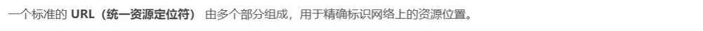
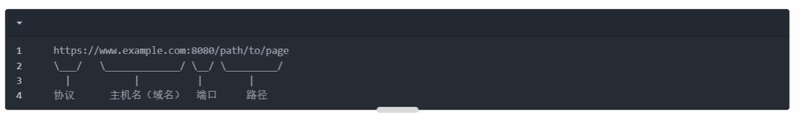
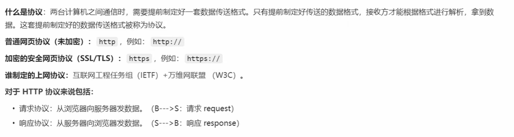
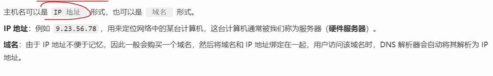
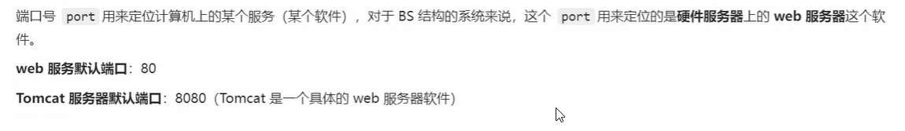
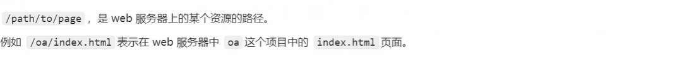
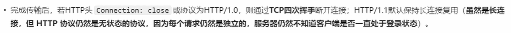
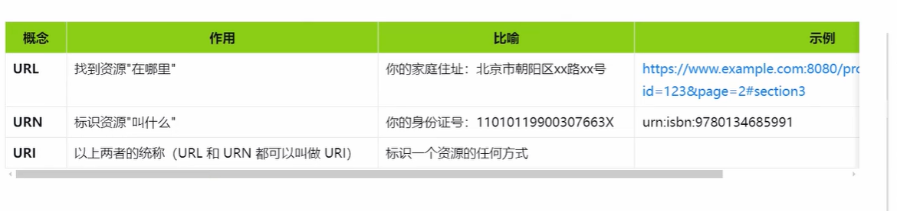

# BS结构通信原理

## 1.URL

### 1.1 URL的完整格式

### 1.2 协议 

### 1.3 主机名（域名）

### 1.4.端口号

### 1.5 路径

## 2.bs结构通信流程

B/S（Browser/Server，浏览器/服务器）结构的通信流程是指用户通过浏览器向服务器发送请求，并获取处理结果的完整交互过程。

整个通信过程主要分为以下几个核心步骤：

2.1**输入 URL**：用户在浏览器的地址栏中输入一个合法的统一资源定位符（URL），并按下回车。
2.2**DNS 解析**：浏览器通过**域名解析器（DNS）**，将人类易读的域名（例如 `://example.com`）转换成服务器在互联网上的真实 **IP 地址**。 
2.3建立**TCP 连接**：浏览器根据获取到的 IP 地址和端口号（默认 HTTP 为 80，HTTPS 为 443），通过三次握手与目标 Web 服务器建立可靠的 TCP 网络连接。如果是HTTPS，会额外进行TLS握手（交换证书，协商加密密钥等）

2.4 **发送 HTTP 请求**：浏览器按照 HTTP 协议格式，向服务器发送一个请求报文。报文内容包括请求方法（如 GET 或 POST）、请求的资源路径、请求头以及可能携带的数据。

  

2.5服务器请求处理

- **接收请求**：部署在服务器端的 **Web 服务器软件**（如 Nginx、Apache、Tomcat 等）接收到浏览器发送的底层网络请求。
- **业务逻辑处理**：Web 服务器解析请求，如果请求的是静态资源（如图片、HTML、CSS 文件），服务器直接定位并读取文件；如果涉及动态数据，服务器会将请求转发给**应用服务器**和**数据库**进行业务逻辑处理与数据交互。 

2.6服务器返回http响应

- **封装响应**：服务器将处理好的结果（如拼接好的 HTML 页面、JSON 数据等）封装成 HTTP 响应报文（包含状态码、响应头和响应体）。
- **传输数据**：服务器通过网络将响应数据发送回客户端浏览器。

2.7浏览器渲染与呈现

- **解析渲染**：浏览器接收到响应数据后，开始解析 HTML、CSS 和 JavaScript 脚本，最终将美观的图形界面渲染并展示在用户的屏幕上

2.8**断开连接**：HTTP/1.1 默认支持 TCP 连接复用（Keep-Alive），在数据传输完成后，连接可能会暂时保持或断开。

## 3.URI,URL,URN的区别与联系

