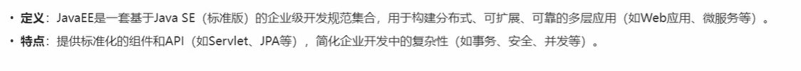
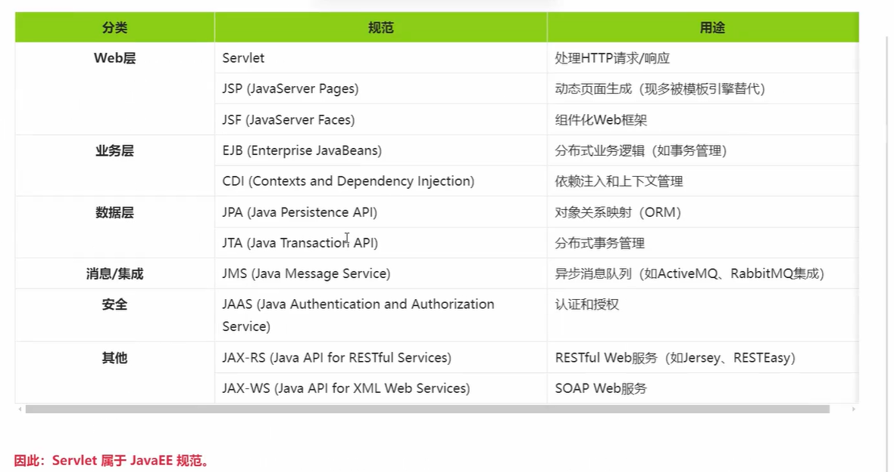
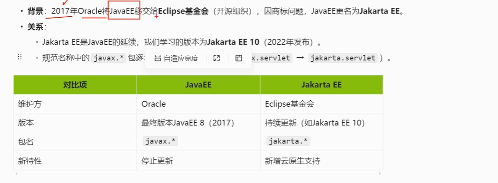

# JavaEE概述

## 1.什么是JavaEE？

## 2.JavaEE的核心规范

## 3.Jakarta EE是什么

## 4.Jakarta EE帮助文档

### https://jakarta.ee/

### 我们还是使用Jakarta EE10平台

### https://jakarta.ee/specifications/platform/10/

### 帮助文档地址：

### https://jakarta.ee/specifications/platform/10/apidocs/