# Tomcat服务器

## 1.web服务器应用服务器应用

### 1.1web server

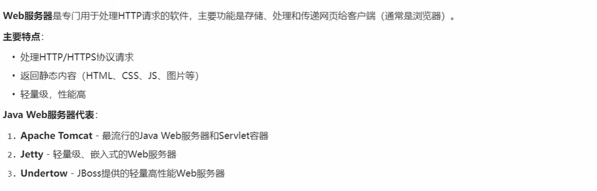

### 1.2 Application Server,包含web server

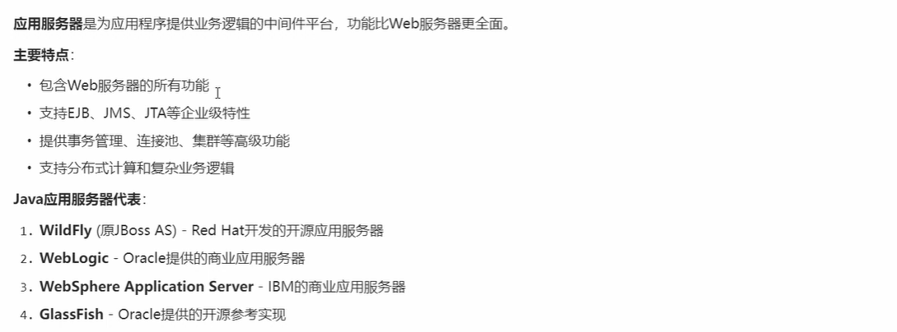

### 1.3 总结

## 2.tomcat简介

### 2.1开发与维护

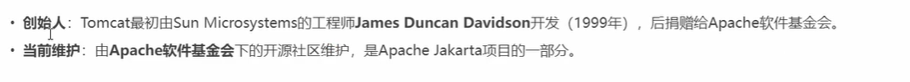

### 2.2 名字和logo

### 2.3 核心功能

### 2.4 核心组件

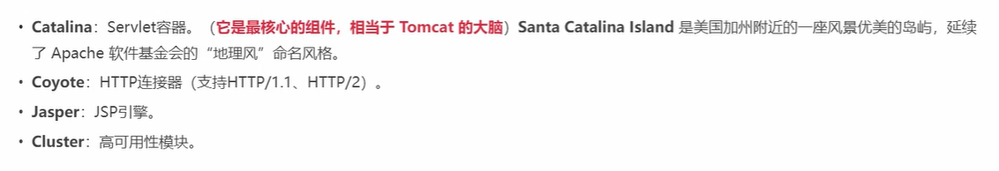

### 2.5 历史版本，现在企业使用的都是tomcat10以上的版本

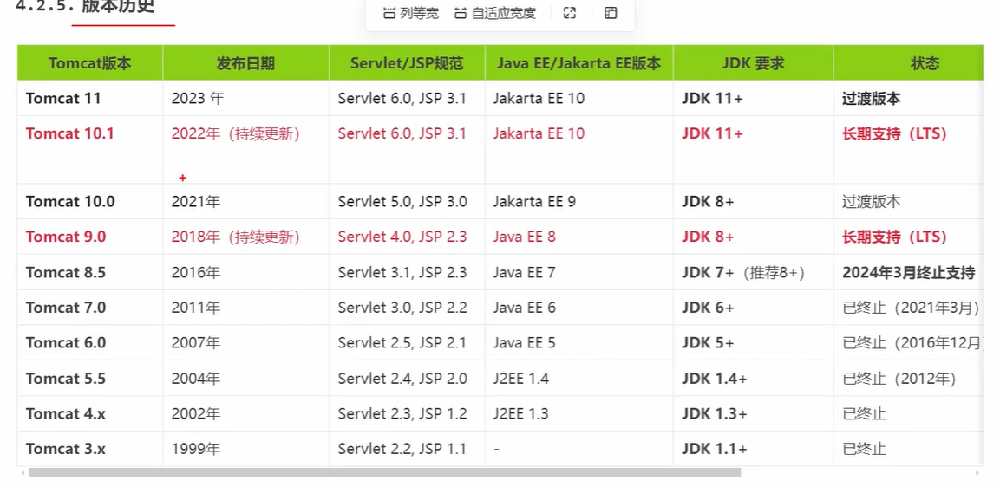

### 2.6 Tomcat10.1.x下载，网址：https://tomcat.apache.org/download-10.cgi

#### 我们下载 Tomcat10.1.60的64位的zip文件和它的源码

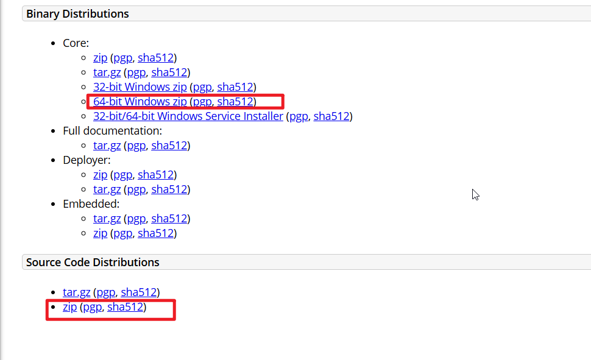

### 2.7 tomcat的安装，我们把这两个文件解压缩然后粘贴到d:\programs\里面

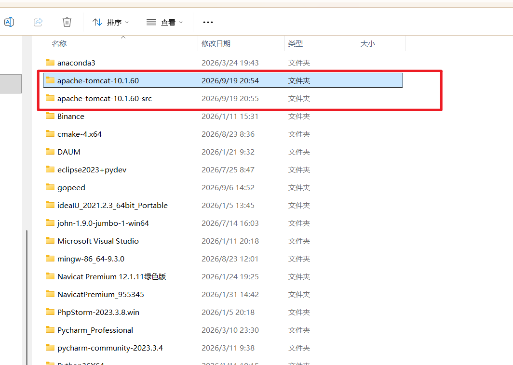

### 然后进入bin目录可以使用了

### 2.8 tomcat的目录的用途

#### bin目录

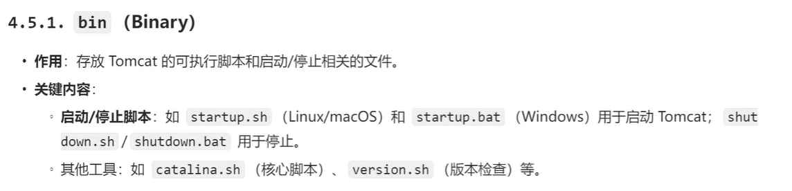

#### conf目录，可以在里面配置tomcat的一些参数

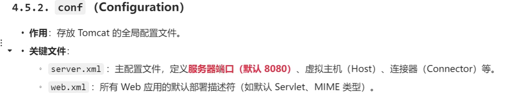

#### lib（tomcat的主要功能库文件）

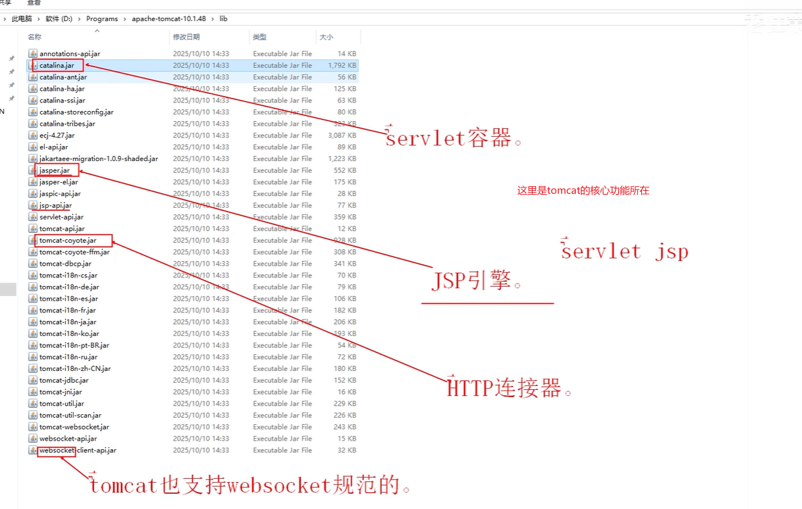

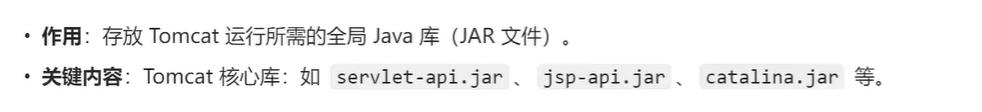

#### logs，tomcat保存日志的文件夹

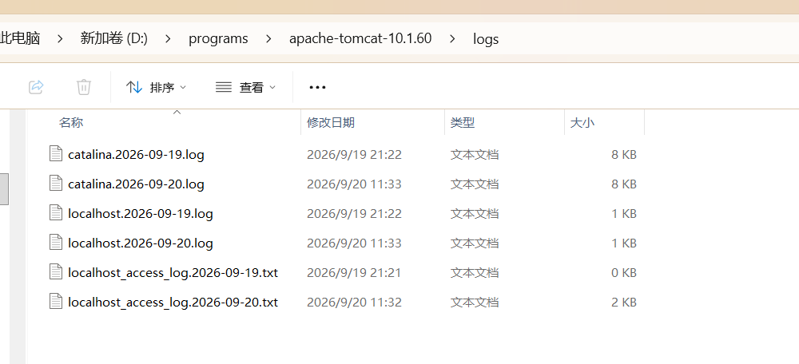

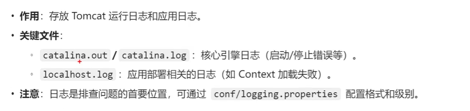

#### temp

#### webapps

#### work

是专门为jsp准备的。

### 2.9 tomcat的配置

#### 1》配置哪些环境变量

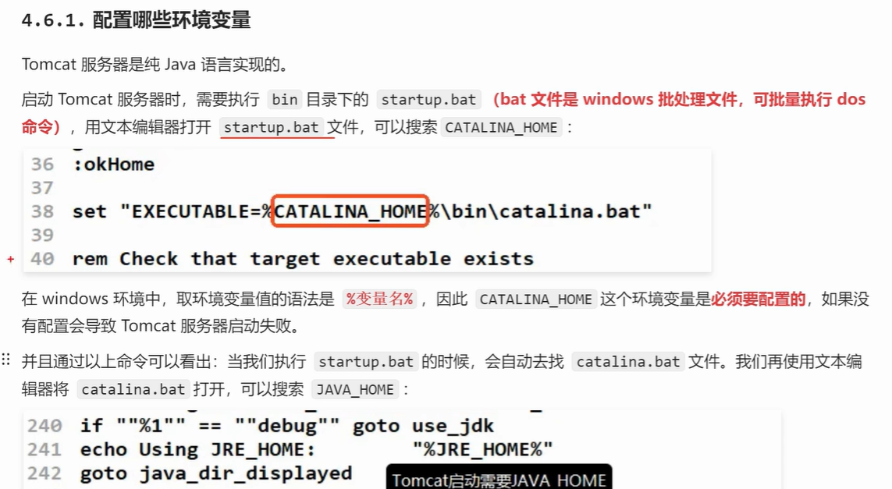

#### 如果我们需要在任何地方都可以启动tomcat，需要新建一个系统环境变量CATALINA_HOME

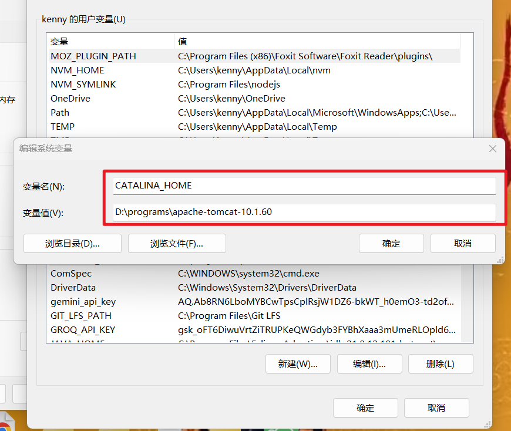

#### 然后我们需要配置一下Path环境变量，添加下面的配置

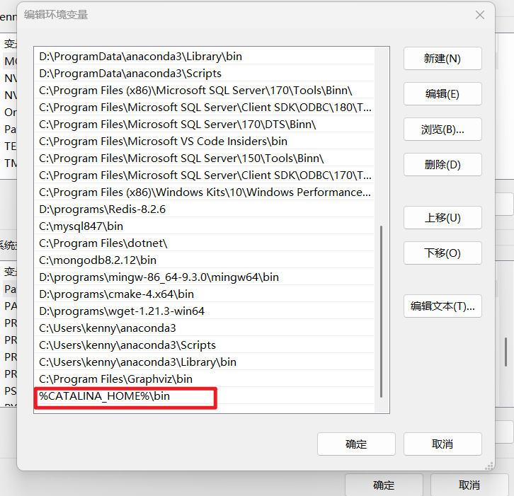

#### 其实，还需要配置JAVA_HOME的只不过在安装elippse的jdk的时候，它帮我们设置好了

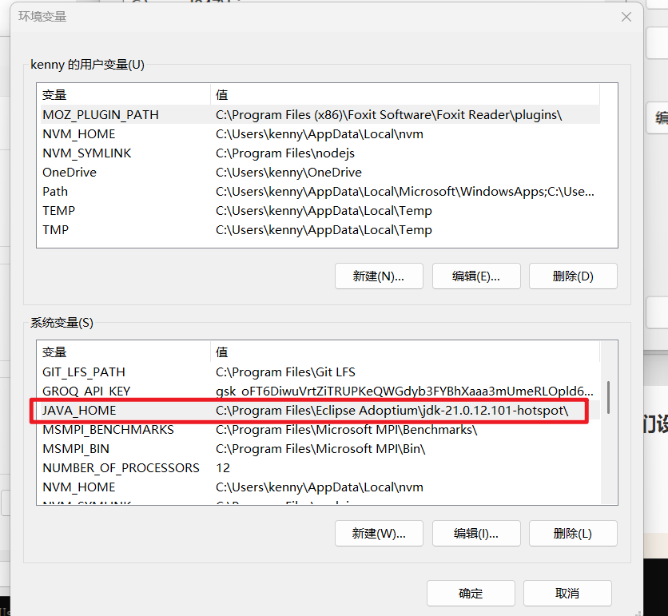

##### 然后端口一个cmd窗口，输入startup.bat,就可以启动tomcat

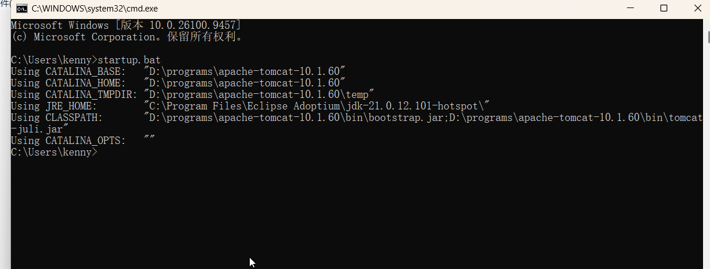

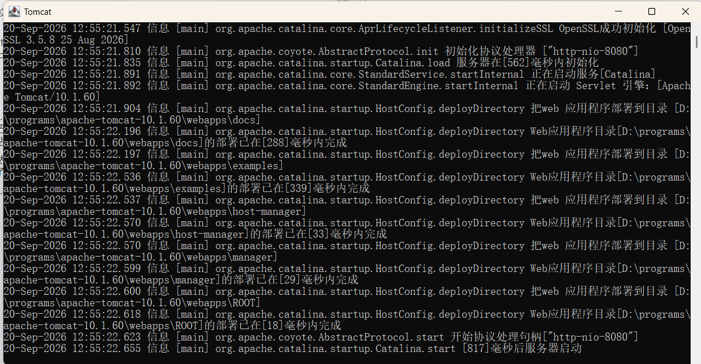

##### 可以在浏览器中访问：http://localhost:8080/

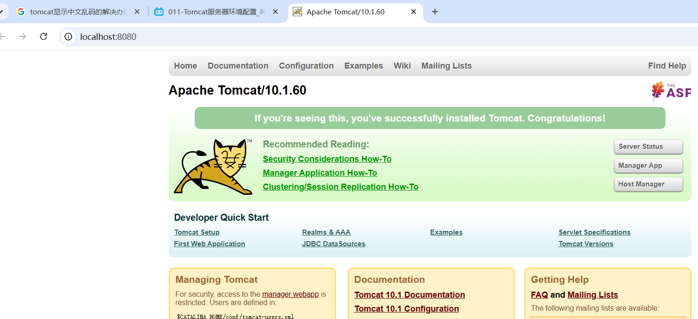

### 3.0 解决tomcat控制台的乱码问题

打开conf里面的logging.properties,把java.util.logging.ConsoleHandler.encoding的值改为GBK

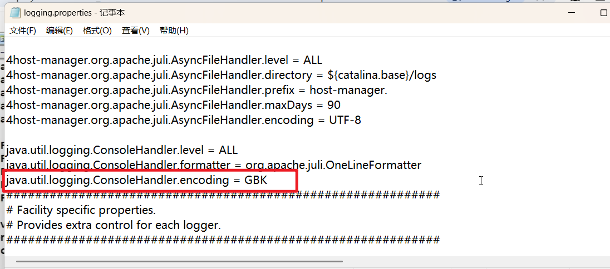