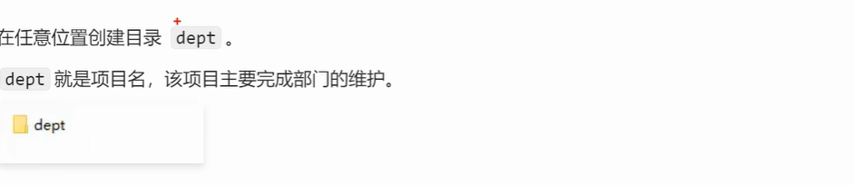
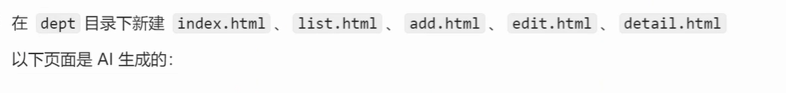
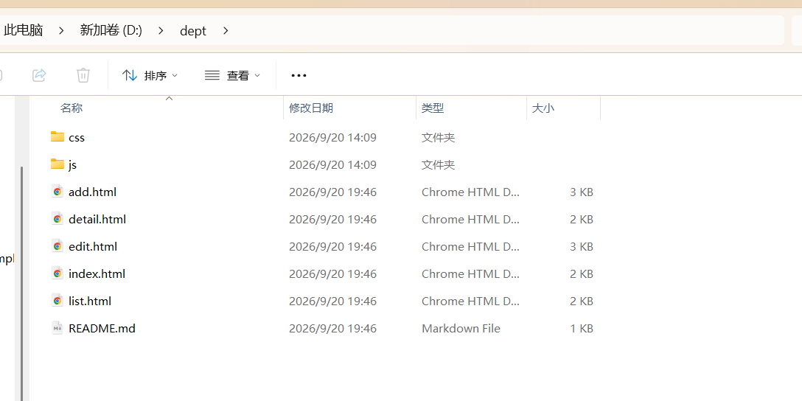
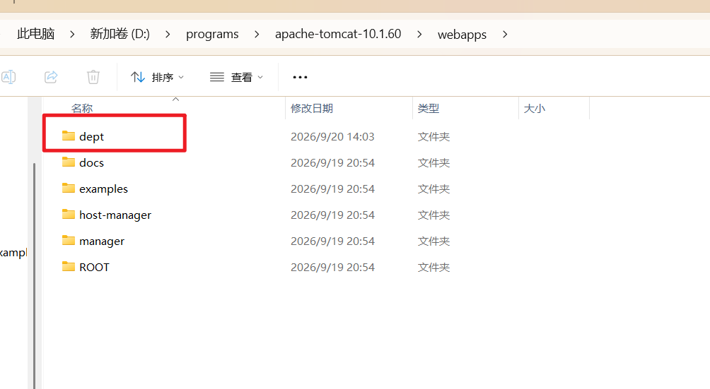
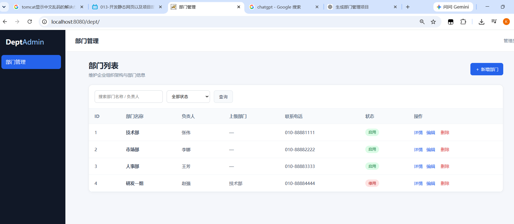
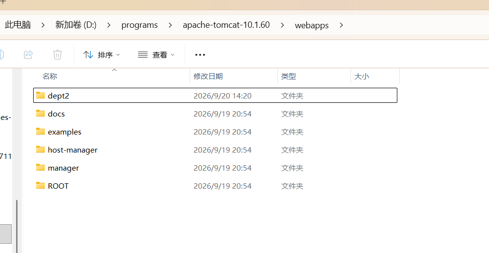
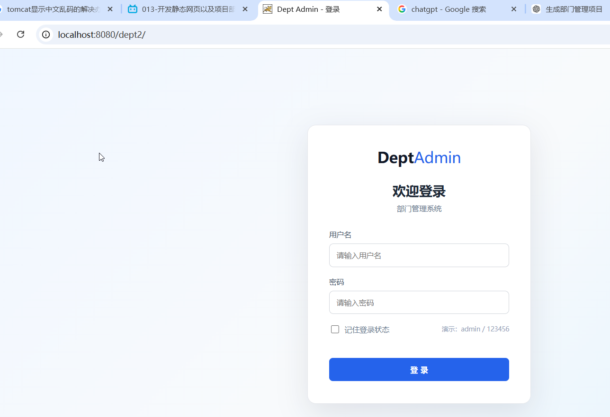
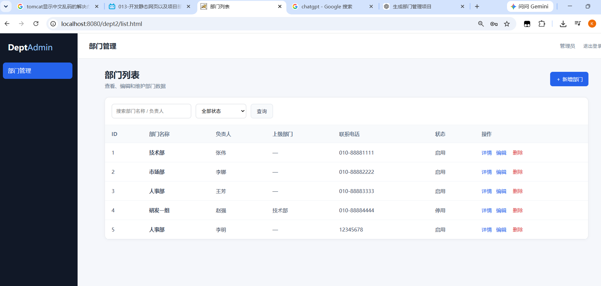
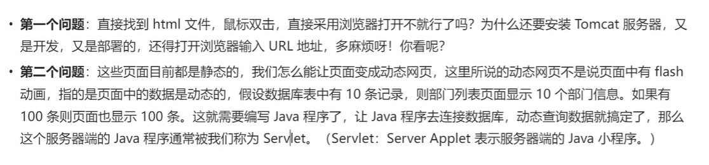

# 开发静态网站

## 1.创建静态网站项目

## 2.开发静态网页

## 3.部署项目

把这个项目的整个文件夹复制到tomcat的webapps文件夹里面

## 4.出现启动tomcat，然后用浏览器打开，输入http://locahost:8080/dept/，就会打开首页

### 由于没有登录功能不太好所以我们使用另外一个项目dept2，有登录功能

### 输入用户名admin和密码123456，就可以进入首页

## 5.添加超链接跑通页面

其实这个项目已经是可以跑通的了

## 6.值得思考的问题

