# 1.创建项目的标准目录

## 创建目录如下

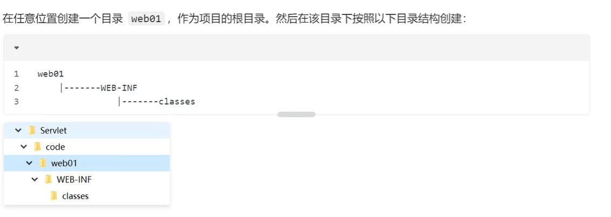

## 然后我们在web01外面创建一个HelloServlet.java

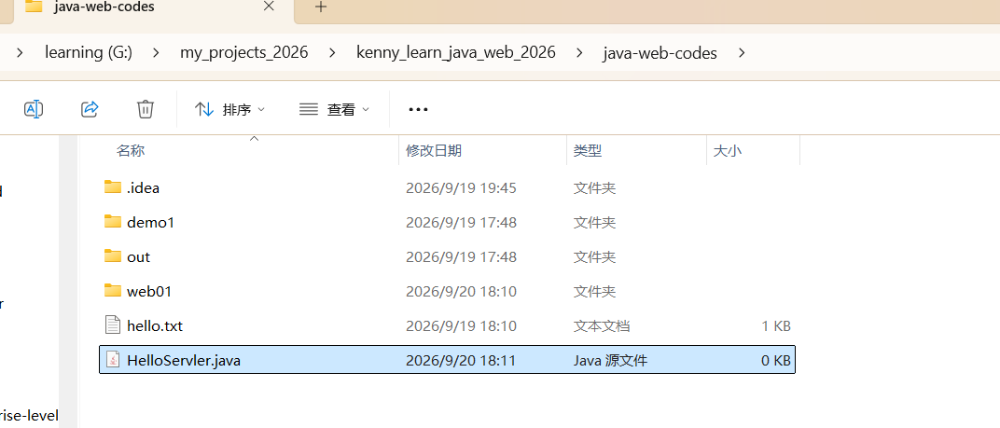

## 我们在里面写一些代码，必须实现Servlet的5个方法

```
package org.kenny.servlet;
import jakarta.servlet.Servlet;
import jakarta.servlet.ServletException;
import jakarta.servlet.ServletConfig;
import jakarta.servlet.ServletRequest;
import jakarta.servlet.ServletResponse;
import java.io.IOException;

public class HelloServlet implements Servlet{
    public void destroy(){

    }

    public void init(ServletConfig config) throws ServletException{

    }

    public String getServletInfo(){
      return " ";
    }

    //是servlet的核心方法，每一次请求，这个方法都会被调用
    public void service(ServletRequest req,ServletResponse res) throws ServletException,IOException{
       System.out.println("Hello,Servlet!!!")
    }

    public ServletConfig getServletConfig(){
      return null;
    }
}

```

## 注意，此时编译这个java文件是 会报错的。因为我们没有jakarta ee api

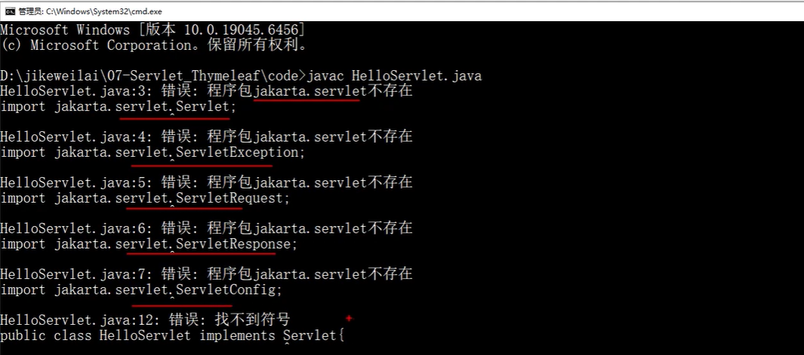

## 但是tomcat里面是有这些api的

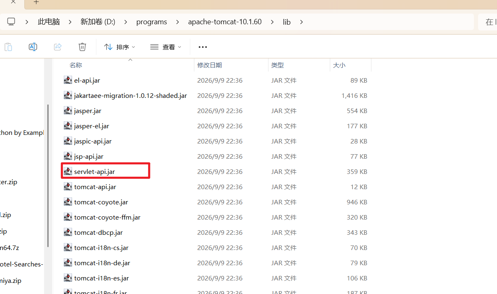

## 我们可以把这个jar包的路径配置到classpath环境变量里面

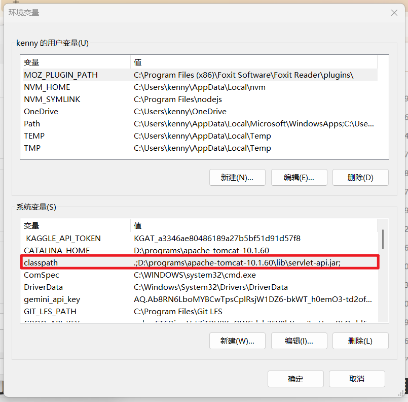

## 然后我们再来编译，就可以通过了

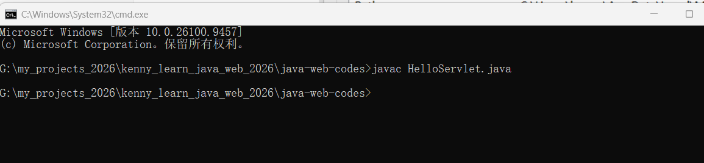

## 不过我们需要带包编译，所以把上面编译生成的文件生成，然后输入下面的命令： javac -d . HelloServlet.java

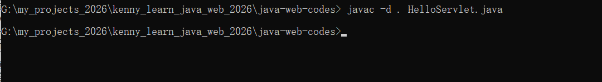

## 生成的class文件就有包了

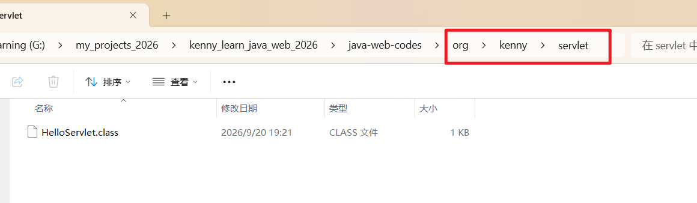

# 2.部署，

## 2.1把我们编译生成的包剪切粘贴到项目的WEB-INF/classes/里面

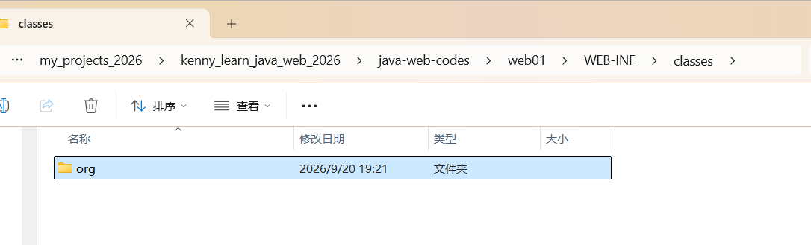

## 2.2 需要在web.xml里面做路径配置，内容如下

```
<?xml version="1.0" encoding="UTF-8"?>

<web-app xmlns="https://jakarta.ee/xml/ns/jakartaee"
         xmlns:xsi="http://www.w3.org/2001/XMLSchema-instance"
         xsi:schemaLocation="https://jakarta.ee/xml/ns/jakartaee
                      https://jakarta.ee/xml/ns/jakartaee/web-app_6_0.xsd"
         version="6.0"
         metadata-complete="true">

    <servlet>
        <servlet-name>HelloServlet</servlet-name>
        <servlet-class>org.kenny.servlet.HelloServlet</servlet-class>
    </servlet>
    <servlet-mapping>
        <!--两个地方的servlet-name必须一致，否则报错 -->
        <servlet-name>HelloServlet</servlet-name>
        <!--下面的路径里面不能有项目名称-->
        <url-pattern>/hello</url-pattern> 
    </servlet-mapping>

</web-app>
```


## 2.3 然后需要把这个项目复制到tomcat服务器的webapps文件夹里面

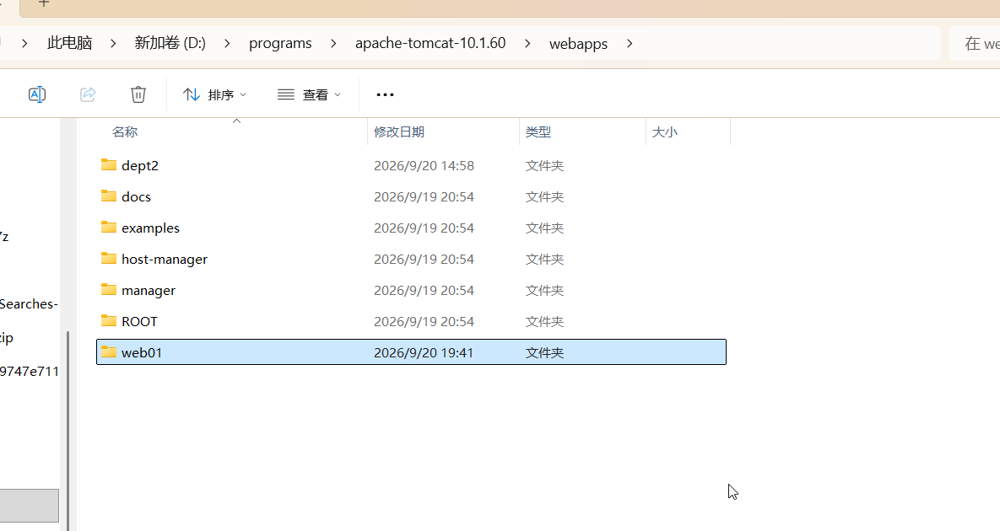

## 2.4 重启tomcat，然后打开浏览器，输入下面的网址，就可以正常访问了，注意输出是在控制台

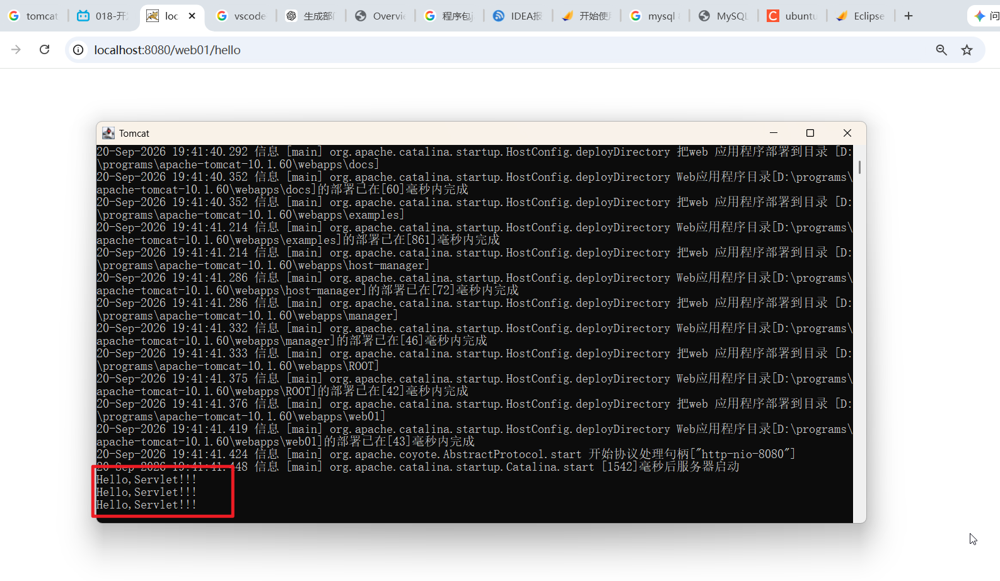

### 注意：如果以后我们使用idea来写代码，就不需要这个环境变量。不过目前还是需要的。

# 2.第一个Servlet程序响应html代码给用户

## 我们的servlet程序目前是把输出显示在控制台上面的，这个对应用户不太友好，我们想让他返回html给用户，此时我们需要利用response对象来实现

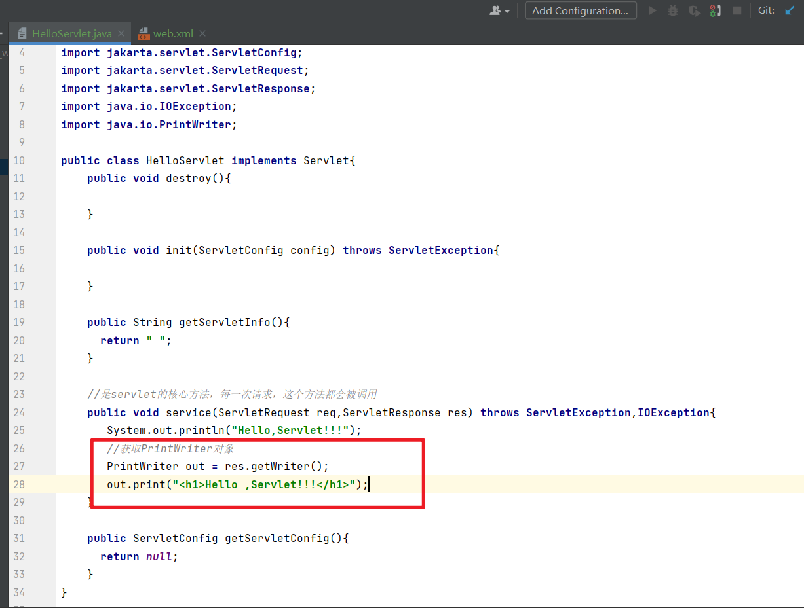

## 然后需要重新编译重新部署，重启服务器，刷新一些网页，效果如下

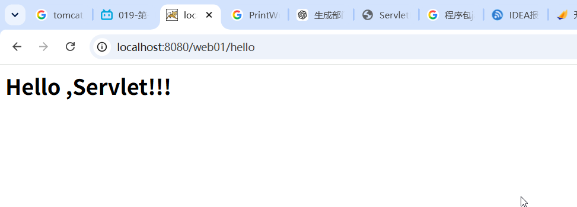

## 注意，如果用PrintWriter对象输出中文，默认是会有乱码的，我们需要在输出内容之前设置编码

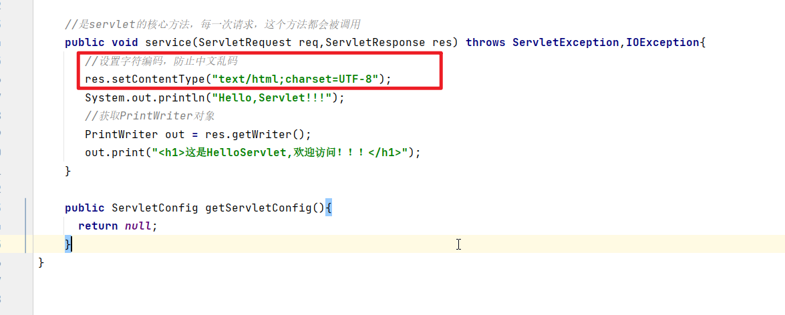

## 重新编译部署，刷新页面，中文就能够正常显示了

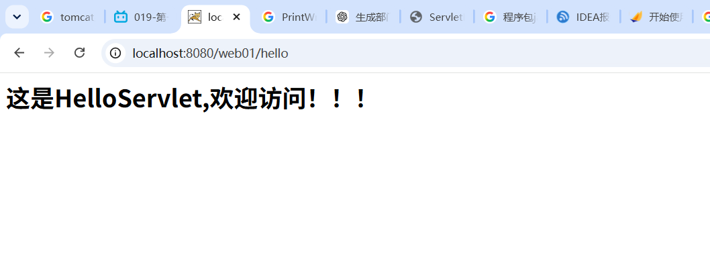

### 当然怎么写也是可以的。

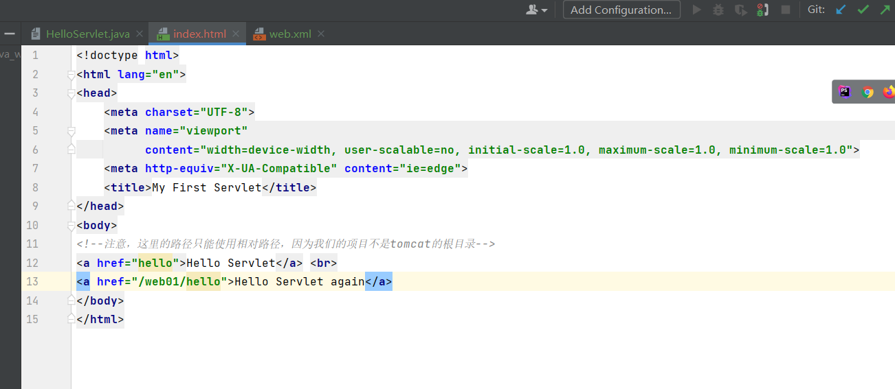

### 注意：在web.xml里面配置路径的时候是不需要写项目名称的