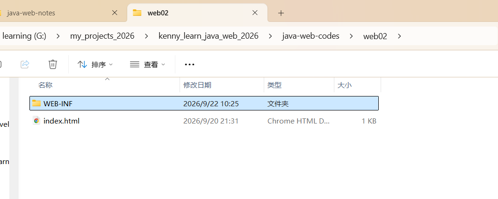
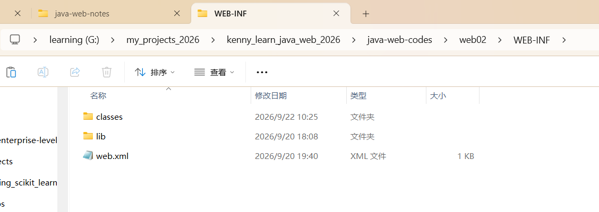
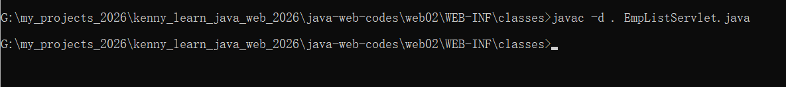
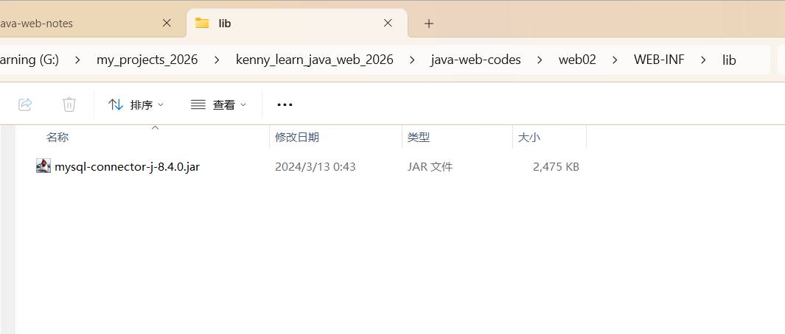
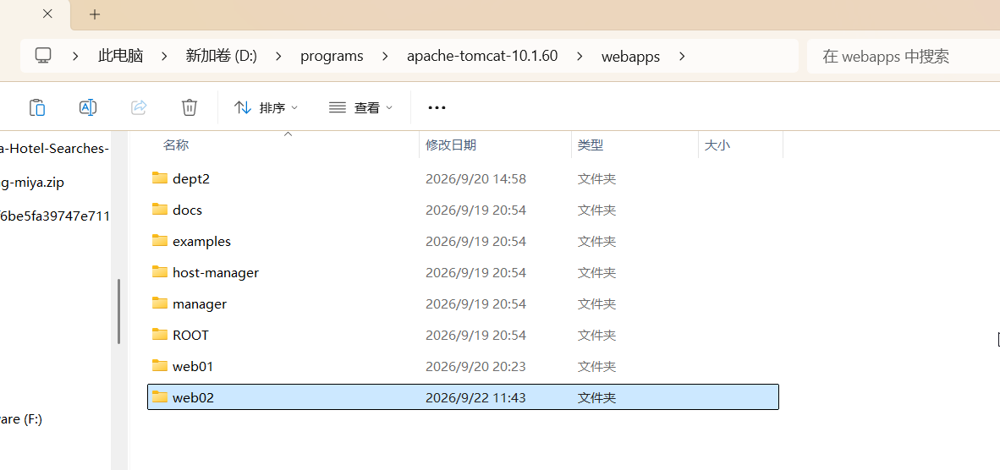
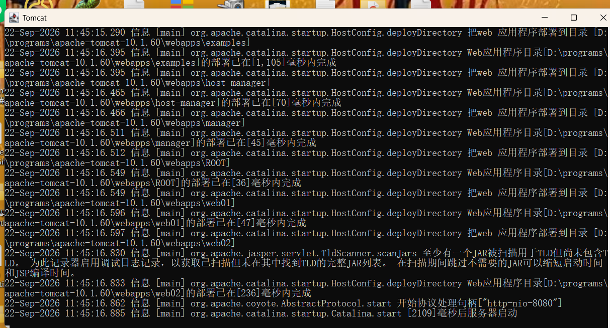
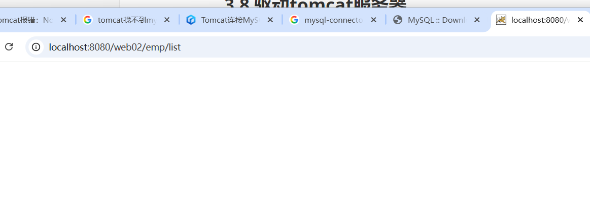
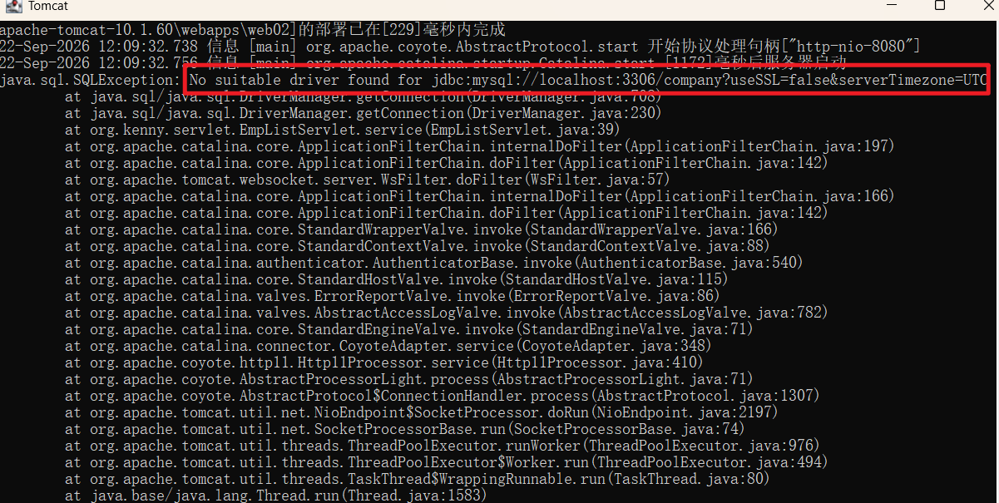
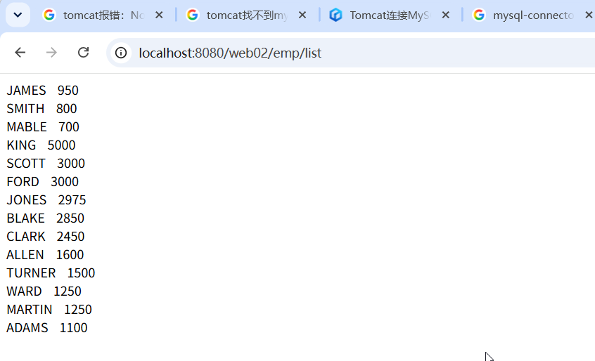

# 1.创建项目的标准目录

## 创建目录如下


## 然后我们在web01外面创建一个HelloServlet.java


## 我们在里面写一些代码，必须实现Servlet的5个方法

```
package org.kenny.servlet;
import jakarta.servlet.Servlet;
import jakarta.servlet.ServletException;
import jakarta.servlet.ServletConfig;
import jakarta.servlet.ServletRequest;
import jakarta.servlet.ServletResponse;
import java.io.IOException;

public class HelloServlet implements Servlet{
    public void destroy(){

    }

    public void init(ServletConfig config) throws ServletException{

    }

    public String getServletInfo(){
      return " ";
    }

    //是servlet的核心方法，每一次请求，这个方法都会被调用
    public void service(ServletRequest req,ServletResponse res) throws ServletException,IOException{
       System.out.println("Hello,Servlet!!!")
    }

    public ServletConfig getServletConfig(){
      return null;
    }
}

```

## 注意，此时编译这个java文件是 会报错的。因为我们没有jakarta ee api


## 但是tomcat里面是有这些api的


## 我们可以把这个jar包的路径配置到classpath环境变量里面


## 然后我们再来编译，就可以通过了


## 不过我们需要带包编译，所以把上面编译生成的文件生成，然后输入下面的命令： javac -d . HelloServlet.java


## 生成的class文件就有包了


# 2.部署，

## 2.1把我们编译生成的包剪切粘贴到项目的WEB-INF/classes/里面


## 2.2 需要在web.xml里面做路径配置，内容如下

```
<?xml version="1.0" encoding="UTF-8"?>

<web-app xmlns="https://jakarta.ee/xml/ns/jakartaee"
         xmlns:xsi="http://www.w3.org/2001/XMLSchema-instance"
         xsi:schemaLocation="https://jakarta.ee/xml/ns/jakartaee
                      https://jakarta.ee/xml/ns/jakartaee/web-app_6_0.xsd"
         version="6.0"
         metadata-complete="true">

    <servlet>
        <servlet-name>HelloServlet</servlet-name>
        <servlet-class>org.kenny.servlet.HelloServlet</servlet-class>
    </servlet>
    <servlet-mapping>
        <!--两个地方的servlet-name必须一致，否则报错 -->
        <servlet-name>HelloServlet</servlet-name>
        <!--下面的路径里面不能有项目名称-->
        <url-pattern>/hello</url-pattern> 
    </servlet-mapping>

</web-app>
```


## 2.3 然后需要把这个项目复制到tomcat服务器的webapps文件夹里面


## 2.4 重启tomcat，然后打开浏览器，输入下面的网址，就可以正常访问了，注意输出是在控制台


### 注意：如果以后我们使用idea来写代码，就不需要这个环境变量。不过目前还是需要的。

# 2.第一个Servlet程序响应html代码给用户

## 我们的servlet程序目前是把输出显示在控制台上面的，这个对应用户不太友好，我们想让他返回html给用户，此时我们需要利用response对象来实现


## 然后需要重新编译重新部署，重启服务器，刷新一些网页，效果如下


## 注意，如果用PrintWriter对象输出中文，默认是会有乱码的，我们需要在输出内容之前设置编码


## 重新编译部署，刷新页面，中文就能够正常显示了


### 当然怎么写也是可以的。


### 注意：在web.xml里面配置路径的时候是不需要写项目名称的

# 3.第一个servlet程序连接mysql数据库

## 3.1首先需要创建一个company数据库，在里面创建一个emp表格，sql语句如下

```
/*
 Navicat Premium Dump SQL

 Source Server         : mysql
 Source Server Type    : MySQL
 Source Server Version : 80407 (8.4.7)
 Source Host           : localhost:3306
 Source Schema         : company

 Target Server Type    : MySQL
 Target Server Version : 80407 (8.4.7)
 File Encoding         : 65001

 Date: 22/09/2026 10:22:13
*/

SET NAMES utf8mb4;
SET FOREIGN_KEY_CHECKS = 0;

-- ----------------------------
-- Table structure for dept
-- ----------------------------
DROP TABLE IF EXISTS `dept`;
CREATE TABLE `dept`  (
  `no` int NOT NULL,
  `name` varchar(255) CHARACTER SET utf8mb4 COLLATE utf8mb4_general_ci NOT NULL,
  `location` varchar(255) CHARACTER SET utf8mb4 COLLATE utf8mb4_general_ci NOT NULL,
  PRIMARY KEY (`no`) USING BTREE
) ENGINE = InnoDB CHARACTER SET = utf8mb4 COLLATE = utf8mb4_general_ci ROW_FORMAT = Dynamic;

-- ----------------------------
-- Records of dept
-- ----------------------------
INSERT INTO `dept` VALUES (1, '生产部', 'new kingston');
INSERT INTO `dept` VALUES (2, '财务部', '35 spanish town road');

-- ----------------------------
-- Table structure for emp
-- ----------------------------
DROP TABLE IF EXISTS `emp`;
CREATE TABLE `emp`  (
  `EMPNO` varchar(255) CHARACTER SET utf8mb3 COLLATE utf8mb3_general_ci NULL DEFAULT NULL,
  `ENAME` varchar(255) CHARACTER SET utf8mb3 COLLATE utf8mb3_general_ci NULL DEFAULT NULL,
  `JOB` varchar(255) CHARACTER SET utf8mb3 COLLATE utf8mb3_general_ci NULL DEFAULT NULL,
  `MGR` varchar(255) CHARACTER SET utf8mb3 COLLATE utf8mb3_general_ci NULL DEFAULT NULL,
  `HIREDATE` varchar(255) CHARACTER SET utf8mb3 COLLATE utf8mb3_general_ci NULL DEFAULT NULL,
  `SAL` varchar(255) CHARACTER SET utf8mb3 COLLATE utf8mb3_general_ci NULL DEFAULT NULL,
  `COMM` varchar(255) CHARACTER SET utf8mb3 COLLATE utf8mb3_general_ci NULL DEFAULT NULL,
  `DEPTNO` varchar(255) CHARACTER SET utf8mb3 COLLATE utf8mb3_general_ci NULL DEFAULT NULL
) ENGINE = InnoDB CHARACTER SET = utf8mb3 COLLATE = utf8mb3_general_ci ROW_FORMAT = Dynamic;

-- ----------------------------
-- Records of emp
-- ----------------------------
INSERT INTO `emp` VALUES ('7369', 'SMITH', 'CLERK', '7902', '1980-12-17', '800', NULL, '20');
INSERT INTO `emp` VALUES ('7499', 'ALLEN', 'SALESMAN', '7698', '1981-02-20', '1600', '200', '30');
INSERT INTO `emp` VALUES ('7521', 'WARD', 'SALESMAN', '7698', '1981-02-22', '1250', '500', '30');
INSERT INTO `emp` VALUES ('7566', 'JONES', 'MANAGER', '7839', '1981-04-02', '2975', NULL, '20');
INSERT INTO `emp` VALUES ('7654', 'MARTIN', 'SALESMAN', '7698', '1981-09-28', '1250', '1400', '30');
INSERT INTO `emp` VALUES ('7698', 'BLAKE', 'MANAGER', '7839', '1981-05-01', '2850', NULL, '30');
INSERT INTO `emp` VALUES ('7782', 'CLARK', 'MANAGER', '7839', '1981-06-09', '2450', '100', '10');
INSERT INTO `emp` VALUES ('7788', 'SCOTT', 'ANALYST', '7566', '1987-04-19', '3000', NULL, '20');
INSERT INTO `emp` VALUES ('7839', 'KING', 'PRESIDENT', NULL, '1981-11-17', '5000', NULL, '10');
INSERT INTO `emp` VALUES ('7844', 'TURNER', 'SALESMAN', '7698', '1981-09-08', '1500', '0', '30');
INSERT INTO `emp` VALUES ('7876', 'ADAMS', 'CLERK', '7788', '1987-05-23', '1100', NULL, '20');
INSERT INTO `emp` VALUES ('7900', 'JAMES', 'CLERK', '7698', '1981-12-03', '950', NULL, '30');
INSERT INTO `emp` VALUES ('7902', 'FORD', 'ANALYST', '7566', '1981-12-03', '3000', NULL, '20');
INSERT INTO `emp` VALUES ('7700', 'MABLE', 'CLERK', '7788', '1985-2-2', '700', '100', '20');

SET FOREIGN_KEY_CHECKS = 1;

```


## 3.2 新建一个项目web02,结构和web01完全一致，我们暂时完全手动创建，以后使用idea来创建





## 注意还有一个事情要做，就是下载MySQL数据库的Java驱动

## 3.3 然后我们在任意位置创建一个EmpListServlet.java,内容如下（3.10的才是正确代码）

```
//注意，这里的代码是有问题的，因为它没有指定驱动器的类名称，正确的代码参考3.10
package org.kenny.servlet;
import jakarta.servlet.Servlet;
import jakarta.servlet.ServletException;
import jakarta.servlet.ServletConfig;
import jakarta.servlet.ServletRequest;
import jakarta.servlet.ServletResponse;
import java.io.IOException;
import java.io.PrintWriter;
import java.sql.*;

public class EmpListServlet implements Servlet{
    public void destroy(){

    }

    public void init(ServletConfig config) throws ServletException{

    }

    public String getServletInfo(){
      return " ";
    }

    //是servlet的核心方法，每一次请求，这个方法都会被调用
    public void service(ServletRequest req,ServletResponse res) throws ServletException,IOException{
       //设置字符编码，防止中文乱码
       res.setContentType("text/html;charset=UTF-8");
       //获取PrintWriter对象
       PrintWriter out = res.getWriter();
       //连接数据库，重新所有员工的名字
        // 数据库连接信息
       String URL = "jdbc:mysql://localhost:3306/company?useSSL=false&serverTimezone=UTC";
       String USER = "root";
       String PASS = "root";
       Connection conn = null;
       ResultSet rs = null;
       PreparedStatement stmt = null;
       try {
           conn = DriverManager.getConnection(URL, USER, PASS);
           String sql="select ename,sal from emp order by sal desc;";
           stmt = conn.prepareStatement(sql);
           rs = stmt.executeQuery();
           while (rs.next()){
               String ename = rs.getString("ename");
               String sal = rs.getString("sal");
               out.print(ename + "&nbsp;&nbsp;&nbsp;&nbsp;" + sal+"<br>");
           }
       } catch (SQLException e) {
           e.printStackTrace();
       } 
    }

    public ServletConfig getServletConfig(){
      return null;
    }
}

//不要加关闭数据库连接和关闭的代码，编译会失败！！！
//以上代码是错误的，正确代码参考3.10
```


## 3.4 在Java文件所在的路径打开一个cmd窗口，输入javac -d . EmpListServlet.java编译一下，没有报错就是编译成功




## 3.5 为了使得我们的程序能够工作，我们把mysql的java驱动的jar包放到项目的lib文件夹里面



## 3.6把我们下项目复制粘贴到tomcat的webapps文件夹里面



## 3.7 配置web.xml

```
<?xml version="1.0" encoding="UTF-8"?>

<web-app xmlns="https://jakarta.ee/xml/ns/jakartaee"
         xmlns:xsi="http://www.w3.org/2001/XMLSchema-instance"
         xsi:schemaLocation="https://jakarta.ee/xml/ns/jakartaee
                      https://jakarta.ee/xml/ns/jakartaee/web-app_6_0.xsd"
         version="6.0"
         metadata-complete="true">

    <servlet>
        <servlet-name>EmpListServlet</servlet-name>
        <servlet-class>org.kenny.servlet.EmpListServlet</servlet-class>
    </servlet>
    <servlet-mapping>
        <!--两个地方的servlet-name必须一致，否则报错 -->
        <servlet-name>EmpListServlet</servlet-name>
        <!--下面的路径里面不能有项目名称-->
        <url-pattern>/emp/list</url-pattern>
    </servlet-mapping>

</web-app>
```


## 3.8 驱动tomcat服务器



## 3.9 当我们尝试从浏览器访问这个链接，发现出问题了



### 浏览器什么都没有，如何控制台报错说找不到合适的驱动



## 3.10原来是代码写错了，我们修改如下

```
package org.kenny.servlet;
import jakarta.servlet.Servlet;
import jakarta.servlet.ServletException;
import jakarta.servlet.ServletConfig;
import jakarta.servlet.ServletRequest;
import jakarta.servlet.ServletResponse;
import java.io.IOException;
import java.io.PrintWriter;
import java.sql.*;

public class EmpListServlet implements Servlet{
    public void destroy(){

    }

    public void init(ServletConfig config) throws ServletException{

    }

    public String getServletInfo(){
      return " ";
    }

    //是servlet的核心方法，每一次请求，这个方法都会被调用
    public void service(ServletRequest req,ServletResponse res) throws ServletException,IOException{
       //设置字符编码，防止中文乱码
       res.setContentType("text/html;charset=UTF-8");
       //获取PrintWriter对象
       PrintWriter out = res.getWriter();
       //连接数据库，重新所有员工的名字
        // 数据库连接信息
       String URL = "jdbc:mysql://localhost:3306/company?useSSL=false&serverTimezone=UTC";
       String USER = "root";
       String PASS = "root";
       Connection conn = null;
       ResultSet rs = null;
       PreparedStatement stmt = null;
       try {
          Class.forName("com.mysql.cj.jdbc.Driver");
          try {
               conn = DriverManager.getConnection(URL, USER, PASS);
               String sql="select ename,sal from emp order by sal desc;";
               stmt = conn.prepareStatement(sql);
               rs = stmt.executeQuery();
               while (rs.next()){
                   String ename = rs.getString("ename");
                   String sal = rs.getString("sal");
                   out.print(ename + "&nbsp;&nbsp;&nbsp;&nbsp;" + sal+"<br>");
               }
          }catch (Exception e){
              e.printStackTrace();
          }
       } catch (Exception e){
           e.printStackTrace();
       }
       
    }

    public ServletConfig getServletConfig(){
      return null;
    }
}


```

## 3.11重新编译部署，再用浏览器打开，此时就能够正常显示了



## 注意：我们在环境变量里面配置的classpath路径只是为了程序能够成功通过编译，在重新的运行阶段的没有任何作用的。我们需要把这个驱动器的jar包放到我们项目里面的lib文件夹里面或者是tomcat服务器里面的lib全局lib文件夹里面，我们的web项目才能够正常运行。程序运行时，tomcat先去我们项目的WEB-INF/lib/里面找驱动，如果没有，就会去服务器的全局lib里面找，如果还找不到，就会报错。

