# 1生命周期以及管理者

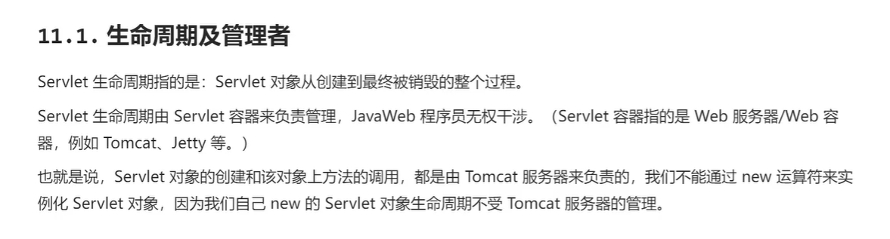

# 演练

## 1.把G:\my_projects_2026\kenny_learn_java_web_2026\java-web-codes\java-web-idea中文一个项目打开，然后添加一个模块web05

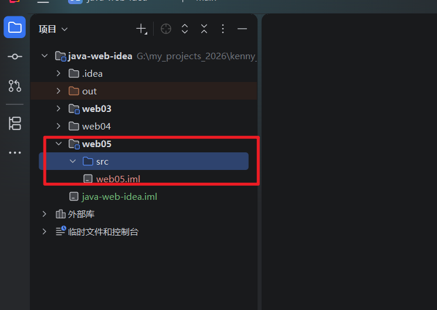

## 2.给web05添加web支持，添加完后可以点击修正按钮-》create artifects创建工件方便部署到tomcat服务器上面,

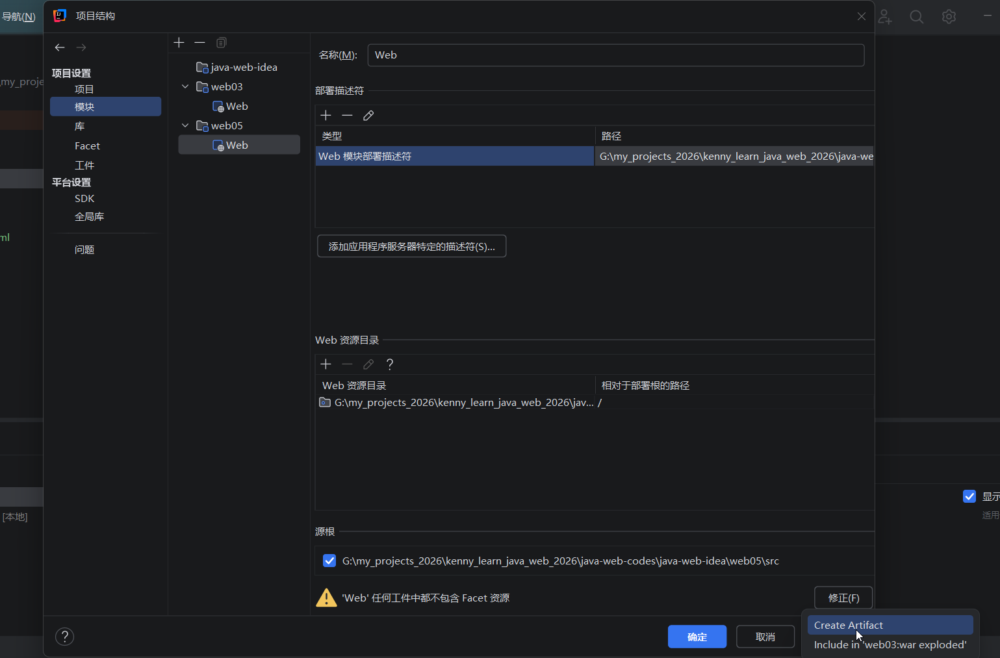

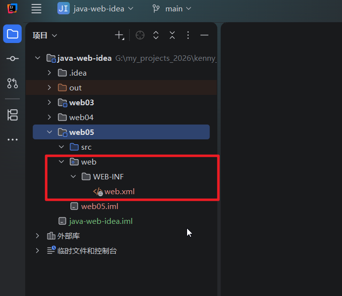


## 3.在web05文件夹里面新建一个lib文件夹，然后把servlet-api.jar拷贝粘贴过来

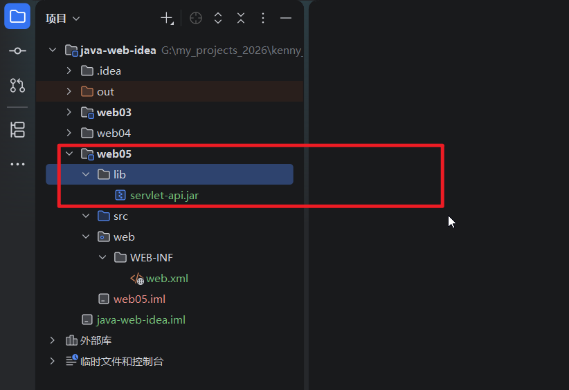

## 4.然后在这个jar包上面点击右键-》添加为库

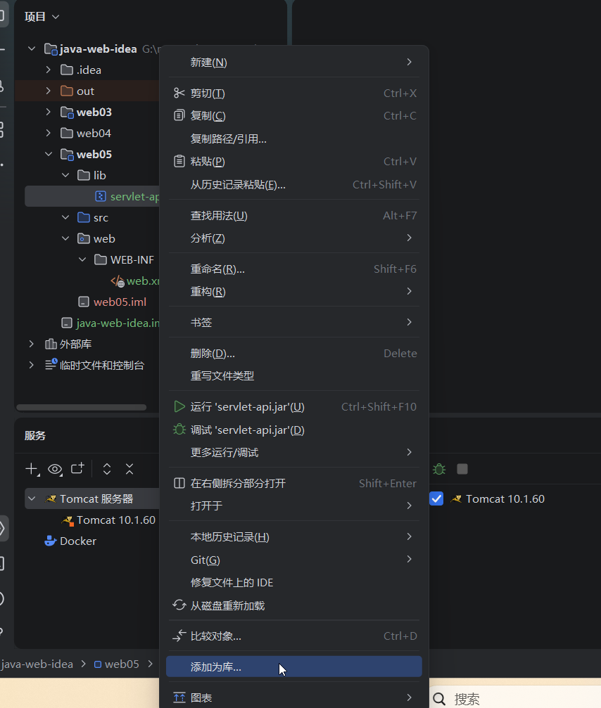

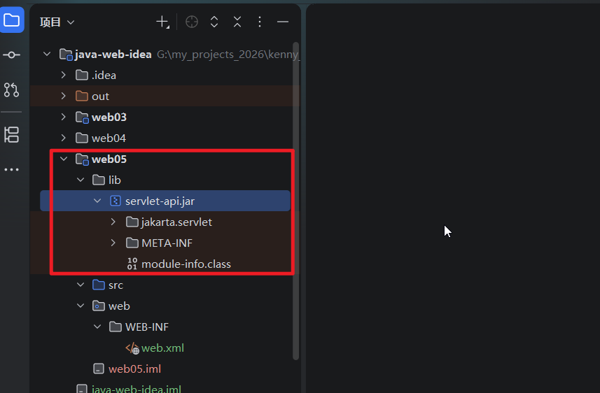


## 5.然后我们把它部署到tomcat服务器上面，点击应用按钮并且点击确定按钮

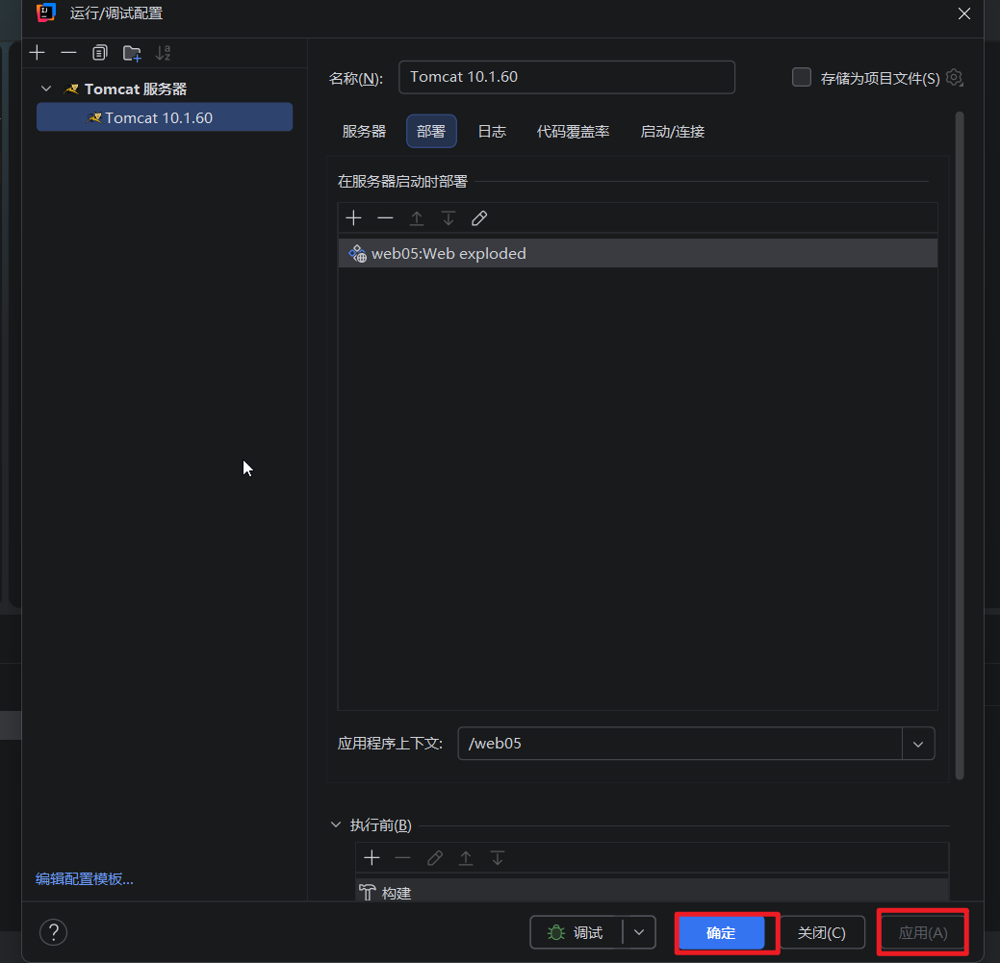

## 6.编辑有些tomcat服务器，把执行更新操作一栏改为“跟新类和静态资源”

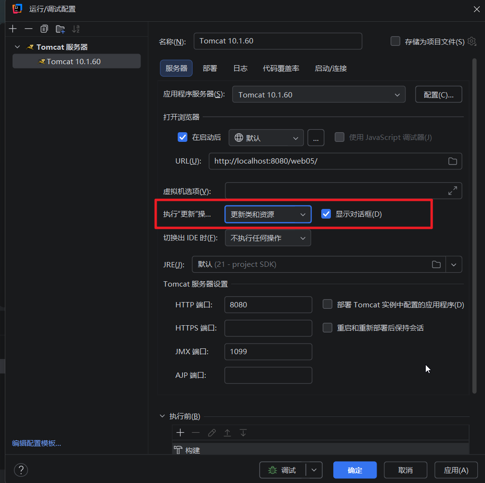

## 7.然后在src文件夹里面新建一个包org.kenny.servlet,在里面新建一个叫做LifecycleServlet的java类，并且实现Servlet接口

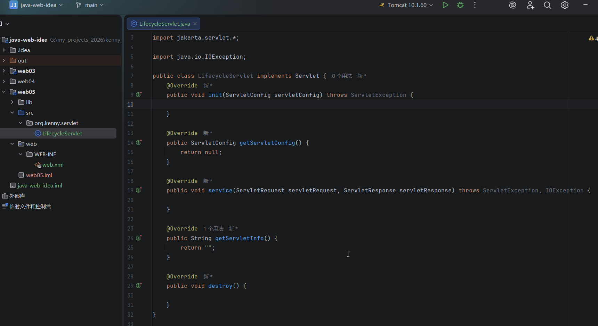

## 8.然后在web.xml在配置servlet

```
<?xml version="1.0" encoding="UTF-8"?>
<web-app xmlns="http://xmlns.jcp.org/xml/ns/javaee"
         xmlns:xsi="http://www.w3.org/2001/XMLSchema-instance"
         xsi:schemaLocation="http://xmlns.jcp.org/xml/ns/javaee http://xmlns.jcp.org/xml/ns/javaee/web-app_4_0.xsd"
         version="4.0">
    <servlet>
        <servlet-name>lifecycle</servlet-name>
        <servlet-class>org.kenny.servlet.LifecycleServlet</servlet-class>
    </servlet>
    <servlet-mapping>
        <servlet-name>lifecycle</servlet-name>
        <url-pattern>/life</url-pattern>
    </servlet-mapping>
</web-app>
```

## 9.我们随便写一些代码

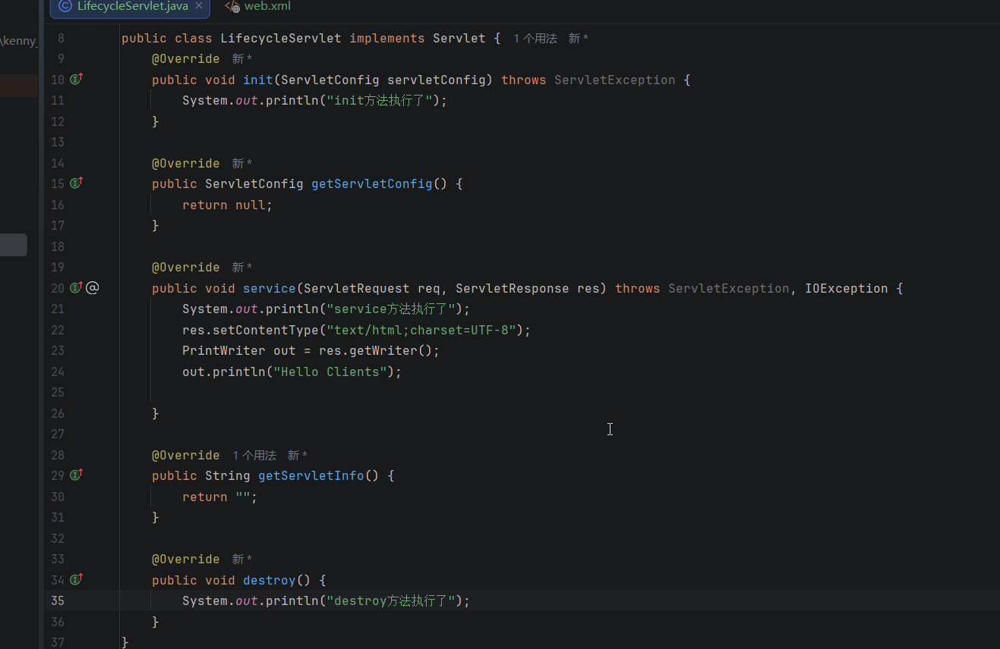

## 10.然后启动服务器，在浏览器中输入：http://localhost:8080/web05/life ，发现可以访问了，

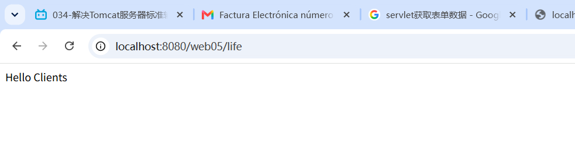

## 在后台的控制台也有输出，但是有中文乱码

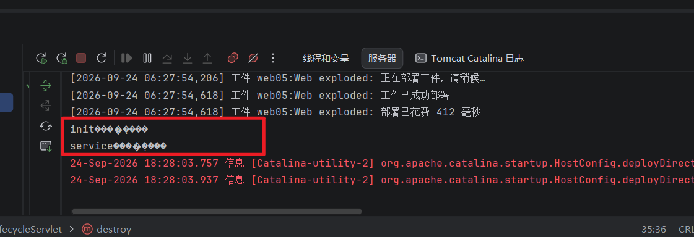

### 问题出现在tomcat服务器里面

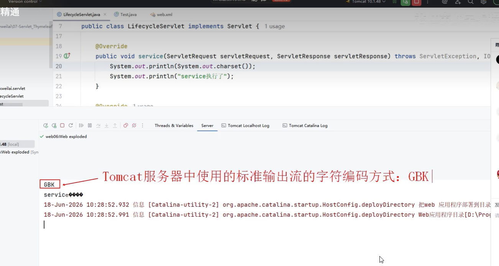

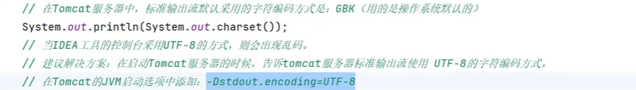

### 解决办法，打开idea的tomcat服务器的配置，在虚拟机选项一栏填入 -Dstdout.encoding=UTF-8,然后点击应用，再点击确定

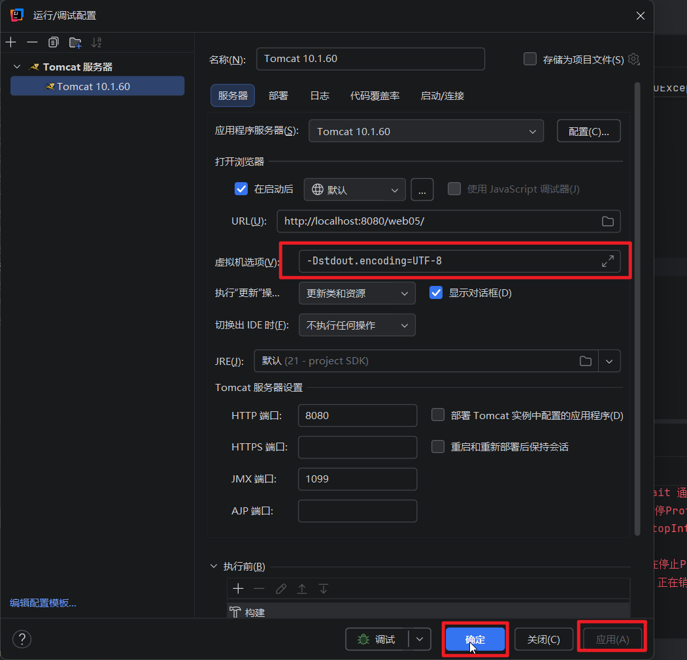

### 然后重启服务器，在浏览器中输入http://localhost:8080/web05/life，一切正常

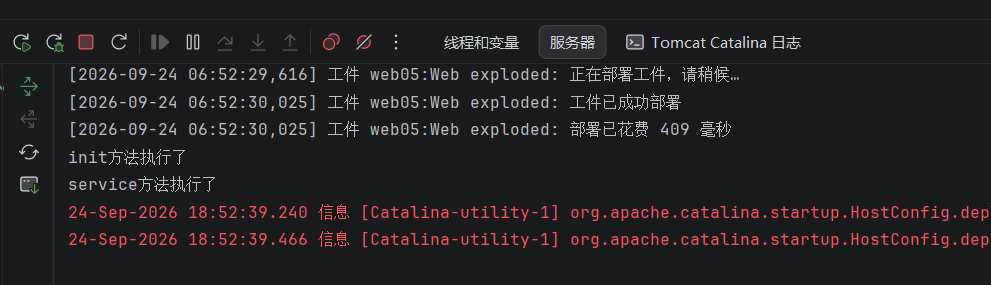

### 我们给这几个方法都添加一条输出语句来看看方法是否会执行，然后我们重启服务器，发现默认只有init和service方法被调用。


# 2.测试Servlet对象的生命周期

