# ServletConfig学习

## 1.ServletConfig对象的实例化

由服务器来完成，程序员不需要参与。

## 2.ServletConfig是什么

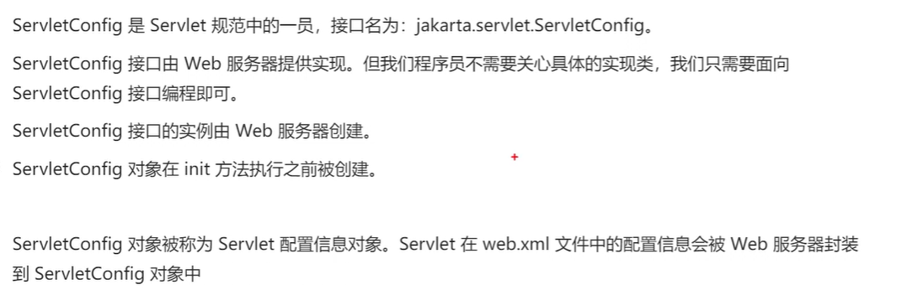

## 演练

### 2.1新建一个模块，起名web07，添加web支持并且创建工件(artifacts)

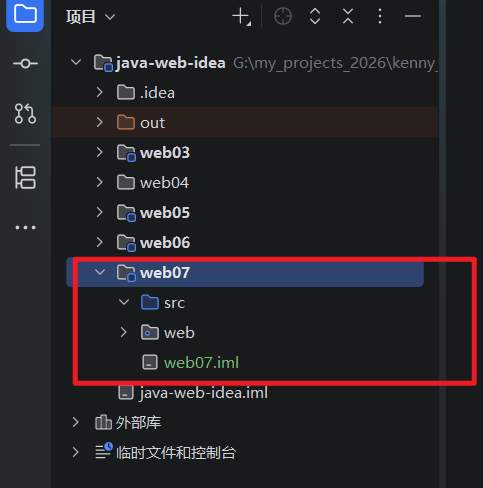

### 2.2在web08里面新建一个lib文件夹，然后把servlet-api.jar粘贴进来并且添加为库

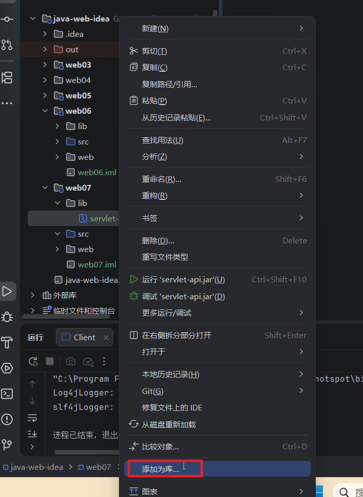

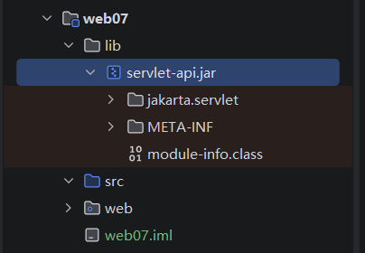


### 2.3 把我们的web07项目部署到服务器

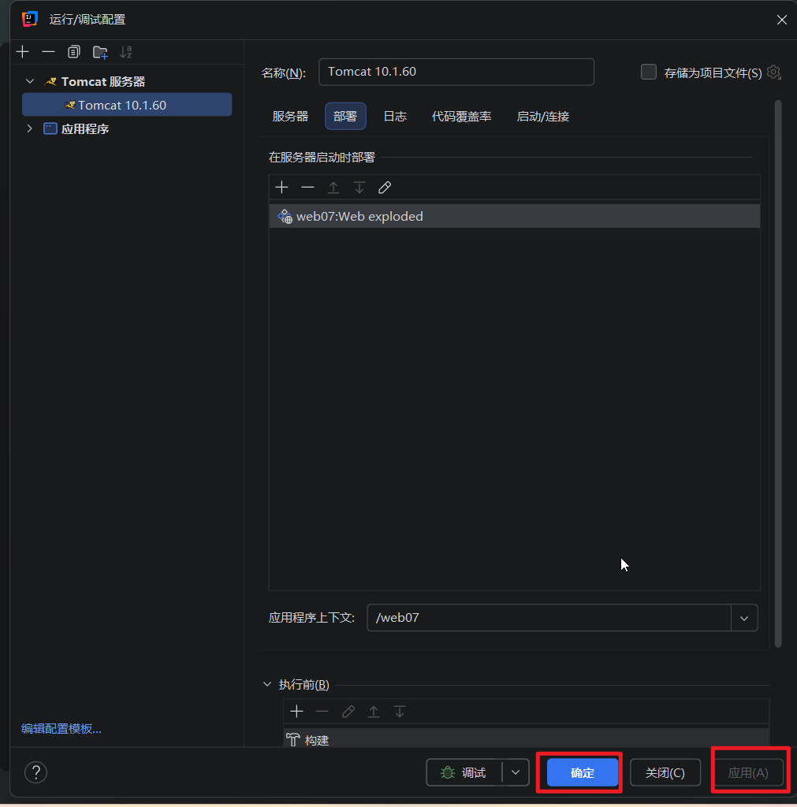

### 2.4然后我们新建一个org.kenny.servlet包，并且在里面新建一个类TestServletConifg，继承GenericServlet然后实现service方法

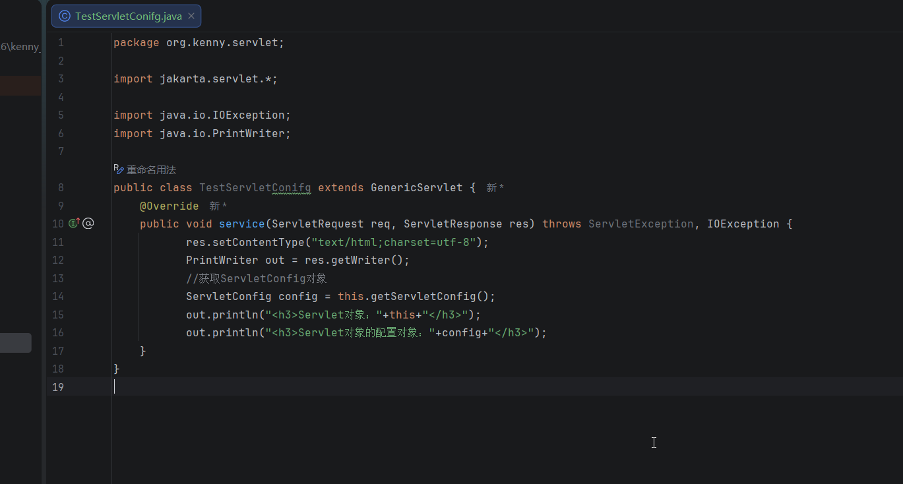

### 2.5 然后我们在web.xml中添加配置路径信息，并且给Servlet对象添加初始化参数

```
<?xml version="1.0" encoding="UTF-8"?>
<web-app xmlns="http://xmlns.jcp.org/xml/ns/javaee"
         xmlns:xsi="http://www.w3.org/2001/XMLSchema-instance"
         xsi:schemaLocation="http://xmlns.jcp.org/xml/ns/javaee http://xmlns.jcp.org/xml/ns/javaee/web-app_4_0.xsd"
         version="4.0">
    <servlet>
        <servlet-name>test</servlet-name>
        <servlet-class>org.kenny.servlet.TestServletConifg</servlet-class>
        <!--配置初始化参数 -->
        <init-param>
            <param-name>pageSize</param-name>
            <param-value>10</param-value>
        </init-param>
        <init-param>
            <param-name>driver</param-name>
            <param-value>com.mysql.cj.jdbc.Driver</param-value>
        </init-param>
        <init-param>
            <param-name>user</param-name>
            <param-value>root</param-value>
        </init-param>

        <init-param>
            <param-name>password</param-name>
            <param-value>root</param-value>
        </init-param>
        <init-param>
            <param-name>url</param-name>
            <param-value>jdbc:mysql://localhost:3306/company</param-value>
        </init-param>
    </servlet>
    <servlet-mapping>
        <servlet-name>test</servlet-name>
        <url-pattern>/test</url-pattern>
    </servlet-mapping>
    
</web-app>
```


### 2.6 然后我们大家idea顶部的调试按钮，在浏览器地址栏中输入：http://localhost:8080/web07/test，就可以看到这两个对象的内存地址

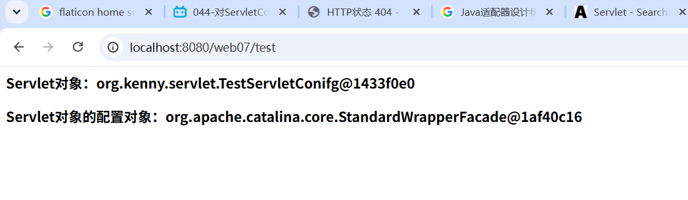

### 2.7 回到TestServletConfig的service方法，我们来遍历输出这些变量的名称和值

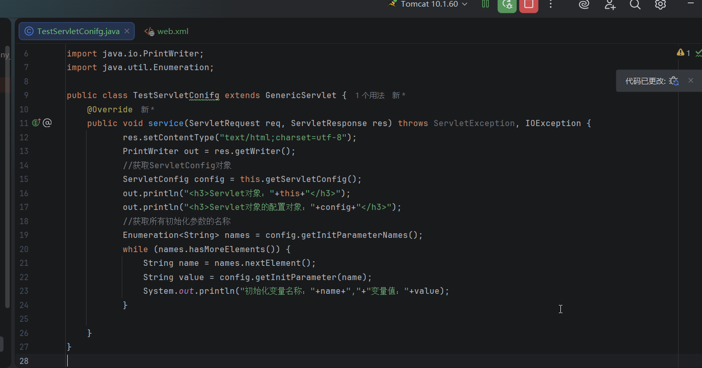

### 2.8 重启服务器，刷新浏览器，在控制台中看到我们的初始化变量和他们的值

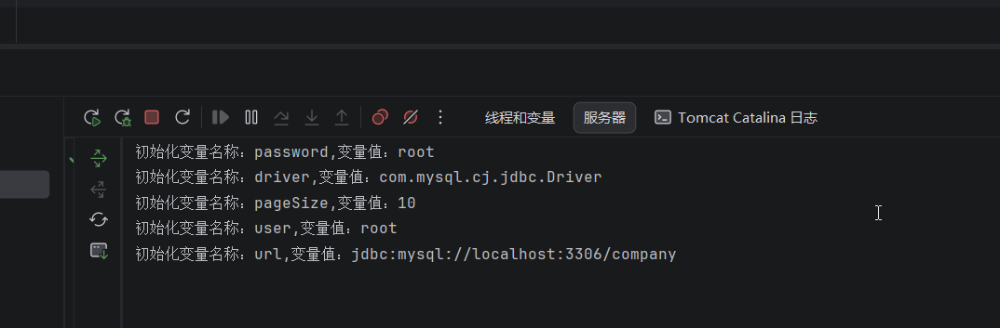

### 2.9 其实我们根本不需要获取ServletConfig对象，因为我们的父类它就有这些方法，我们可以直接通过this来调用

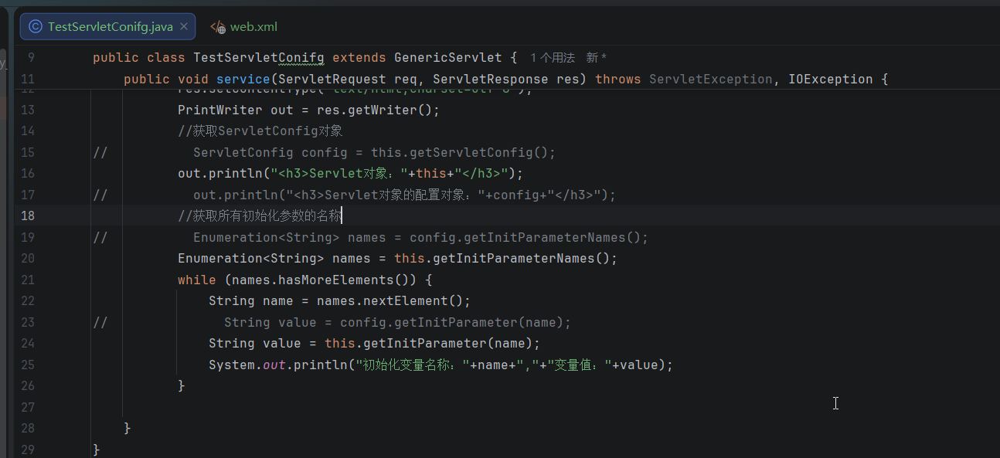

#### 效果是一样的

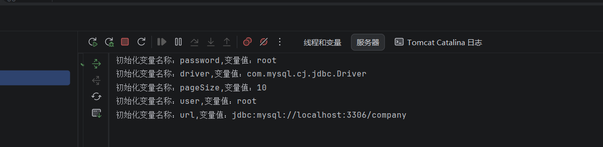

### 2.10可以通过ServletConfig对象获取Servlet的名称，也就是我们在web.xml里面配置的servlet-name

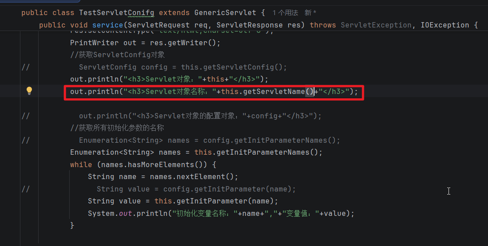

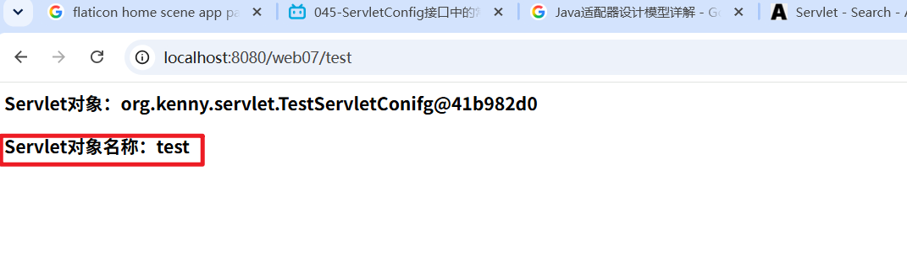

### 2.11还可以获取ServletContext对象

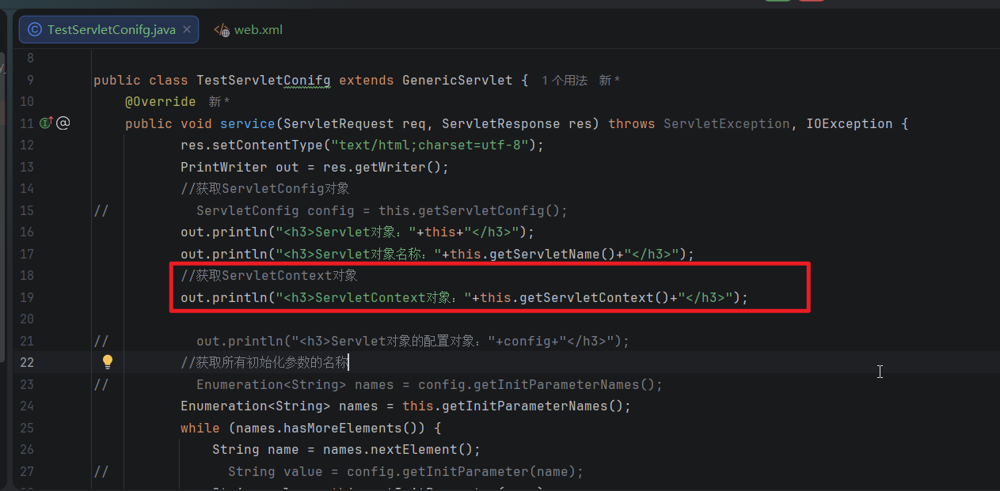


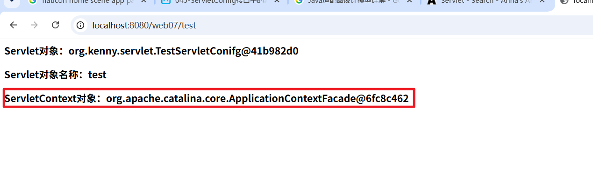

## 3.ServletConfig接口常用方法

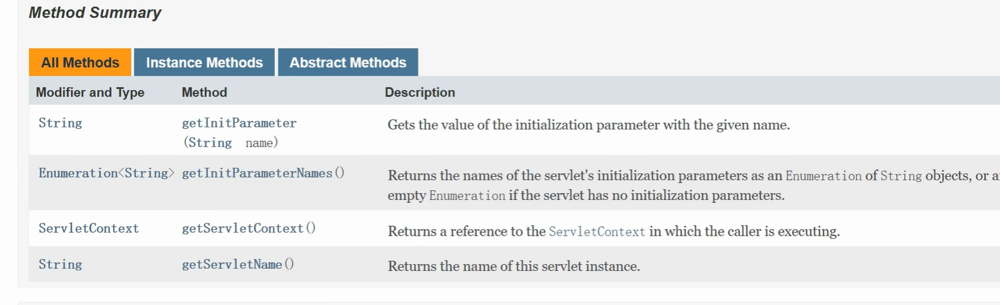