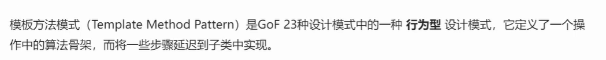
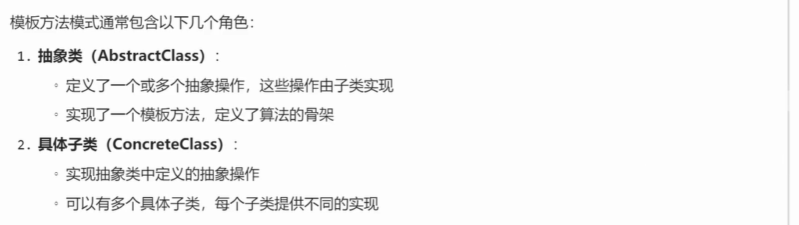
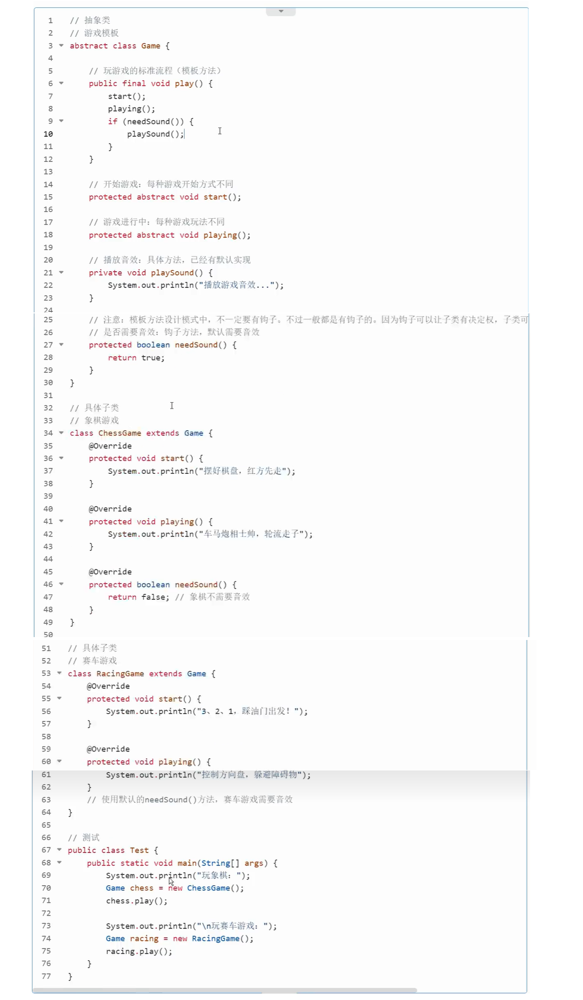
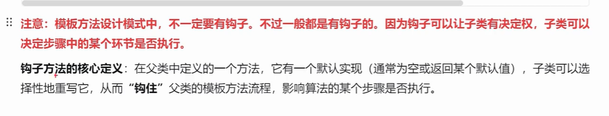
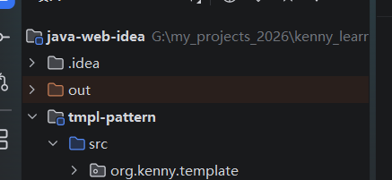
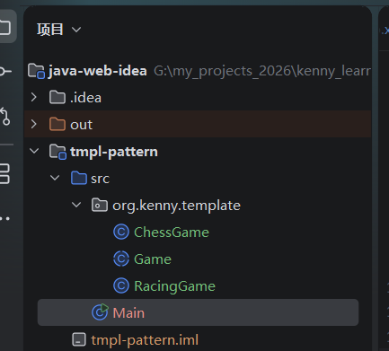
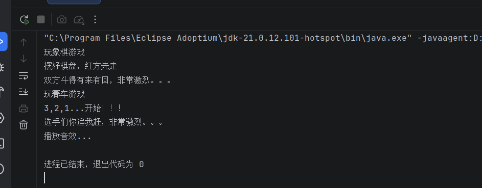
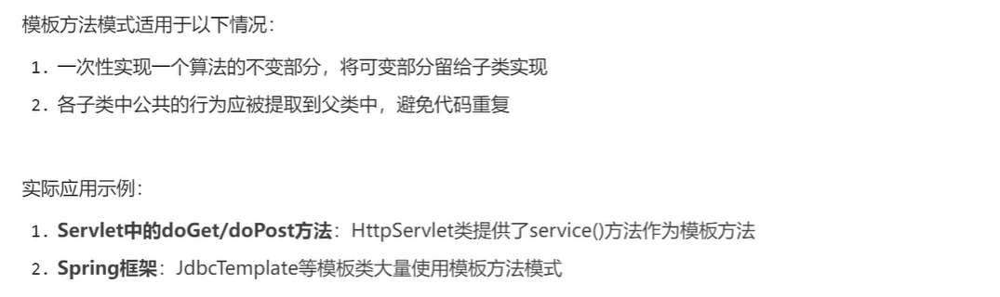
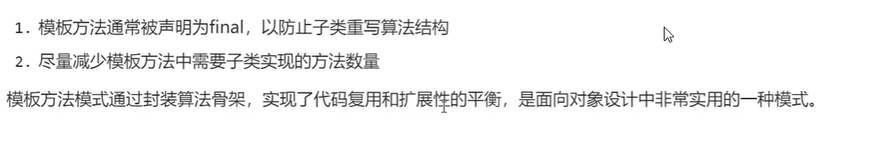

# 1.模板方法设计模式



## 1.1 核心概念


## 1.2 结构组成



## 1.3实例代码






## 设计要点解析

### 1.抽象类Game里面的play方法是核心方法，这是游戏的核心流程，我们并不希望子类重写这个方法，所以在方法前面添加final关键字

### 2.至于游戏怎么快速，游戏如何玩，每一个游戏的具体玩法都不一样，我们可以把这两个方法定义为抽象方法，让具体的子类来实现。

### 3.有一个playSound的私有方法，他是根据needSound钩子方法来决定是否需要调用。

### 4.needSound是一个钩子方法(可以选择性覆盖就叫做钩子方法)，用它，就可以控制是否要播放音效，默认是返回true，如果子类不需要音效，需要重写这个方法，返回false。

## 演练

### 1》新建一个Java模块，起名tmpl-pattern,然后在里面新建一个包org.kenny.template



### 2>在template里面新建一个Game.java,在里面定义一个抽象类Game，代码如下

```
package org.kenny.template;

public abstract class Game {
    //玩游戏的标准流程
    public final void play(){
        start();
        playing();
        if(needSound()){
            playSound();
        }
    }
    //开始游戏
    protected abstract void start();
    //游戏进行中
    protected abstract void playing();

    //播放音效，有默认实现
    private   void playSound(){
        System.out.println("播放音效...");
    }

    //钩子方法，是否需要音效
    protected boolean needSound(){
        return true;
    }
}

```

### 3>然后在template里面新建一个ChessGame.java文件，内容如下

```
package org.kenny.template;

public class ChessGame extends Game{
    @Override
    protected void start() {
        System.out.println("摆好棋盘，红方先走");
    }

    @Override
    protected void playing() {
        System.out.println("双方斗得有来有回，非常激烈。。。");
    }

    @Override
    protected boolean needSound() {
        return false; //象棋游戏可以不要音效
    }
}

```

### 4>然后在template包里面创建一个RacingGame.java,内容如下

```
package org.kenny.template;

public class RacingGame extends Game {
    @Override
    protected void start() {
        System.out.println("3,2,1...开始！！！");
    }

    @Override
    protected void playing() {
        System.out.println("选手们你追我赶，非常激烈。。。");
    }
}

```

### 5.然后在src文件夹里面新建一个Main类，代码如下

```
import org.kenny.template.ChessGame;
import org.kenny.template.RacingGame;

//TIP 要<b>运行</b>代码，请按 <shortcut actionId="Run"/> 或
// 点击装订区域中的 <icon src="AllIcons.Actions.Execute"/> 图标。
public class Main {
    public static void main(String[] args) {
        System.out.println("玩象棋游戏");
        ChessGame chessGame = new ChessGame();
        chessGame.play();
        System.out.println("玩赛车游戏");
        RacingGame racingGame = new RacingGame();
        racingGame.play();
    }
}
```

### 6.类结构视图如下



### 7.运行Main类里面的main方法，效果如下



## 1.4应用场景



## 1.5注意事项



# 2.HttpServlet源码剖析


## HTTPServlet源码分析

- HttpServelt类是专门为HTTP协议准备的。比GenericServlet更加适合HTTP协议下的开发。

- HttpServlet在哪个包下？

  - jakarta.servlet.http.HttpServlet

- 到目前为止我们接触了了servlet规范中的那些接口？

  - jakarta.servlet.Servelt 核心接口
  - jakarta.servlet.ServeltConfig Servlet配置信息接口
  - jakarta.servlet.ServeltContext Servlet上下文接口
  - jakarta.servlet.ServeltRequest Servlet请求接口
  - jakarta.servlet.ServeltResponse Servlet响应接口
  - jakarta.servlet.ServeltException Servlet 异常接口
  - jakarta.servlet.GenericServlet Servlet 实现类接口

- Http包下都有哪些类和接口呢？jakarta.servlet.http.*;

  > jakarta.servlet.http.HttpServlet(HTTP协议专用的Servlet类，抽象类)
  > jakarta.servlet.http.HttpServletRequest(HTTP协议专用的请求对象)
  > jakarta.servlet.http.HttpServletResponse（Http协议专用的响应对象）

- HttpServletRequest对象中封装了什么信息？

  > HttpServletRequest，简称request对象。
  > HttpServletRequest中封装了请求协议的全部内容。
  > Tomcat服务器（WEB服务器）将“请求协议”中的数据全部解析出来，然后将这些数据全部封装到了request对象当中了。
  > 也就说，我们要面向HttpServletRequest，就可以获取协议中的数据

- HttpServletResponse对象是专门用来响应HTTP协议到浏览器的。

- 回忆Servelt生命周期？

  1. 用户第一次请求

     > - Tomcat服务器通过反射机制，创建Servlet对象。（web.xml文件中的配置的Servlet类对应的对象。）
     > - Tomcat服务器调用Servlet对象的init方法完成初始化。
     > - Tomcat服务器调用Servlet对象的service方法处理请求。

  2. 用户的第二次请求

     > - Tomcat服务器调用Servlet对象的service方法处理请求。

     > - - Tomcat服务器调用Servlet对象的service方法处理请求。
     > - …（.Tomcat服务器调用Servlet对象的service方法处理请求。）
     > - 服务器关闭
     > - Tomcat服务器调用Servlet对象的destroy方法，做销毁之前的准备工作。

- HttpServlet 源码分析

  ```java
  public class HelloServlet extends HttpServlet {
      //用户第一次请求，创建HelloServlet对象的时候，会执行这个无参数构造方法。
      public HelloServlet(){}
  }
  public abstract class GenericServlet implements Servlet,ServletConfig,java.io.Serializable{
      //用户第一次请求的时候，HelloServlet对象第一次被创建之后，这个init方法会执行。
      public void init(ServletConfig config) throws ServletException{
          this.config = config;
          this.init()
      }
      //用户第一次请求的时候，带有参数的init（ServletConfig config）执行之后，会执行这个没有参数的init()
      public void init() throws ServletException{
          
      }
  }
  
  //HttpServlet是一个典型的模板类
  public abstract class HttpServlet extends GenericServlet{
      //用户发送第一次请求的时候这个service会执行
      //用户发送第N次请求的时候，这个service方法还是会执行。
      //用户只要发送一次请求，这个service方法就会执行一次。
       public void service(ServletRequest req, ServletResponse res)
           throws ServletException, IOException {
          HttpServletRequest request;
          HttpServletResponse response;
          try {
              //将ServletRequest和ServeltResponse向下转型为带有Http的HttpServletRequest和HttpServletResponse
              request = (HttpServletRequest)req;
              response = (HttpServletResponse)res;
          } catch (ClassCastException var6) {
              throw new ServletException(lStrings.getString("http.non_http"));
          }
  		//调用重载的service方法
          this.service(request, response);
      }
      
      //这个service方法的两个参数都是带有Http的
      //这个service是一个模板方法
      //在该方法中定义核心算法骨架，具体的实现步骤延迟到子类中去完成。
      protected void service(HttpServletRequest req, HttpServletResponse resp) throws ServletException, IOException {
          //获取请求方式
          //这个请求方式最终可能是：""
          //注意：request.getMethod()方法获取的是请求方式,可能是七种之一：
          //GET POST DELETE HEAD OPTIONS OOPTIONS TRACE
          String method = req.getMethod();
          long lastModified;
          if (method.equals("GET")) {
              lastModified = this.getLastModified(req);
              if (lastModified == -1L) {
                  this.doGet(req, resp);
              } else {
                  long ifModifiedSince;
                  try {
                      ifModifiedSince = req.getDateHeader("If-Modified-Since");
                  } catch (IllegalArgumentException var9) {
                      ifModifiedSince = -1L;
                  }
  
                  if (ifModifiedSince < lastModified / 1000L * 1000L) {
                      this.maybeSetLastModified(resp, lastModified);
                      this.doGet(req, resp);
                  } else {
                      resp.setStatus(304);
                  }
              }
          } else if (method.equals("HEAD")) {
              lastModified = this.getLastModified(req);
              this.maybeSetLastModified(resp, lastModified);
              this.doHead(req, resp);
          } else if (method.equals("POST")) {
              this.doPost(req, resp);
          } else if (method.equals("PUT")) {
              this.doPut(req, resp);
          } else if (method.equals("DELETE")) {
              this.doDelete(req, resp);
          } else if (method.equals("OPTIONS")) {
              this.doOptions(req, resp);
          } else if (method.equals("TRACE")) {
              this.doTrace(req, resp);
          } else {
              String errMsg = lStrings.getString("http.method_not_implemented");
              Object[] errArgs = new Object[]{method};
              errMsg = MessageFormat.format(errMsg, errArgs);
              resp.sendError(501, errMsg);
          }
  
      }
  }
  protected void doGet(HttpServletRequest req, HttpServletResponse resp) throws ServletException, IOException {
      //报405错误
          String msg = lStrings.getString("http.method_get_not_supported");
          this.sendMethodNotAllowed(req, resp, msg);
      }
  
  protected void doPost(HttpServletRequest req, HttpServletResponse resp) throws ServletException, IOException {
          String msg = lStrings.getString("http.method_post_not_supported");
          this.sendMethodNotAllowed(req, resp, msg);
      }
  
  /*
  通过以上源代码分析：
  	假设前端发送的请求是get请求，后端程序员重写的方法是doPost
  	假设前端发送的请求是Post请求，后端程序员重写的方法是doGet
  	会发生什么呢？
  	发生405这样的一个错误。
  	405表示前端你的错误，发送的请求方式不对。和服务器不一致。不是服务器需要的请求方式。
  	通过以上源代码可以知道：只要HttpServlet类中的doGet方法或doPost方法执行了，必然405.
  	怎么避免405错误呢？
  	后端重写doGet方法，前端一定要发get请求。
  	后端重写doPost方法，前端一定要发Post请求。 
  有的人，你会看到为了避免405错误，在Servlet类当中，将doGet和doPost方法都进行了重写。这样，确实可以避免405的放生，但是不建议，405错误还是有用的，该报错的时候应该让他报错。
  ```

- 我们编写的HelloServlet直接继承HttpServlet，直接重写HttpServlet类中的service()方法行吗？

  > 可以，只不过你享受不到405错误，享受不到HTTP协议专属的东西。

- 到今天我们终于得到了最终的一个Servlet类的开发步骤：

  > - 第一步：编写一个Servlet类，直接继承HttpServlet
  > - 第二步：重写doGet方法或者doPost方法，到底重写谁，程序员说了算。
  > - 第三步：将Servlet类配置到web.xml文件当中。
  > - 第四步：准备前端的页面（from表单），from表单中指定请求路径

## 演练

### 1.》给web07下面添加一个UserServlet，继承HttpServlet，注意，以后我们写的servlet都需要继承HttpServlet并且切记不要重写service方法，如果你需要处理get请求，就重写doGet方法，如果你需要处理Post请求，就重写doPost方法，以此类推，我们这里重写doGet,注意，这里不要调用父类的doGet方法，会抛异常,(这个方法的底层就是用来抛异常的)，我们是完全重写。


## 描述HttpServlet执行原理

HttpServlet 的执行原理核心在于**Servlet 容器（如 Tomcat）接收到客户端的 HTTP 请求后，通过多线程调度并调用 `service()` 方法，再分发到具体的 `doGet()` 或 `doPost()` 等方法中完成响应**。

核心执行流程

- **请求接收**：客户端（浏览器）发送 HTTP 请求到 Web 服务器，服务器（如 Tomcat）的**连接器（Connector）**监听到请求并将其包装成 `HttpServletRequest` 和 `HttpServletResponse` 对象。 
- **容器分发**：容器根据请求的 URL 路径匹配到对应的 Servlet 映射，从容器的**Servlet 缓存**中查找该 Servlet 实例（如果实例不存在，则先执行加载、实例化和 `init()` 初始化）。
- **调用 service 方法**：容器为每个请求创建一个**新的线程**，调用该 HttpServlet 对象的 `service(ServletRequest req, ServletResponse res)` 方法。 
- **分发至 doXXX 方法**：`HttpServlet` 的 `service()` 方法会将参数强转为 `HttpServletRequest` 和 `HttpServletResponse`，并获取 HTTP 请求方式（GET、POST 等）。
- **多态触发**：根据请求方式，`service()` 内部通过分支判断分别调用对应的 **`doGet()`、`doPost()`、`doPut()`** 等子方法。开发者在自定义 Servlet 中重写这些方法来实现具体业务逻辑。 
- **响应输出**：业务处理完毕后，数据写入 `HttpServletResponse` 对象，由容器将其转换为标准的 HTTP 响应报文发送回客户端。 [[1](https://cloud.baidu.com/article/3308493)]

生命周期简述

1. **加载与实例化**：容器启动时或首次请求时通过反射创建 Servlet 对象。
2. **初始化**：调用 `init()` 方法，仅执行一次。
3. **服务**：多次调用 `service()` 方法处理请求。
4. **销毁**：服务器关闭或应用卸载时调用 `destroy()` 方法释放资源


# 3.405错误的发生

是由于开发者没有根据前端的请求方法来编写对应的处理函数导致的。比如前端发送的是get请求，而程序员却在servlet里面重写了doPost方法，导致系统检测不到程序员的doGet代码，就会执行父类的doGet函数，而父类doGet函数就只是做一件事，就是抛出405错误。

要避免405错误也非常简单，就是根据请求方法来写对应的请求方法处理函数。


# 4.JavaWeb最佳实践

JavaWeb开发的最佳实践包括清晰的[代码分层](https://www.51cto.com/article/573085.html)、安全的[数据传输与加密防护](https://cloud.baidu.com/article/2695281)，以及高效的[前端与后端性能优化](https://blog.csdn.net/fm241694049/article/details/152588660)。 

架构与代码分层

- **职责分离**：采用经典的三层架构（Controller控制层、Service业务逻辑层、DAO数据访问层），让每一层各司其职，降低代码耦合度。
- **外部化配置**：将数据库连接、端口等敏感或易变配置放入外部的 `properties` 或 `yaml` 文件中，避免硬编码。
- **统一异常与日志**：在全局捕获异常，将检查异常转换为运行时异常或自定义异常，并添加适当的日志记录以便排查问题。

安全性考虑

- **密码加密**：用户注册和登录时使用盐值加密（如 BCrypt）安全存储密码，禁止明文保存。
- **输入校验与防攻击**：对所有用户输入进行过滤和转义，防止 SQL 注入和 XSS 跨站脚本攻击。
- **传输加密**：全面启用 HTTPS 协议，防止数据在传输过程中被窃取或篡改。 

性能优化

- **前端优化**：压缩合并静态资源（CSS、JS），开启浏览器缓存，对图片实施懒加载和压缩，减少网络传输与请求次数。
- **后端缓存**：合理利用 Redis 或本地缓存减轻数据库查询压力，提高系统响应速度。

进一步探索

- 了解具体的 黑马程序员最新版JavaWeb综合案例 获取实战与性能优化技巧。
- 参考 [Servlet/JSP核心技术巩固的最佳实践](https://zhuanlan.zhihu.com/p/22112669?refer=passer) 夯实底层基础。
- 查看 Java Web应用的代码分层最佳实践 深入学习解耦与事务处理逻辑。
