# 1.环境搭建


## 1.1新建一个模块，前面web08,并且添加web支持，并且创建工件artifacts


## 1.2 在web0b项目里面新建一个lib文件夹吧servlet-api.jar粘贴进来，然后作为库添加到classpath中


## 1.3.在 WEB-INF 在新建一个lib文件夹，把mysql驱动jar包粘贴进来


## 1.4 把我们前面的静态页面粘贴到web根目录里面，（静态页面有些东西需要修改）


## 1.5 把项目部署到tomcat，然后启动服务器，静态页面可以正常工作


## 1.6 在src文件夹里面新建一个包：org.kenny.dept.util,然后我们在里面创建一个DbUtil类型，代码如下

```
package org.kenny.dept.util;
import java.sql.*;
import java.util.*;


public class DbUtils {
    private static String driver;
    private static String url ;
    private static String user;
    private static String password;

    static {
        ResourceBundle bundle = ResourceBundle.getBundle("jdbc");
        //获取配置信息
        driver = bundle.getString("driver");
        url = bundle.getString("url");
        user = bundle.getString("user");
        password = bundle.getString("password");
        //注册启动
        try {
            Class.forName(driver);
        } catch (ClassNotFoundException e) {
            e.printStackTrace();
        }
    }

    public static Connection getConnection() throws SQLException {
        // 获取数据库连接对象
        Connection conn = DriverManager.getConnection(url,user,password);
        return conn;
    }

    public static void close(Connection conn, Statement ps, ResultSet rs){
        if(rs != null){
            try {
                rs.close();
            } catch (SQLException throwables) {
                throwables.printStackTrace();
            }
        }

        if(ps != null){
            try {
                ps.close();
            } catch (SQLException throwables) {
                throwables.printStackTrace();
            }
        }

        if(conn != null){
            try {
                conn.close();
            } catch (SQLException throwables) {
                throwables.printStackTrace();
            }
        }
    }


}

```


## 1.7 然后我们需要在src文件夹里面添加一个jdbc.properties配置文件，在里面配置数据库连接信息，我们使用company数据库，配置信息如下

```
driver=com.mysql.cj.jdbc.Driver
url=jdbc:mysql://localhost:3306/company
user=root
password=root

```

## 1.8然后我们打开navicat里面的company数据库，创建一个查询，用来创建dept数据表，这里我们先不让部门编号自动生成。代码如下

```
DROP TABLE IF EXISTS `dept`;
CREATE TABLE `dept`  (
  `DEPTNO` int NOT NULL PRIMARY KEY,
  `DNAME` varchar(255)  NOT NULL,
  `LOC` varchar(255) NOT NULL
) ENGINE = InnoDB CHARACTER SET = utf8mb4 COLLATE = utf8mb4_general_ci ROW_FORMAT = Dynamic;

-- ----------------------------
-- Records of dept
-- ----------------------------
INSERT INTO `dept` VALUES (1, 'ACCOUNTING', 'NEW YORK');
INSERT INTO `dept` VALUES (2, 'RESEARCH', 'DALLAS');
INSERT INTO `dept` VALUES (3, 'SALES', 'CHICAGO');
INSERT INTO `dept` VALUES (4, 'OPERATION', 'BOSTON');
```

### 在navicat中运行这个代码，就会创建一个dept数据表如下


## 至此，环境搭建完毕下一节我们来开始编码

# 2.部门列表

## 2.1还是上面的项目，我们新建应该包：org.kenny.dept.dao,然后在里面新建应该DeptDao接口。内容先留空


## 2.2 然后我们创建一个包org.kenny.dept.entity,然后在里面新建一个dept类，其实就是一个JavaBean对应数据库里面的一条记录。代码如下

```
package org.kenny.dept.entity;

/**
 * 这个类是用来封装数据库的一行数据的。
 * <p>
 * */
public class Dept {
    private int deptNo;
    private String dName;
    private String loc;

    //无参构造函数
    public Dept() {}
    //全参数构造函数
    public Dept(int deptNo, String dName, String loc) {
        this.deptNo = deptNo;
        this.dName = dName;
        this.loc = loc;
    }

    public int getDeptNo() {
        return deptNo;
    }

    public void setDeptNo(int deptNo) {
        this.deptNo = deptNo;
    }

    public String getdName() {
        return dName;
    }

    public void setdName(String dName) {
        this.dName = dName;
    }

    public String getLoc() {
        return loc;
    }

    public void setLoc(String loc) {
        this.loc = loc;
    }

    @Override
    public String toString() {
        return "Dept[deptNo=" + deptNo + ", dName=" + dName + ", loc=" + loc + "]";
    }
}

```

### 类结构如图


## 2.3 回到DeptDao,我们编写下面的代码,

```
package org.kenny.dept.dao;

import org.kenny.dept.entity.Dept;

import java.util.List;

/**
 * 专门完成增删改查的Dao接口
 * 使用Dao接口的好处是然Dao层和业务层解耦
 * 在Dao接口在不能定义业务代码，只能是crud操作
 * */
public interface DeptDao {
     //新增（保存部门）
     int insert(Dept dept);
     //修改部门信息
     int update(Dept newDept);
     //根据部门编号删除部门
     int deleteByNo(Integer deptNo);
     //获取所有部门数据
     List<Dept> selectAll();
     //根据部门编号查找部门
     Dept selectByNo(Integer deptNo);
     //查找最大的部门编号方法
     //本阶段，这里添加一个找到读取最大的deptNo的方法，方便我们加1计算新记录的deptNo，不过这个会有并发问题，这里暂时不考虑并发
     //我们的数据库里面DEPTNO没有设置自增长
     Integer selectMaxNo();
}

```


## 2.4然后我们在dao包里面新建一个impl子包，在里面新建一个DeptDaoImpl类，实现DeptDao接口的所有方法，代码如下

```
package org.kenny.dept.dao.impl;

import org.kenny.dept.dao.DeptDao;
import org.kenny.dept.entity.Dept;
import org.kenny.dept.util.DbUtils;

import java.sql.Connection;
import java.sql.PreparedStatement;
import java.sql.ResultSet;
import java.sql.SQLException;
import java.util.LinkedList;
import java.util.List;
/**
 * 注意：不应该在Dao里面关闭数据库连接对象，因为可能业务层还有调用。
 * */
public class DeptDaoImpl implements DeptDao {
    @Override
    public int insert(Dept dept) {
        String sql = "insert into dept(DEPTNO,DNAME,LOC) values(?,?,?)"; //使用预编译sql的方式
        int count=0;
        try(Connection conn = DbUtils.getConnection();
        PreparedStatement ps = conn.prepareStatement(sql);) {
          //用传递进来的dept对象的属性给sql语句的对应的变量赋值
          ps.setInt(1, dept.getDeptNo());
          ps.setString(2, dept.getdName());
          ps.setString(3, dept.getLoc());
          count = ps.executeUpdate();
        } catch (Exception e) {
            //注意，这里不能只用e.printStackTrace()方法，因为正常来说，不应该在Dao中吞没异常
            //有异常应该往上抛给业务层
            e.printStackTrace();
            throw new RuntimeException(e);
        }
        return count;
    }

    @Override
    public int update(Dept newDept) {
        String sql = "update dept set DNAME=?,LOC=? where DEPTNO=?"; //使用预编译sql的方式
        int count=0;
        try(Connection conn = DbUtils.getConnection();
            PreparedStatement ps = conn.prepareStatement(sql);) {
            //用传递进来的dept对象的属性给sql语句的对应的变量赋值
            ps.setString(1, newDept.getdName());
            ps.setString(2, newDept.getLoc());
            ps.setInt(3, newDept.getDeptNo());
            count = ps.executeUpdate();
        } catch (Exception e) {
            //注意，这里不能只用e.printStackTrace()方法，因为正常来说，不应该在Dao中吞没异常
            //有异常应该往上抛给业务层
            e.printStackTrace();
            throw new RuntimeException(e);
        }
        return count;
    }

    @Override
    public int deleteByNo(Integer deptNo) {
        String sql = "delete from dept where DEPTNO=?"; //使用预编译sql的方式
        int count=0;
        try(Connection conn = DbUtils.getConnection();
            PreparedStatement ps = conn.prepareStatement(sql);) {
            //用传递进来的dept对象的属性给sql语句的对应的变量赋值
            ps.setInt(1, deptNo);
            count = ps.executeUpdate();
        } catch (Exception e) {
            //注意，这里不能只用e.printStackTrace()方法，因为正常来说，不应该在Dao中吞没异常
            //有异常应该往上抛给业务层
            e.printStackTrace();
            throw new RuntimeException(e);
        }
        return count;
    }

    @Override
    public List<Dept> selectAll() {
        String sql = "select * from dept"; //使用预编译sql的方式
        List<Dept> deptList = new LinkedList<Dept>();
        Dept dept = null;
        try(Connection conn = DbUtils.getConnection();
            PreparedStatement ps = conn.prepareStatement(sql);
            ResultSet rs = ps.executeQuery();
            ) {
            //用传递进来的dept对象的属性给sql语句的对应的变量赋值
            while(rs.next()) {
                dept = new Dept(rs.getInt("DEPTNO"),rs.getString("DNAME"),rs.getString("LOC"));
                deptList.add(dept);
            }


        } catch (Exception e) {
            //注意，这里不能只用e.printStackTrace()方法，因为正常来说，不应该在Dao中吞没异常
            //有异常应该往上抛给业务层
            e.printStackTrace();
            throw new RuntimeException(e);
        }

        return deptList;

    }

    @Override
    public Dept selectByNo(Integer deptNo) {
        String sql = "select * from dept where DEPTNO=?"; //使用预编译sql的方式
        Dept dept = null;
        try(Connection conn = DbUtils.getConnection();
            PreparedStatement ps = conn.prepareStatement(sql);) {
            //用传递进来的dept对象的属性给sql语句的对应的变量赋值
            ps.setInt(1,deptNo);
            try(ResultSet rs = ps.executeQuery()) {
                if(rs.next()) {
                    dept = new Dept(rs.getInt("DEPTNO"),rs.getString("DNAME"),rs.getString("LOC"));
                }
            }

        } catch (Exception e) {
            //注意，这里不能只用e.printStackTrace()方法，因为正常来说，不应该在Dao中吞没异常
            //有异常应该往上抛给业务层
            e.printStackTrace();
            throw new RuntimeException(e);
        }

        return dept;
    }

    @Override
    public Integer selectMaxNo() {
        String sql = "select  max(DEPTNO) from dept";
        int deptno=0;
        try(Connection conn = DbUtils.getConnection();
            PreparedStatement ps = conn.prepareStatement(sql);
            ResultSet rs = ps.executeQuery();
            ) {
            if(rs.next()) {
                deptno = rs.getInt(1);
            }
        } catch (Exception e) {
            //注意，这里不能只用e.printStackTrace()方法，因为正常来说，不应该在Dao中吞没异常
            //有异常应该往上抛给业务层
            e.printStackTrace();
            throw new RuntimeException(e);
        }
        return deptno;
    }
}

```

### 类视图结构如下


## 2.5我们在org.kenny.dept里面新建应该子包servlet，在里面新建一个DeptListServlet类，我们先写一些静态页面代码，看看能否正常显示

```
package org.kenny.dept.servlet;

import jakarta.servlet.ServletException;
import jakarta.servlet.annotation.WebServlet;
import jakarta.servlet.http.HttpServlet;
import jakarta.servlet.http.HttpServletRequest;
import jakarta.servlet.http.HttpServletResponse;
import org.kenny.dept.dao.impl.DeptDaoImpl;
import org.kenny.dept.entity.Dept;

import java.io.IOException;
import java.io.PrintWriter;
import java.util.List;

@WebServlet("/list")
public class DeptListServlet extends HttpServlet {
    @Override
    protected void doGet(HttpServletRequest req, HttpServletResponse resp) throws ServletException, IOException {
        //设置响应内容类型和编码
        resp.setContentType("text/html;charset=utf-8");
        //获取页面的输出对象
        PrintWriter out = resp.getWriter();
        out.println("""
                <!DOCTYPE html>
                   <html lang="en">
                   <head>
                       <meta charset="UTF-8">
                       <meta name="viewport" content="width=device-width, initial-scale=1.0">
                       <title>Document</title>
                       <link href="https://cdn.jsdelivr.net/npm/bootstrap@4.6.2/dist/css/bootstrap.min.css" rel="stylesheet" type="text/css" />
                       <link href="/css/style.css" rel="stylesheet">
                   </head>
                   <body>
                       <main class="container" style="margin-top:22px;">
                         <section class="page">
                           <div class="page-header">
                               <div class="d-flex justify-content-between">
                                   <h3>部门列表</h3>
                                   <a class="btn btn-primary btn-sm mb-2" href="add.html">＋ 新增部门</a>
                               </div>
                           <div>
                                <div class="table-wrap">
                                   <table class="table table-bordered">
                                       <thead>
                                       <tr>
                                           <th>部门编号</th>
                                           <th>部门名称</th>
                                           <th>部门地址</th>
                                           <th>操作</th>
                                       </tr>
                                       </thead>
                                       <tbody id="deptBody">
                                       <tr>
                                           <td>部门编号</td>
                                           <td>部门名称</td>
                                           <td>部门地址</td>
                                           <td>
                                           <a href=" " class="btn btn-success btn-sm">查看</a>
                                           <a href=" " class="btn btn-warning btn-sm">修改</a>
                                           <a href=" " class="btn btn-danger btn-sm">删除</a>
                                           </td>
                                       </tr>
                                       </tbody>
                                   </table>
                                   <div class="d-flex justify-content-right">
                                      <button class="btn btn-light btn-sm" style="margin-left: auto;">退出登录</button>
                                   </div>
                               </div>
                           </div>
                       </section>
                   </main>
               </body>
               </html>
                """);
        List<Dept> deptList = null;
        DeptDaoImpl deptDao = new DeptDaoImpl();
        deptList = deptDao.selectAll();

    }
}

```

## 2.6 把项目重新部署，把根路径改为/dept


## 2.7启动服务器，在浏览器中输入：http://localhost:8080/dept/list， 效果如下

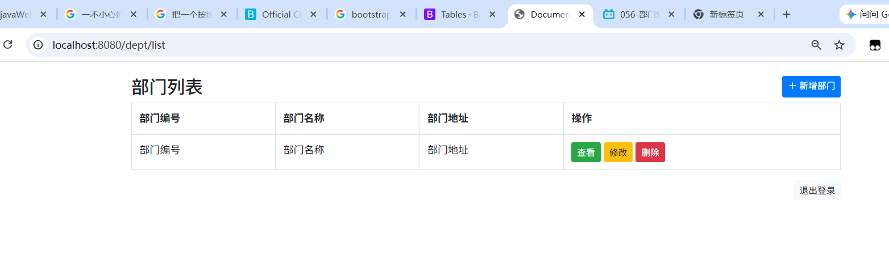

## 2.8.我们现在需要把数据变为动态的，需要把上面的输出分割成3部分，头部，中间部分的数据输出部分和尾部。然后我们需要导入dao对象修改后代码如下

```
package org.kenny.dept.servlet;

import jakarta.servlet.ServletException;
import jakarta.servlet.annotation.WebServlet;
import jakarta.servlet.http.HttpServlet;
import jakarta.servlet.http.HttpServletRequest;
import jakarta.servlet.http.HttpServletResponse;
import org.kenny.dept.dao.DeptDao;
import org.kenny.dept.dao.impl.DeptDaoImpl;
import org.kenny.dept.entity.Dept;

import java.io.IOException;
import java.io.PrintWriter;
import java.util.List;

@WebServlet("/list")
public class DeptListServlet extends HttpServlet {

    //定义一个dao成员变量
    private DeptDao deptDao = new DeptDaoImpl();

    @Override
    protected void doGet(HttpServletRequest req, HttpServletResponse resp) throws ServletException, IOException {

        //设置响应内容类型和编码
        resp.setContentType("text/html;charset=utf-8");
        //获取所有部门信息
        List<Dept> deptList = null;
        deptDao = new DeptDaoImpl();
        deptList = deptDao.selectAll();

        //获取页面的输出对象
        PrintWriter out = resp.getWriter();
        out.println("""
                 <!DOCTYPE html>
                 <html lang="zh-CN">
                 <head>
                     <meta charset="UTF-8">
                     <meta name="viewport" content="width=device-width, initial-scale=1.0">
                     <title>部门管理系统 - 部门列表</title>
                     <style>
                         * {
                             margin: 0;
                             padding: 0;
                             box-sizing: border-box;
                             font-family: 'Arial', sans-serif;
                         }
                         body {
                             background-color: #f5f5f5;
                         }
                         .container {
                             max-width: 1200px;
                             margin: 0 auto;
                             padding: 20px;
                         }
                         .header {
                             display: flex;
                             justify-content: space-between;
                             align-items: center;
                             margin-bottom: 30px;
                         }
                         .header h1 {
                             color: #333;
                             font-size: 24px;
                         }
                         .add-btn {
                             padding: 10px 20px;
                             background-color: #4a90e2;
                             color: white;
                             border: none;
                             border-radius: 4px;
                             cursor: pointer;
                             text-decoration: none;
                             font-size: 14px;
                             transition: background-color 0.3s;
                         }
                         .add-btn:hover {
                             background-color: #3a7bc8;
                         }
                         .department-table {
                             width: 100%;
                             border-collapse: collapse;
                             background-color: white;
                             box-shadow: 0 2px 8px rgba(0, 0, 0, 0.1);
                             border-radius: 4px;
                             overflow: hidden;
                         }
                         .department-table th, .department-table td {
                             padding: 15px;
                             text-align: left;
                             border-bottom: 1px solid #eee;
                         }
                         .department-table th {
                             background-color: #f8f9fa;
                             font-weight: 600;
                             color: #555;
                         }
                         .department-table tr:hover {
                             background-color: #f8f9fa;
                         }
                         .action-btn {
                             padding: 6px 12px;
                             margin-right: 5px;
                             border: none;
                             border-radius: 4px;
                             cursor: pointer;
                             font-size: 13px;
                             transition: all 0.3s;
                             text-decoration: none;
                             display: inline-block;
                         }
                         .view-btn {
                             background-color: #5cb85c;
                             color: white;
                         }
                         .view-btn:hover {
                             background-color: #4cae4c;
                         }
                         .edit-btn {
                             background-color: #f0ad4e;
                             color: white;
                         }
                         .edit-btn:hover {
                             background-color: #eea236;
                         }
                         .delete-btn {
                             background-color: #d9534f;
                             color: white;
                         }
                         .delete-btn:hover {
                             background-color: #d43f3a;
                         }
                         .logout {
                             text-align: right;
                             margin-top: 20px;
                         }
                         .logout a {
                             color: #777;
                             text-decoration: none;
                             font-size: 14px;
                         }
                         .logout a:hover {
                             color: #333;
                         }
                     </style>
                 </head>
                 <body>
                     <div class="container">
                         <div class="header">
                             <h1>部门列表</h1>
                             <a href="add.html" class="add-btn">添加部门</a>
                         </div>
                
                         <table class="department-table">
                             <thead>
                                 <tr>
                                     <th>部门编号</th>
                                     <th>部门名称</th>
                                     <th>部门地理位置</th>
                                     <th>操作</th>
                                 </tr>
                             </thead>
                             <tbody>
                """);
        //需要动态获取项目的根路径，防止我们修改了项目名称找不到根路径
        //String rootPath = this.getServletContext().getContextPath();
        String rootPath = req.getContextPath(); //HttpServletRequest也可以获取到
        deptList.forEach(dept -> {
               out.print("<tr>");
               out.print("<td>"+dept.getDeptNo()+"</td>");
               out.print("<td>"+dept.getdName()+"</td>");
               out.print("<td>"+dept.getLoc()+"</td>");
               out.print("<td>");
               out.print("<a href='"+rootPath+"/detail?id="+dept.getDeptNo()+"' class='action-btn view-btn'>查看</a>"+" ");
               out.print("<a href=' ' class='action-btn edit-btn'>修改</a>"+" ");
               out.print("<a href='#' class='action-btn delete-btn' onclick=''>删除</a>"+" ");
               out.print("</td>");
               out.print("</tr>");
        });


        out.println("""                          
                                      </tbody>
                               </table>
                               <div class="logout">
                                   <a href="">退出登录</a>
                               </div>
                           </div>
                       </body>
                       </html>
               """);


    }
}

```

## 2.9 重启服务器，在浏览器地址栏中输入：http://localhost:8080/dept/list， 就可以看到我们的部门列表

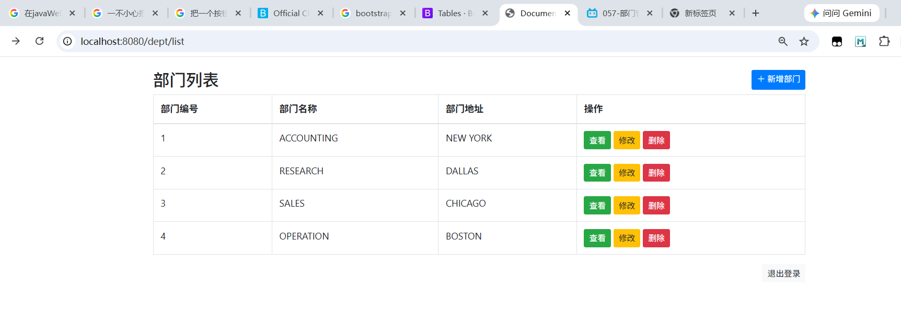

# 3.查看部门(详情)

## 3.1.我们把上面的代码中的查看对应的a并且的链接修改一下，如图

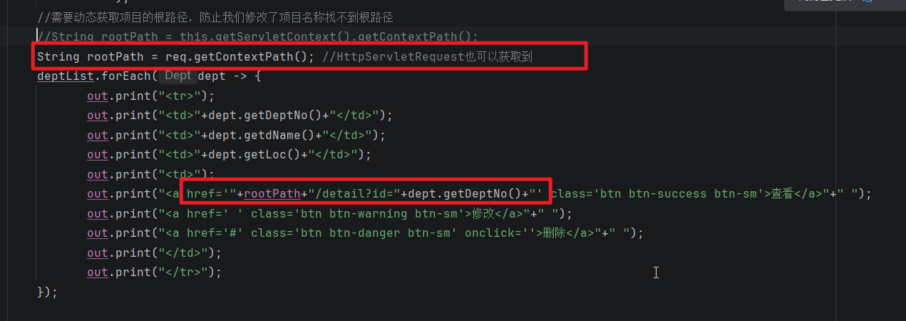

## 3.2 在servlet包里面新建一个DeptDetailServlet类，继承HttpServlet，还是实现doGet方法

```
package org.kenny.dept.servlet;

import jakarta.servlet.ServletException;
import jakarta.servlet.annotation.WebServlet;
import jakarta.servlet.http.HttpServlet;
import jakarta.servlet.http.HttpServletRequest;
import jakarta.servlet.http.HttpServletResponse;
import org.kenny.dept.dao.impl.DeptDaoImpl;
import org.kenny.dept.entity.Dept;

import java.io.IOException;
import java.io.PrintWriter;

@WebServlet("/detail")
public class DeptDetailServlet extends HttpServlet {
    @Override
    protected void doGet(HttpServletRequest req, HttpServletResponse resp) throws ServletException, IOException {
        int deptId = Integer.parseInt(req.getParameter("id"));
        Dept dept = new DeptDaoImpl().selectByNo(deptId);
        resp.setContentType("text/html;charset=utf-8");
        PrintWriter out = resp.getWriter();
        //获取项目根路径，这里是/dept/,方便动态路径拼接
        String rootPath = req.getContextPath(); //HttpServletRequest也可以获取到
        out.print("""
                <!DOCTYPE html>
                <html lang="zh-CN">
                <head>
                    <meta charset="UTF-8">
                    <meta name="viewport" content="width=device-width, initial-scale=1.0">
                    <title>部门管理系统 - 部门详情</title>
                    <style>
                        * {
                            margin: 0;
                            padding: 0;
                            box-sizing: border-box;
                            font-family: 'Arial', sans-serif;
                        }
                        body {
                            background-color: #f5f5f5;
                        }
                        .container {
                            max-width: 800px;
                            margin: 30px auto;
                            padding: 30px;
                            background-color: white;
                            border-radius: 8px;
                            box-shadow: 0 2px 8px rgba(0, 0, 0, 0.1);
                        }
                        .header {
                            display: flex;
                            justify-content: space-between;
                            align-items: center;
                            margin-bottom: 30px;
                            padding-bottom: 15px;
                            border-bottom: 1px solid #eee;
                        }
                        .header h1 {
                            color: #333;
                            font-size: 24px;
                        }
                        .back-btn {
                            padding: 8px 16px;
                            background-color: #6c757d;
                            color: white;
                            border: none;
                            border-radius: 4px;
                            cursor: pointer;
                            text-decoration: none;
                            font-size: 14px;
                            transition: background-color 0.3s;
                        }
                        .back-btn:hover {
                            background-color: #5a6268;
                        }
                        .detail-card {
                            padding: 20px;
                            border-radius: 6px;
                            background-color: #f8f9fa;
                        }
                        .detail-row {
                            display: flex;
                            margin-bottom: 15px;
                            padding-bottom: 15px;
                            border-bottom: 1px solid #e9ecef;
                        }
                        .detail-row:last-child {
                            margin-bottom: 0;
                            padding-bottom: 0;
                            border-bottom: none;
                        }
                        .detail-label {
                            width: 150px;
                            font-weight: 600;
                            color: #495057;
                        }
                        .detail-value {
                            flex: 1;
                            color: #212529;
                        }
                        .action-btns {
                            margin-top: 30px;
                            text-align: right;
                        }
                        .edit-btn {
                            padding: 10px 20px;
                            background-color: #f0ad4e;
                            color: white;
                            border: none;
                            border-radius: 4px;
                            cursor: pointer;
                            text-decoration: none;
                            font-size: 14px;
                            transition: background-color 0.3s;
                        }
                        .edit-btn:hover {
                            background-color: #eea236;
                        }
                    </style>
                </head>
                <body>
                """);
        out.print("""
                 <div class="container">
                        <div class="header">
                            <h1>部门详细信息</h1>""");
        out.print("<a href='"+rootPath+"/list' class='back-btn'>返回列表</a>");
        out.print("</div>");


        out.print("""
                <div class="detail-card">
                <div class="detail-row">
                <div class="detail-label">部门编号</div>
               """);
        out.print("<div class='detail-value'>"+dept.getDeptNo()+"</div></div>");
        out.print("""
                <div class="detail-row">
                <div class="detail-label">部门名称</div>
               """);
        out.print("<div class='detail-value'>"+dept.getdName()+"</div></div>");
        out.print("""
                <div class="detail-row">
                <div class="detail-label">部门地理位置</div>
               """);
        out.print("<div class='detail-value'>"+dept.getLoc()+"</div></div>");
        out.print("""
                <div class="action-btns">""");
        out.print(" <a href='"+rootPath +"/edit' class='edit-btn'>编辑部门信息</a>");
        out.print("""
                 </div>
                    </div>
                </body>
                </html>
          """) ;


    }
}

```

### 在部门列表中选择一个部门，点击查看，就会进入/dept/detail

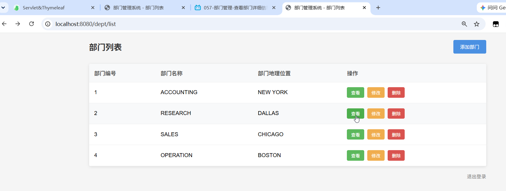

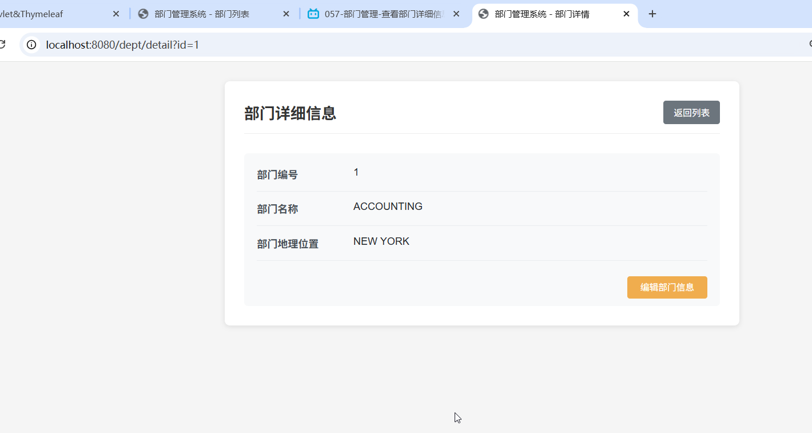

### 点击返回列表，就会返回到部门列表，这里我们还没有实现编辑页面，点击按钮暂时会报错，等到我们实现了编辑功能，就可以正常跳转

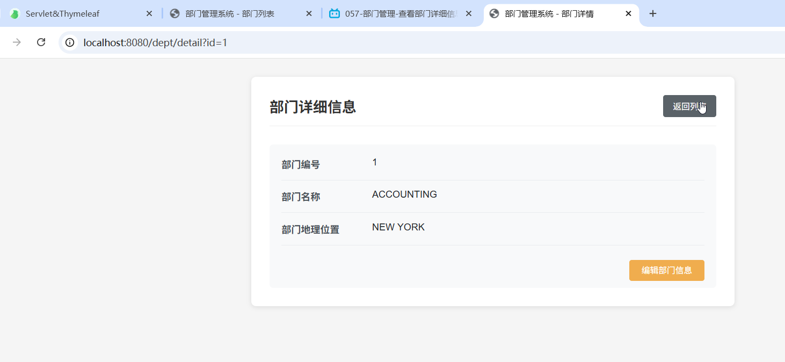

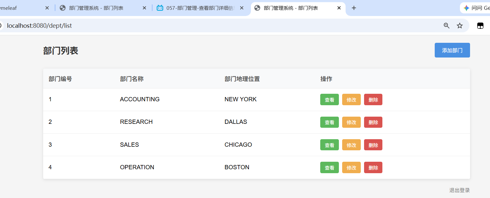


# 4.删除部门

## 4.1我们在用户点击了输出按钮后，其实需要先退出一个确认消息框，只有用户点击了确定后，我们才删除，这个功能弹窗需要在DeptListServlet里面完成，

### 我们修改DeptListServlet的代码如下

```
package org.kenny.dept.servlet;

import jakarta.servlet.ServletException;
import jakarta.servlet.annotation.WebServlet;
import jakarta.servlet.http.HttpServlet;
import jakarta.servlet.http.HttpServletRequest;
import jakarta.servlet.http.HttpServletResponse;
import org.kenny.dept.dao.DeptDao;
import org.kenny.dept.dao.impl.DeptDaoImpl;
import org.kenny.dept.entity.Dept;

import java.io.IOException;
import java.io.PrintWriter;
import java.util.List;

@WebServlet("/list")
public class DeptListServlet extends HttpServlet {

    //定义一个dao成员变量
    private DeptDao deptDao = new DeptDaoImpl();

    @Override
    protected void doGet(HttpServletRequest req, HttpServletResponse resp) throws ServletException, IOException {
        resp.setContentType("text/html;charset=utf-8");
        //获取所有部门信息
        List<Dept> deptList = null;
        deptDao = new DeptDaoImpl();
        deptList = deptDao.selectAll();
        //需要动态获取项目的根路径，防止我们修改了项目名称找不到根路径
        //String rootPath = this.getServletContext().getContextPath();
        String rootPath = req.getContextPath(); //HttpServletRequest也可以获取到
        //设置响应内容类型和编码
        //获取页面的输出对象
        PrintWriter out = resp.getWriter();
        out.println("""
                 <!DOCTYPE html>
                 <html lang="zh-CN">
                 <head>
                     <meta charset="UTF-8">
                     <meta name="viewport" content="width=device-width, initial-scale=1.0">
                     <title>部门管理系统 - 部门列表</title>
                     <script>
                             function del(deptNo){
                                 if(window.confirm("删除是不可恢复的，你确定要删除该部门吗?")){
                 """);
        out.print("document.location.href='"+rootPath+"/delete?id='+deptNo"); //注意：rootPath前面不要加‘/’
        out.print("""
                                                      }
                             }
                         </script>
                     <style>
                         * {
                             margin: 0;
                             padding: 0;
                             box-sizing: border-box;
                             font-family: 'Arial', sans-serif;
                         }
                         body {
                             background-color: #f5f5f5;
                         }
                         .container {
                             max-width: 1200px;
                             margin: 0 auto;
                             padding: 20px;
                         }
                         .header {
                             display: flex;
                             justify-content: space-between;
                             align-items: center;
                             margin-bottom: 30px;
                         }
                         .header h1 {
                             color: #333;
                             font-size: 24px;
                         }
                         .add-btn {
                             padding: 10px 20px;
                             background-color: #4a90e2;
                             color: white;
                             border: none;
                             border-radius: 4px;
                             cursor: pointer;
                             text-decoration: none;
                             font-size: 14px;
                             transition: background-color 0.3s;
                         }
                         .add-btn:hover {
                             background-color: #3a7bc8;
                         }
                         .department-table {
                             width: 100%;
                             border-collapse: collapse;
                             background-color: white;
                             box-shadow: 0 2px 8px rgba(0, 0, 0, 0.1);
                             border-radius: 4px;
                             overflow: hidden;
                         }
                         .department-table th, .department-table td {
                             padding: 15px;
                             text-align: left;
                             border-bottom: 1px solid #eee;
                         }
                         .department-table th {
                             background-color: #f8f9fa;
                             font-weight: 600;
                             color: #555;
                         }
                         .department-table tr:hover {
                             background-color: #f8f9fa;
                         }
                         .action-btn {
                             padding: 6px 12px;
                             margin-right: 5px;
                             border: none;
                             border-radius: 4px;
                             cursor: pointer;
                             font-size: 13px;
                             transition: all 0.3s;
                             text-decoration: none;
                             display: inline-block;
                         }
                         .view-btn {
                             background-color: #5cb85c;
                             color: white;
                         }
                         .view-btn:hover {
                             background-color: #4cae4c;
                         }
                         .edit-btn {
                             background-color: #f0ad4e;
                             color: white;
                         }
                         .edit-btn:hover {
                             background-color: #eea236;
                         }
                         .delete-btn {
                             background-color: #d9534f;
                             color: white;
                         }
                         .delete-btn:hover {
                             background-color: #d43f3a;
                         }
                         .logout {
                             text-align: right;
                             margin-top: 20px;
                         }
                         .logout a {
                             color: #777;
                             text-decoration: none;
                             font-size: 14px;
                         }
                         .logout a:hover {
                             color: #333;
                         }
                     </style>
                 </head>
                 <body>
                     <div class="container">
                         <div class="header">
                             <h1>部门列表</h1>
                             <a href="add.html" class="add-btn">添加部门</a>
                         </div>
                
                         <table class="department-table">
                             <thead>
                                 <tr>
                                     <th>部门编号</th>
                                     <th>部门名称</th>
                                     <th>部门地理位置</th>
                                     <th>操作</th>
                                 </tr>
                             </thead>
                             <tbody>
                """);

        deptList.forEach(dept -> {
               out.print("<tr>");
               out.print("<td>"+dept.getDeptNo()+"</td>");
               out.print("<td>"+dept.getdName()+"</td>");
               out.print("<td>"+dept.getLoc()+"</td>");
               out.print("<td>");
               out.print("<a href='"+rootPath+"/detail?id="+dept.getDeptNo()+"' class='action-btn view-btn'>查看</a>"+" ");
               out.print("<a href=' ' class='action-btn edit-btn'>修改</a>"+" ");
               out.print("<a href='#' class='action-btn delete-btn' onclick='del("+dept.getDeptNo()+")'>删除</a>"+" ");
               out.print("</td>");
               out.print("</tr>");
        });


        out.println("""                          
                                      </tbody>
                               </table>
                               <div class="logout">
                                   <a href="">退出登录</a>
                               </div>
                           </div>
                       </body>
                       </html>
               """);


    }
}

```


## 4.2然后重启服务器，此时你点击删除，会弹出一个确认窗口，这是js代码做到的，

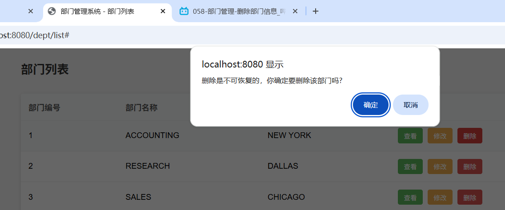

## 然后你点击确认后，页面的url是能够跳转的，不过此时出现404因为我们的删除路径还没有写

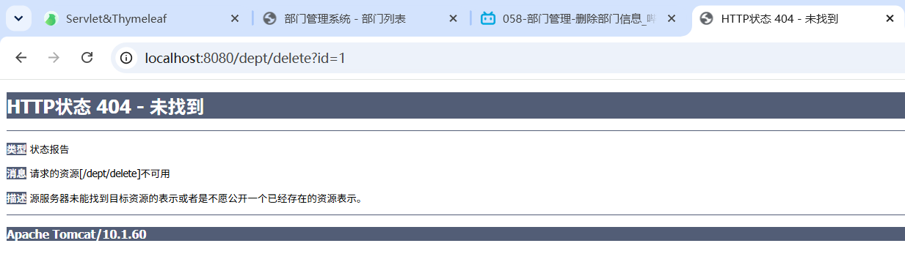

## 4.3然后我们创建一个DeptDeleteServlet类，继承HttpServlet，查询doGet方法，代码如下

```
package org.kenny.dept.servlet;

import jakarta.servlet.ServletException;
import jakarta.servlet.annotation.WebServlet;
import jakarta.servlet.http.HttpServlet;
import jakarta.servlet.http.HttpServletRequest;
import jakarta.servlet.http.HttpServletResponse;
import org.kenny.dept.dao.DeptDao;
import org.kenny.dept.dao.impl.DeptDaoImpl;

import java.io.IOException;

@WebServlet("/delete")
public class DeptDeleteServlet extends HttpServlet {
    @Override
    protected void doGet(HttpServletRequest req, HttpServletResponse resp) throws ServletException, IOException {
        int deptNo = Integer.parseInt(req.getParameter("id"));
        DeptDao dao = new DeptDaoImpl();
        int count = dao.deleteByNo(deptNo);
        if (count > 0) {
            //重定向到列表页面
            resp.sendRedirect(req.getContextPath()+"/list");
        }

    }
}

```

## 4.4重启服务器，进入列表页面，然后选择一个部门如第一个，点击删除，弹出确认窗口后点击确定。如果删除成功，就会重定向到列表页面

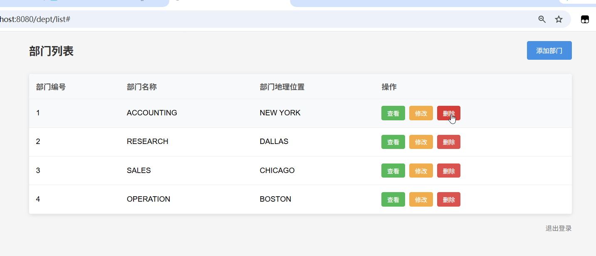

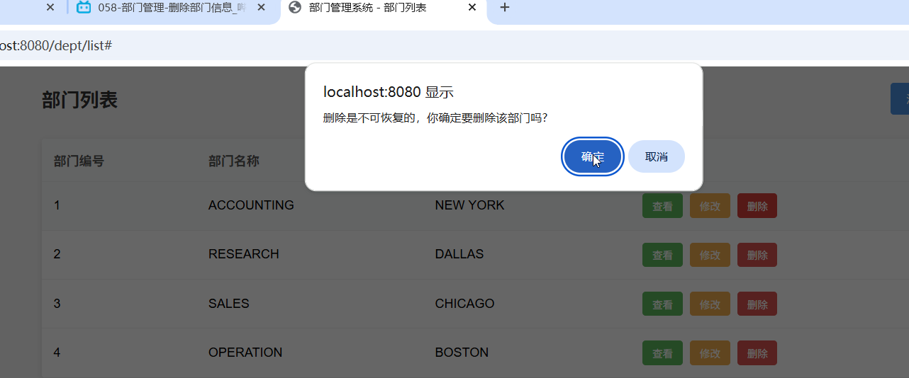

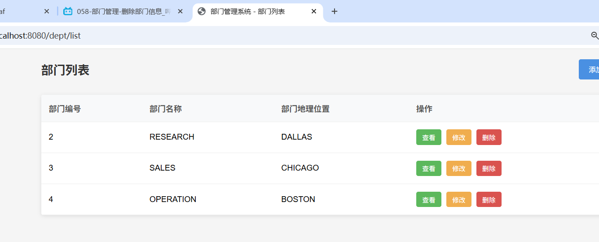


# 5.添加部门

## 5.1.我们需要在DeptListSerlet里面修改一下链接，使得等级添加按钮可以跳转到添加页面，需要把原来写死的链接用字符串拼接，如图

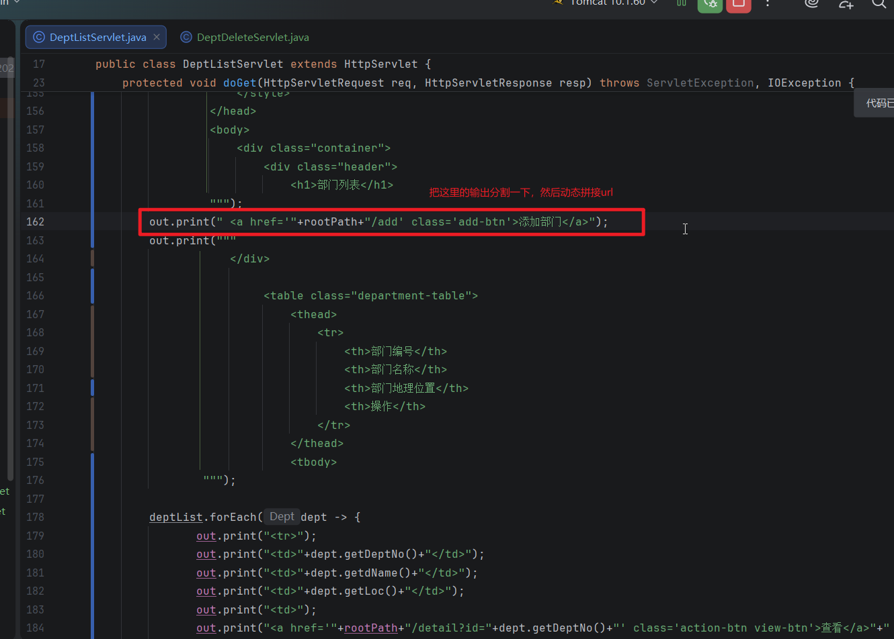

## 5.2然后我们需要新建一个DeptAddServlet，继承HttpServlet，映射路径是"/add",这个servlet其实只需要输出一个form表单，但是它里面有2个动态路径，我们需要使用路径拼接，代码如下

```
package org.kenny.dept.servlet;

import jakarta.servlet.ServletException;
import jakarta.servlet.annotation.WebServlet;
import jakarta.servlet.http.HttpServlet;
import jakarta.servlet.http.HttpServletRequest;
import jakarta.servlet.http.HttpServletResponse;

import java.io.IOException;
import java.io.PrintWriter;

@WebServlet("/add")
public class DeptAddServlet extends HttpServlet {
    @Override
    protected void doGet(HttpServletRequest req, HttpServletResponse resp) throws ServletException, IOException {
        req.setCharacterEncoding("UTF-8");
        resp.setContentType("text/html;charset=UTF-8");
        PrintWriter out = resp.getWriter();
        String rootPath = getServletContext().getContextPath();
        out.print("""
               <!DOCTYPE html>
                       <html lang="zh-CN">
                       <head>
                           <meta charset="UTF-8">
                           <meta name="viewport" content="width=device-width, initial-scale=1.0">
                           <title>部门管理系统 - 添加部门</title>
                           <style>
                               * {
                                   margin: 0;
                                   padding: 0;
                                   box-sizing: border-box;
                                   font-family: 'Arial', sans-serif;
                               }
                               body {
                                   background-color: #f5f5f5;
                               }
                               .container {
                                   max-width: 800px;
                                   margin: 30px auto;
                                   padding: 30px;
                                   background-color: white;
                                   border-radius: 8px;
                                   box-shadow: 0 2px 8px rgba(0, 0, 0, 0.1);
                               }
                               .header {
                                   display: flex;
                                   justify-content: space-between;
                                   align-items: center;
                                   margin-bottom: 30px;
                                   padding-bottom: 15px;
                                   border-bottom: 1px solid #eee;
                               }
                               .header h1 {
                                   color: #333;
                                   font-size: 24px;
                               }
                               .back-btn {
                                   padding: 8px 16px;
                                   background-color: #6c757d;
                                   color: white;
                                   border: none;
                                   border-radius: 4px;
                                   cursor: pointer;
                                   text-decoration: none;
                                   font-size: 14px;
                                   transition: background-color 0.3s;
                               }
                               .back-btn:hover {
                                   background-color: #5a6268;
                               }
                               .form-group {
                                   margin-bottom: 20px;
                               }
                               .form-group label {
                                   display: block;
                                   margin-bottom: 8px;
                                   color: #555;
                                   font-weight: 500;
                               }
                               .form-group input, .form-group select {
                                   width: 100%;
                                   padding: 12px;
                                   border: 1px solid #ddd;
                                   border-radius: 4px;
                                   font-size: 16px;
                                   transition: border-color 0.3s;
                               }
                               .form-group input:focus, .form-group select:focus {
                                   border-color: #4a90e2;
                                   outline: none;
                               }
                               .submit-btn {
                                   padding: 12px 24px;
                                   background-color: #4a90e2;
                                   color: white;
                                   border: none;
                                   border-radius: 4px;
                                   cursor: pointer;
                                   font-size: 16px;
                                   transition: background-color 0.3s;
                               }
                               .submit-btn:hover {
                                   background-color: #3a7bc8;
                               }
                               .footer {
                                   text-align: right;
                                   margin-top: 30px;
                                   padding-top: 15px;
                                   border-top: 1px solid #eee;
                               }
                           </style>
                       </head>
                       <body>
                           <div class="container">
                               <div class="header">
                                   <h1>添加新部门</h1>
        """);
        out.print("<a href='"+rootPath+"/list' class='back-btn'>返回列表</a>");
        out.print("</div>");

        out.print("<form action='"+rootPath+"/save' method='post'>");
        out.print("""                          
                                       <div class="form-group">
                                       <label for="deptName">部门名称</label>
                                       <input type="text" id="deptName" name="deptName" placeholder="请输入部门名称" required>
                                   </div>
                                   <div class="form-group">
                                       <label for="location">部门地理位置</label>
                                       <input type="text" id="location" name="location" placeholder="请输入部门地理位置" required>
                                   </div>

                                   <div class="footer">
                                       <button type="submit" class="submit-btn">保存</button>
                                   </div>
                               </form>
                           </div>
                       </body>
                       </html>
        """);
    }
}

```

### 此时点击返回列表是好用的，因为我们已经实现了这个功能

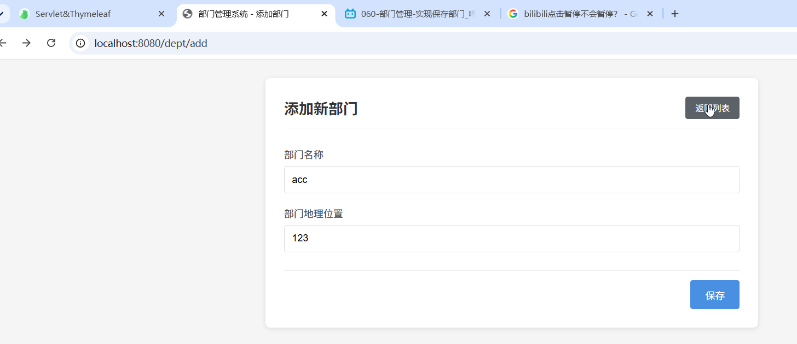

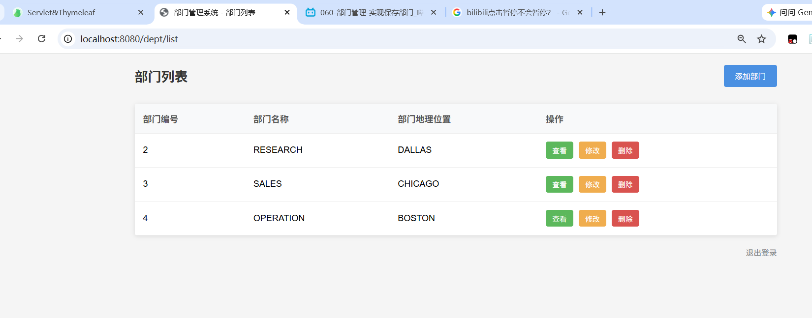

### 点击保存是会报404的因为我们还没有实现这个功能，但是路径是对的，我们马上就会实现这个功能

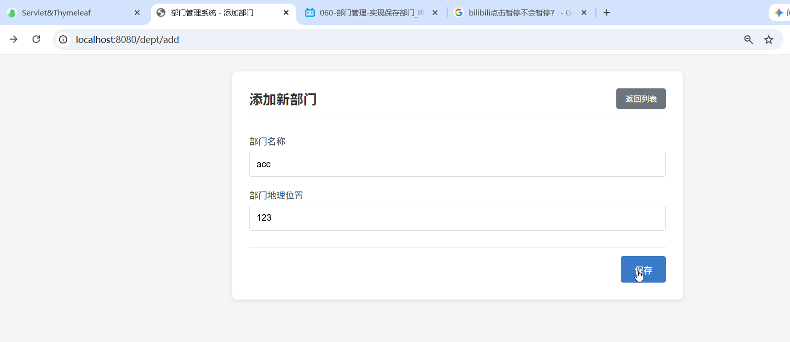

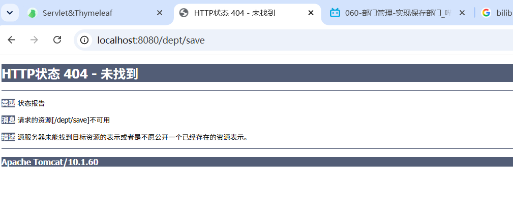

## 5.3.新建一个DeptSaveServlet，继承HttpServlet，路径是/save，然后实现doPost方法，代码如下

```
package org.kenny.dept.servlet;

import jakarta.servlet.ServletException;
import jakarta.servlet.annotation.WebServlet;
import jakarta.servlet.http.HttpServlet;
import jakarta.servlet.http.HttpServletRequest;
import jakarta.servlet.http.HttpServletResponse;
import org.kenny.dept.dao.DeptDao;
import org.kenny.dept.dao.impl.DeptDaoImpl;
import org.kenny.dept.entity.Dept;

import java.io.IOException;
import java.io.PrintWriter;

@WebServlet("/save")
public class DeptSaveServlet extends HttpServlet {
    private DeptDao dao = new DeptDaoImpl();

    @Override
    protected void doPost(HttpServletRequest req, HttpServletResponse resp) throws ServletException, IOException {
          resp.setContentType("text/html;charset=utf-8");
          resp.setCharacterEncoding("utf-8");
          PrintWriter out = resp.getWriter();
          String location = req.getParameter("location");
          String deptName = req.getParameter("deptName");
          //out.print("Dept Name:"+deptName+",Location:"+location);

          int deptNo = dao.selectMaxNo()+1;
          int row = dao.insert(new Dept(deptNo,deptName,location));
          if(row>0){
              //out.print("添加部门成功");
              resp.sendRedirect(req.getContextPath()+"/list");
          }

    }
}

```

## 5.4重启服务器，进入列表页面，点击添加填写信息，然后点击保存，效果如下

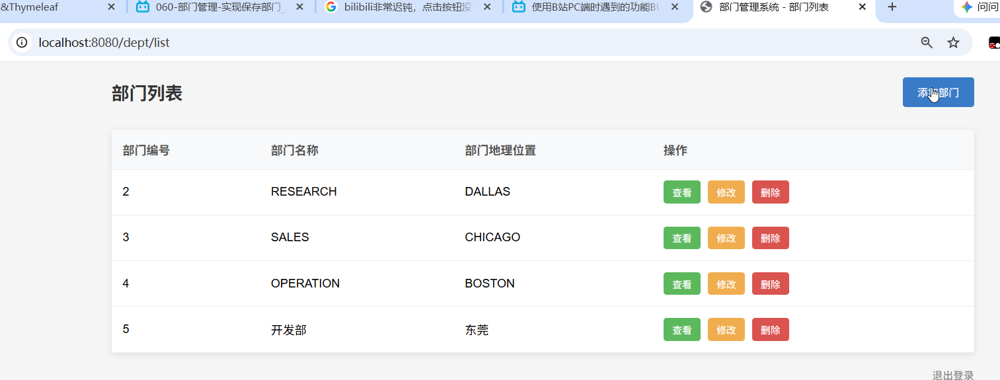

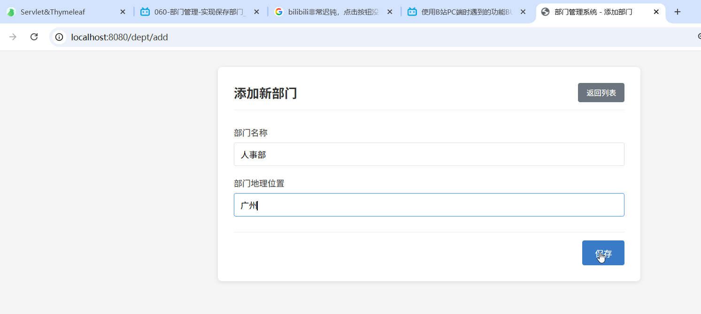


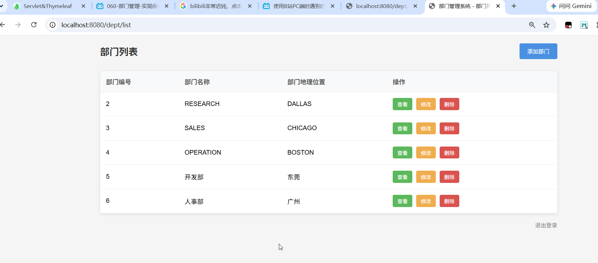

## 5.5我们可以再添加一个采购部试一试

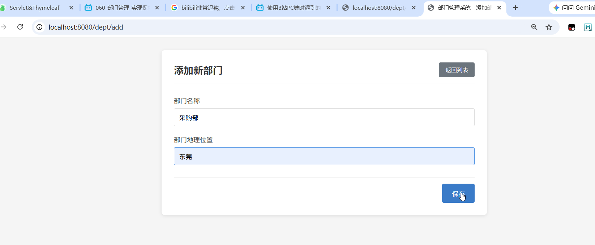

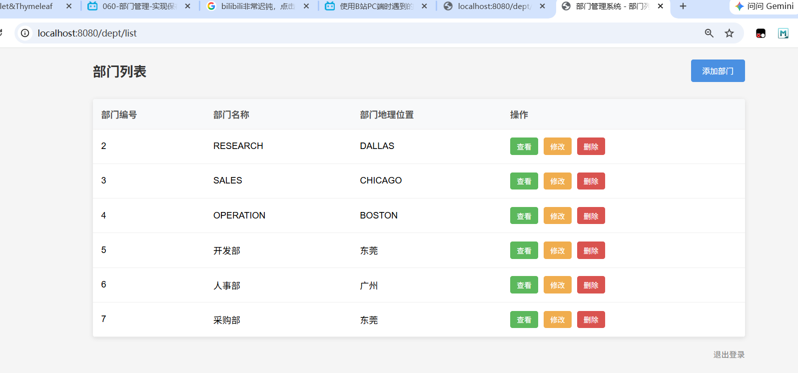

### 至此，添加功能完成


# 6.跳转到修改页面

## 6.1.需要跳转到修改页面，我们需要回到DaptListServlet里面修改一下超链接的代码

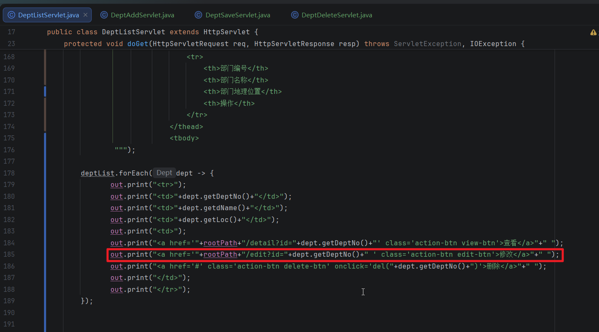

## 6.2重启服务器，进入列表页面，把鼠标放到修改超链接上面，就会出现修改的路径

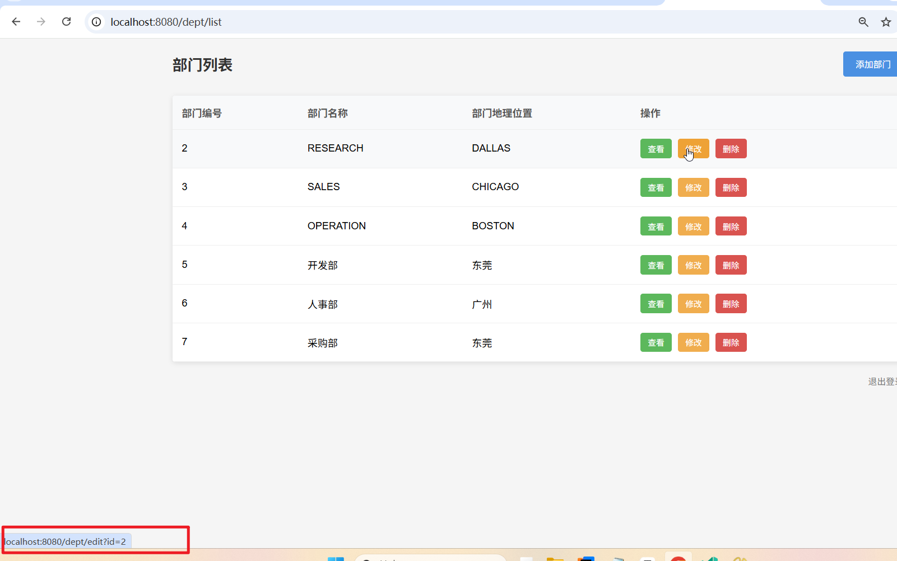

## 6.3然后我们新建一个DeptEditServlet，继承HttpServlet，这里我们实现他的doGet方法，这个servlet可以根据用户传递的序号获取部门信息并且展示在页面上,代码如下，注意：它并不能够真正修改数据，我们需要另外一个servlet来修改数据

```
package org.kenny.dept.servlet;

import jakarta.servlet.ServletException;
import jakarta.servlet.annotation.WebServlet;
import jakarta.servlet.http.HttpServlet;
import jakarta.servlet.http.HttpServletRequest;
import jakarta.servlet.http.HttpServletResponse;
import org.kenny.dept.dao.DeptDao;
import org.kenny.dept.dao.impl.DeptDaoImpl;
import org.kenny.dept.entity.Dept;

import java.io.IOException;
import java.io.PrintWriter;

@WebServlet("/edit")
public class DeptEditServlet extends HttpServlet {

    private DeptDao dao = new DeptDaoImpl();

    @Override
    protected void doGet(HttpServletRequest req, HttpServletResponse resp) throws ServletException, IOException {
        resp.setContentType("text/html;charset=utf-8");
        PrintWriter out = resp.getWriter();
        //获取项目根路径,方便拼接
        String rootPath = req.getServletContext().getContextPath();
        //获取用户传递管理的部门编号
        int deptNo = Integer.parseInt(req.getParameter("id"));
        //根据编号查询部门信息
        Dept dept = dao.selectByNo(deptNo);
        //把部门信息动态显示在页面说
        out.print("""
                <!DOCTYPE html>
                <html lang='zh-CN'>
                <head>
                    <meta charset='UTF-8'>
                    <meta name='viewport' content='width=device-width, initial-scale=1.0'>
                    <title>部门管理系统 - 修改部门</title>
                    <style>
                        * {
                            margin: 0;
                            padding: 0;
                            box-sizing: border-box;
                            font-family: 'Arial', sans-serif;
                        }
                        body {
                            background-color: #f5f5f5;
                        }
                        .container {
                            max-width: 800px;
                            margin: 30px auto;
                            padding: 30px;
                            background-color: white;
                            border-radius: 8px;
                            box-shadow: 0 2px 8px rgba(0, 0, 0, 0.1);
                        }
                        .header {
                            display: flex;
                            justify-content: space-between;
                            align-items: center;
                            margin-bottom: 30px;
                            padding-bottom: 15px;
                            border-bottom: 1px solid #eee;
                        }
                        .header h1 {
                            color: #333;
                            font-size: 24px;
                        }
                        .back-btn {
                            padding: 8px 16px;
                            background-color: #6c757d;
                            color: white;
                            border: none;
                            border-radius: 4px;
                            cursor: pointer;
                            text-decoration: none;
                            font-size: 14px;
                            transition: background-color 0.3s;
                        }
                        .back-btn:hover {
                            background-color: #5a6268;
                        }
                        .form-group {
                            margin-bottom: 20px;
                        }
                        .form-group label {
                            display: block;
                            margin-bottom: 8px;
                            color: #555;
                            font-weight: 500;
                        }
                        .form-group input, .form-group select {
                            width: 100%;
                            padding: 12px;
                            border: 1px solid #ddd;
                            border-radius: 4px;
                            font-size: 16px;
                            transition: border-color 0.3s;
                        }
                        .form-group input:focus, .form-group select:focus {
                            border-color: #4a90e2;
                            outline: none;
                        }
                        .form-group input[readonly] {
                            background-color: #f8f9fa;
                            color: #6c757d;
                        }
                        .btn-group {
                            display: flex;
                            justify-content: space-between;
                            margin-top: 30px;
                            padding-top: 15px;
                            border-top: 1px solid #eee;
                        }
                        .submit-btn {
                            padding: 12px 24px;
                            background-color: #4a90e2;
                            color: white;
                            border: none;
                            border-radius: 4px;
                            cursor: pointer;
                            font-size: 16px;
                            transition: background-color 0.3s;
                        }
                        .submit-btn:hover {
                            background-color: #3a7bc8;
                        }
                        .cancel-btn {
                            padding: 12px 24px;
                            background-color: #6c757d;
                            color: white;
                            border: none;
                            border-radius: 4px;
                            cursor: pointer;
                            font-size: 16px;
                            transition: background-color 0.3s;
                            text-decoration: none;
                        }
                        .cancel-btn:hover {
                            background-color: #5a6268;
                        }
                    </style>
                </head>
                <body>
                    <div class='container'>
                        <div class='header'>
                            <h1>修改部门信息</h1>
                """);
        out.print("<a href='"+rootPath+"/list' class='back-btn'>返回列表</a> </div>");


        out.print("<form action='"+rootPath+"/update' method='post'>");
        out.print(""" 
                            <div class='form-group'>
                                <label for='deptId'>部门编号</label>
             """);
        out.print("<input type='text' id='deptId' name='deptId' value='"+dept.getDeptNo()+"' readonly>"); //编号不能修改

        out.print("""
                                                </div>
                            <div class='form-group'>
                                <label for='deptName'>部门名称</label>
             """);
        out.print("<input type='text' id='deptName' name='deptName' value='"+dept.getdName()+"' required>");
        out.print("""
                                                </div>
                            <div class='form-group'>
                                <label for='location'>部门地理位置</label>
            """);
        out.print("<input type='text' id='location' name='location' value='"+dept.getLoc()+"' required>");

        out.print("""                    
                            </div>
                
                            <div class='btn-group'>
                """);
        out.print("<a href='"+rootPath+"/list' class='cancel-btn'>取消</a>");

        out.print("""                     
                            <button type='submit' class='submit-btn'>保存更改</button>
                            </div>
                        </form>
                    </div>
                </body>
                </html>
                """);
    }
}

```

### 重启服务器，进入列表页面，选择一个部门，点击修改，修改如下

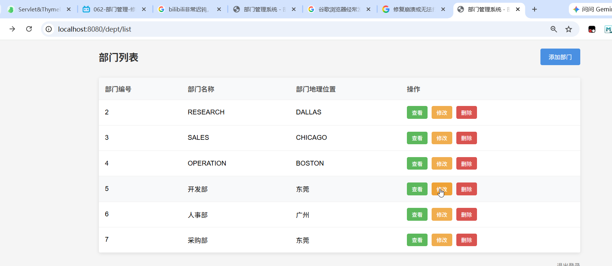

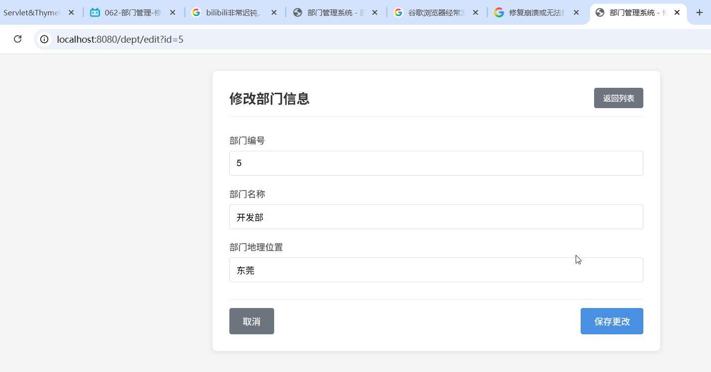


### 注意，此时点击保存，它会报错，因为dept/update/路由还没有实现，我们马上来解决这个问题

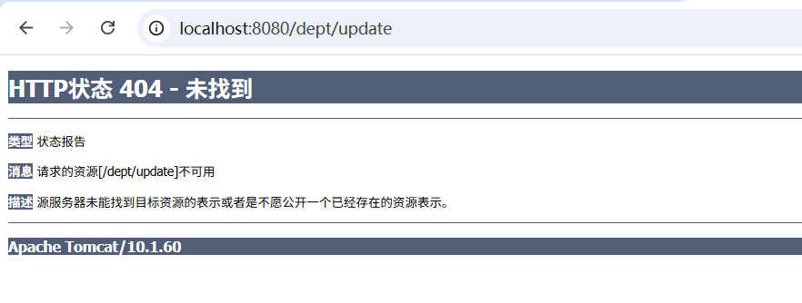

# 7.修改部门

## 7.1新建一个DeptUpdataServlet，继承HttpServlet，实现doPost方法，路径是/update，代码如下

```
package org.kenny.dept.servlet;

import jakarta.servlet.ServletException;
import jakarta.servlet.annotation.WebServlet;
import jakarta.servlet.http.HttpServlet;
import jakarta.servlet.http.HttpServletRequest;
import jakarta.servlet.http.HttpServletResponse;
import org.kenny.dept.dao.DeptDao;
import org.kenny.dept.dao.impl.DeptDaoImpl;
import org.kenny.dept.entity.Dept;

import java.io.IOException;

@WebServlet("/update")
public class DeptUpdateServlet extends HttpServlet {
    private DeptDao dao = new DeptDaoImpl();

    @Override
    protected void doPost(HttpServletRequest req, HttpServletResponse resp) throws ServletException, IOException {
        resp.setContentType("text/html;charset=utf-8");
        int deptNo = Integer.parseInt(req.getParameter("deptId"));
        String deptName = req.getParameter("deptName");
        String loc = req.getParameter("location");
        int count = dao.update(new Dept(deptNo, deptName, loc));
        if (count > 0) {
            resp.sendRedirect(req.getContextPath()+"/list");
        }
    }
}

```

## 7.2重启服务器，选择一个部门，点击编辑，修改信息，点击保存更改，就可以修改数据了。

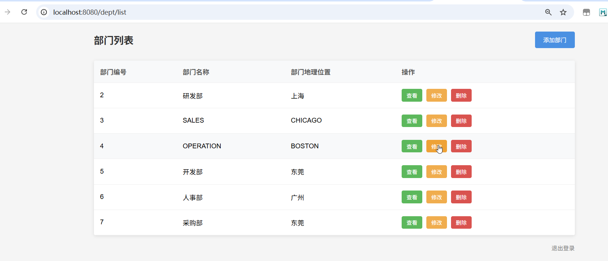

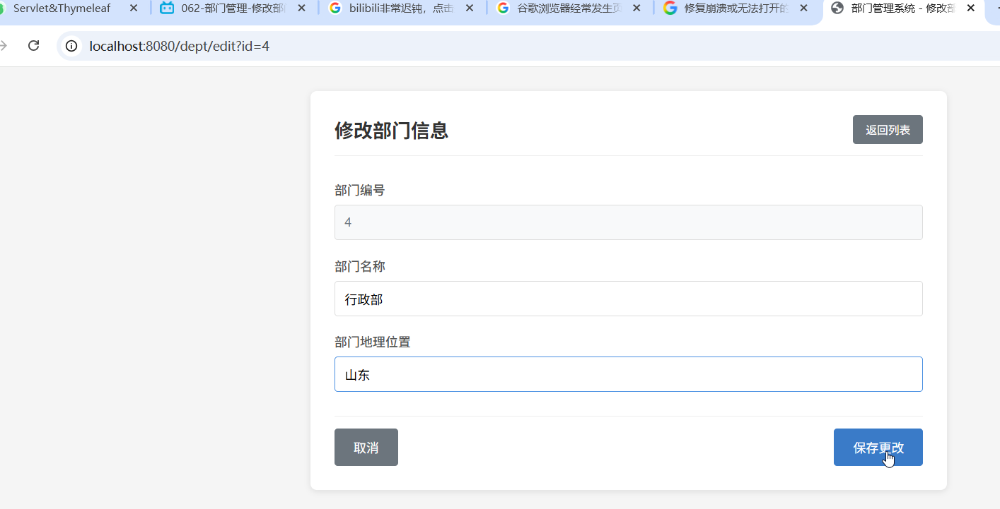

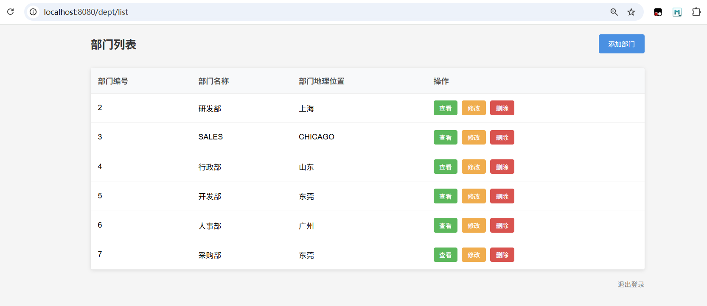

## 7.3 在详情页面DeptDetailServlet里面有一个编辑部门按钮的链接有错误，我们把它修改一下。

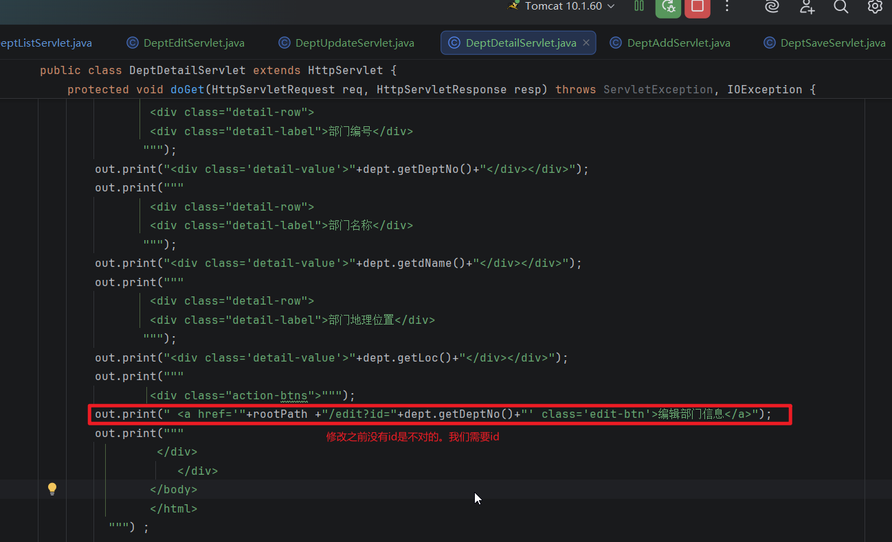

### 修改后的代码如下

```
package org.kenny.dept.servlet;

import jakarta.servlet.ServletException;
import jakarta.servlet.annotation.WebServlet;
import jakarta.servlet.http.HttpServlet;
import jakarta.servlet.http.HttpServletRequest;
import jakarta.servlet.http.HttpServletResponse;
import org.kenny.dept.dao.impl.DeptDaoImpl;
import org.kenny.dept.entity.Dept;

import java.io.IOException;
import java.io.PrintWriter;

@WebServlet("/detail")
public class DeptDetailServlet extends HttpServlet {
    @Override
    protected void doGet(HttpServletRequest req, HttpServletResponse resp) throws ServletException, IOException {
        int deptId = Integer.parseInt(req.getParameter("id"));
        Dept dept = new DeptDaoImpl().selectByNo(deptId);
        resp.setContentType("text/html;charset=utf-8");
        PrintWriter out = resp.getWriter();
        //获取项目根路径，这里是/dept/,方便动态路径拼接
        String rootPath = req.getContextPath(); //HttpServletRequest也可以获取到
        out.print("""
                <!DOCTYPE html>
                <html lang="zh-CN">
                <head>
                    <meta charset="UTF-8">
                    <meta name="viewport" content="width=device-width, initial-scale=1.0">
                    <title>部门管理系统 - 部门详情</title>
                    <style>
                        * {
                            margin: 0;
                            padding: 0;
                            box-sizing: border-box;
                            font-family: 'Arial', sans-serif;
                        }
                        body {
                            background-color: #f5f5f5;
                        }
                        .container {
                            max-width: 800px;
                            margin: 30px auto;
                            padding: 30px;
                            background-color: white;
                            border-radius: 8px;
                            box-shadow: 0 2px 8px rgba(0, 0, 0, 0.1);
                        }
                        .header {
                            display: flex;
                            justify-content: space-between;
                            align-items: center;
                            margin-bottom: 30px;
                            padding-bottom: 15px;
                            border-bottom: 1px solid #eee;
                        }
                        .header h1 {
                            color: #333;
                            font-size: 24px;
                        }
                        .back-btn {
                            padding: 8px 16px;
                            background-color: #6c757d;
                            color: white;
                            border: none;
                            border-radius: 4px;
                            cursor: pointer;
                            text-decoration: none;
                            font-size: 14px;
                            transition: background-color 0.3s;
                        }
                        .back-btn:hover {
                            background-color: #5a6268;
                        }
                        .detail-card {
                            padding: 20px;
                            border-radius: 6px;
                            background-color: #f8f9fa;
                        }
                        .detail-row {
                            display: flex;
                            margin-bottom: 15px;
                            padding-bottom: 15px;
                            border-bottom: 1px solid #e9ecef;
                        }
                        .detail-row:last-child {
                            margin-bottom: 0;
                            padding-bottom: 0;
                            border-bottom: none;
                        }
                        .detail-label {
                            width: 150px;
                            font-weight: 600;
                            color: #495057;
                        }
                        .detail-value {
                            flex: 1;
                            color: #212529;
                        }
                        .action-btns {
                            margin-top: 30px;
                            text-align: right;
                        }
                        .edit-btn {
                            padding: 10px 20px;
                            background-color: #f0ad4e;
                            color: white;
                            border: none;
                            border-radius: 4px;
                            cursor: pointer;
                            text-decoration: none;
                            font-size: 14px;
                            transition: background-color 0.3s;
                        }
                        .edit-btn:hover {
                            background-color: #eea236;
                        }
                    </style>
                </head>
                <body>
                """);
        out.print("""
                 <div class="container">
                        <div class="header">
                            <h1>部门详细信息</h1>""");
        out.print("<a href='"+rootPath+"/list' class='back-btn'>返回列表</a>");
        out.print("</div>");


        out.print("""
                <div class="detail-card">
                <div class="detail-row">
                <div class="detail-label">部门编号</div>
               """);
        out.print("<div class='detail-value'>"+dept.getDeptNo()+"</div></div>");
        out.print("""
                <div class="detail-row">
                <div class="detail-label">部门名称</div>
               """);
        out.print("<div class='detail-value'>"+dept.getdName()+"</div></div>");
        out.print("""
                <div class="detail-row">
                <div class="detail-label">部门地理位置</div>
               """);
        out.print("<div class='detail-value'>"+dept.getLoc()+"</div></div>");
        out.print("""
                <div class="action-btns">""");
        out.print(" <a href='"+rootPath +"/edit?id="+dept.getDeptNo()+"' class='edit-btn'>编辑部门信息</a>");
        out.print("""
                 </div>
                    </div>
                </body>
                </html>
          """) ;


    }
}

```

