# 1.环境搭建

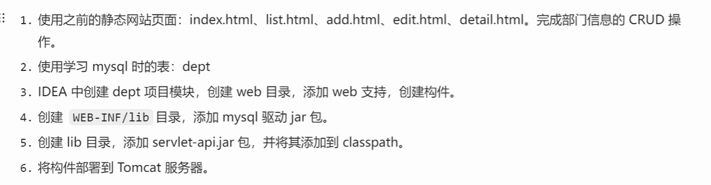

## 1.1新建一个模块，前面web08,并且添加web支持，并且创建工件artifacts

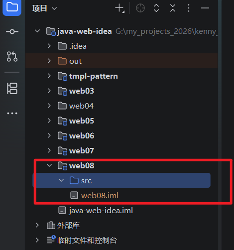

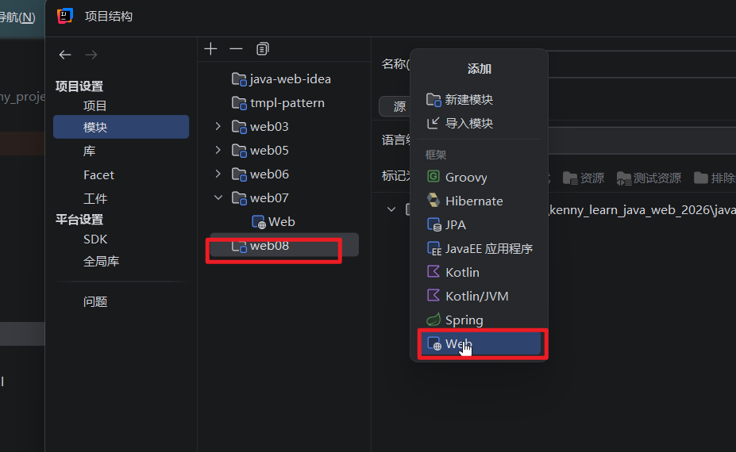

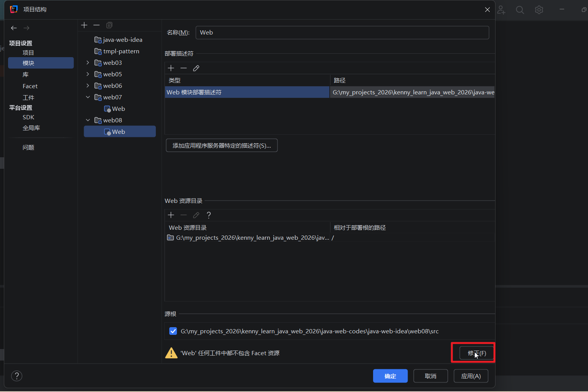

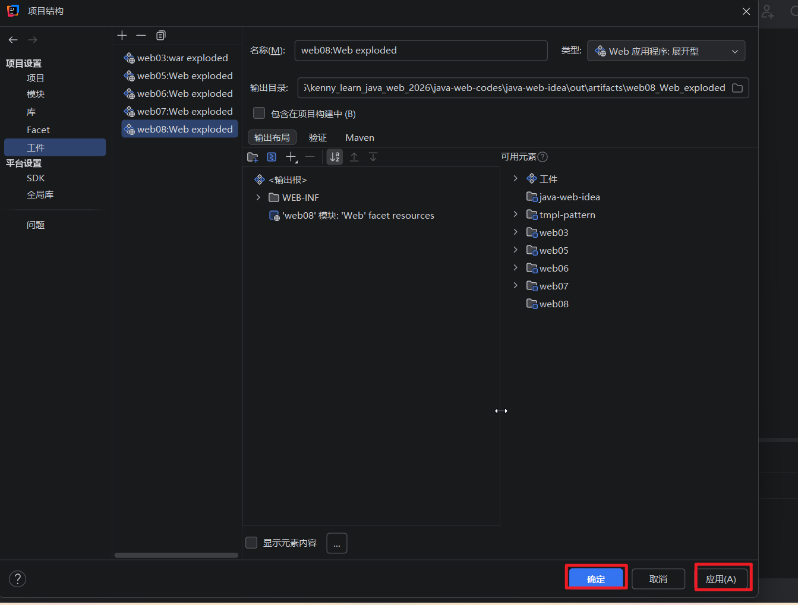

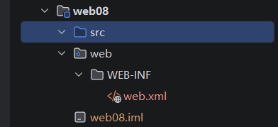

## 1.2 在web0b项目里面新建一个lib文件夹吧servlet-api.jar粘贴进来，然后作为库添加到classpath中

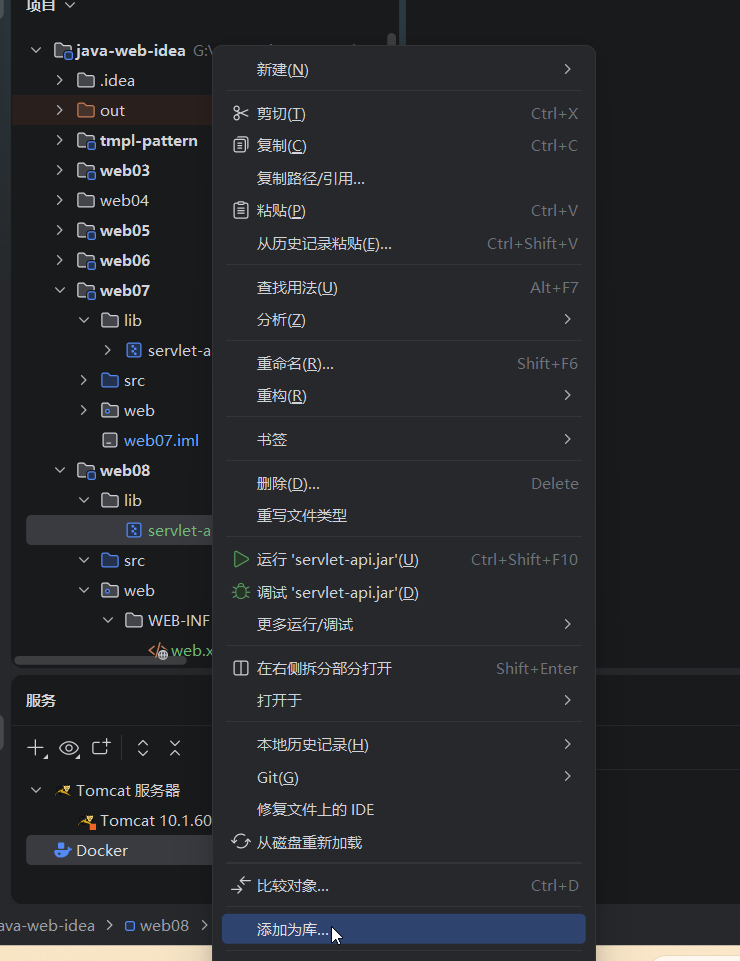

## 1.3.在 WEB-INF 在新建一个lib文件夹，把mysql驱动jar包粘贴进来

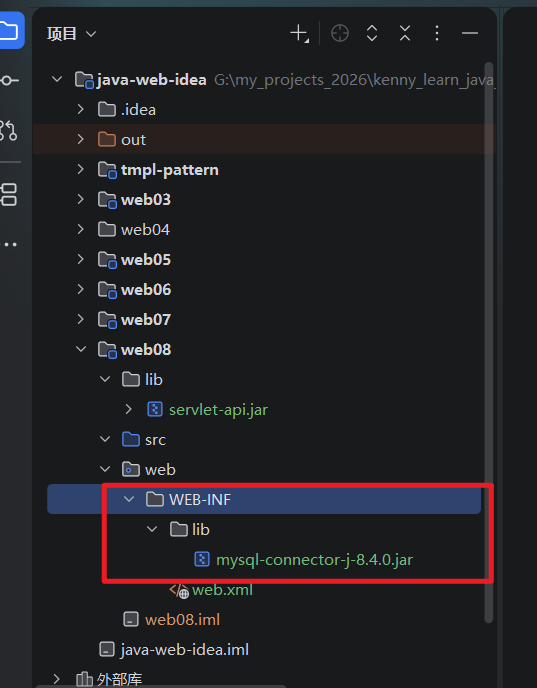


## 1.4 把我们前面的静态页面粘贴到web根目录里面，（静态页面有些东西需要修改）

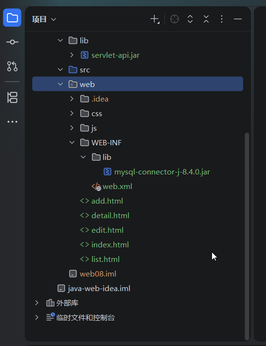

## 1.5 把项目部署到tomcat，然后启动服务器，静态页面可以正常工作

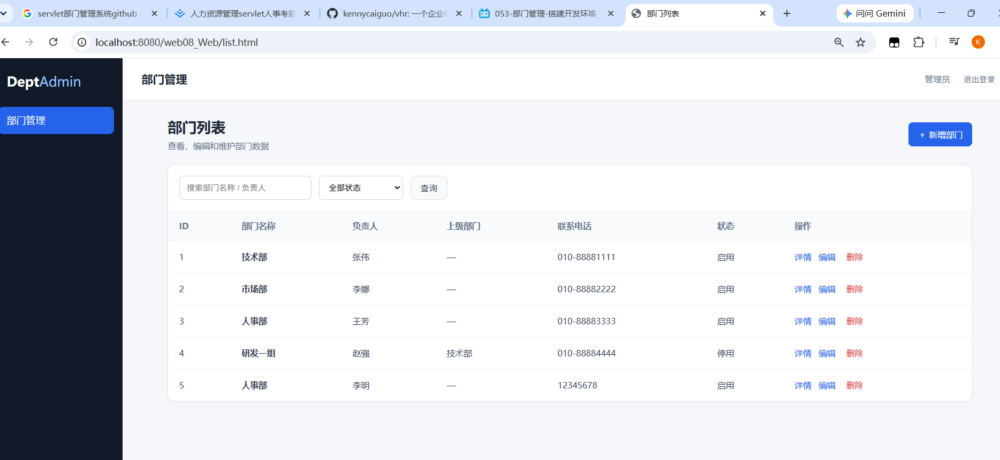

## 1.6 在src文件夹里面新建一个包：org.kenny.dept.util,然后我们在里面创建一个DbUtil类型，代码如下

```
package org.kenny.dept.util;
import java.sql.*;
import java.util.*;


public class DbUtils {
    private static String driver;
    private static String url ;
    private static String user;
    private static String password;

    static {
        ResourceBundle bundle = ResourceBundle.getBundle("jdbc");
        //获取配置信息
        driver = bundle.getString("driver");
        url = bundle.getString("url");
        user = bundle.getString("user");
        password = bundle.getString("password");
        //注册启动
        try {
            Class.forName(driver);
        } catch (ClassNotFoundException e) {
            e.printStackTrace();
        }
    }

    public static Connection getConnection() throws SQLException {
        // 获取数据库连接对象
        Connection conn = DriverManager.getConnection(url,user,password);
        return conn;
    }

    public static void close(Connection conn, Statement ps, ResultSet rs){
        if(rs != null){
            try {
                rs.close();
            } catch (SQLException throwables) {
                throwables.printStackTrace();
            }
        }

        if(ps != null){
            try {
                ps.close();
            } catch (SQLException throwables) {
                throwables.printStackTrace();
            }
        }

        if(conn != null){
            try {
                conn.close();
            } catch (SQLException throwables) {
                throwables.printStackTrace();
            }
        }
    }


}

```


## 1.7 然后我们需要在src文件夹里面添加一个jdbc.properties配置文件，在里面配置数据库连接信息，我们使用company数据库，配置信息如下

```
driver=com.mysql.cj.jdbc.Driver
url=jdbc:mysql://localhost:3306/company
user=root
password=root

```

## 1.8然后我们打开navicat里面的company数据库，创建一个查询，用来创建dept数据表，这里我们先不让部门编号自动生成。代码如下

```
DROP TABLE IF EXISTS `dept`;
CREATE TABLE `dept`  (
  `DEPTNO` int NOT NULL PRIMARY KEY,
  `DNAME` varchar(255)  NOT NULL,
  `LOC` varchar(255) NOT NULL
) ENGINE = InnoDB CHARACTER SET = utf8mb4 COLLATE = utf8mb4_general_ci ROW_FORMAT = Dynamic;

-- ----------------------------
-- Records of dept
-- ----------------------------
INSERT INTO `dept` VALUES (1, 'ACCOUNTING', 'NEW YORK');
INSERT INTO `dept` VALUES (2, 'RESEARCH', 'DALLAS');
INSERT INTO `dept` VALUES (3, 'SALES', 'CHICAGO');
INSERT INTO `dept` VALUES (4, 'OPERATION', 'BOSTON');
```

### 在navicat中运行这个代码，就会创建一个dept数据表如下

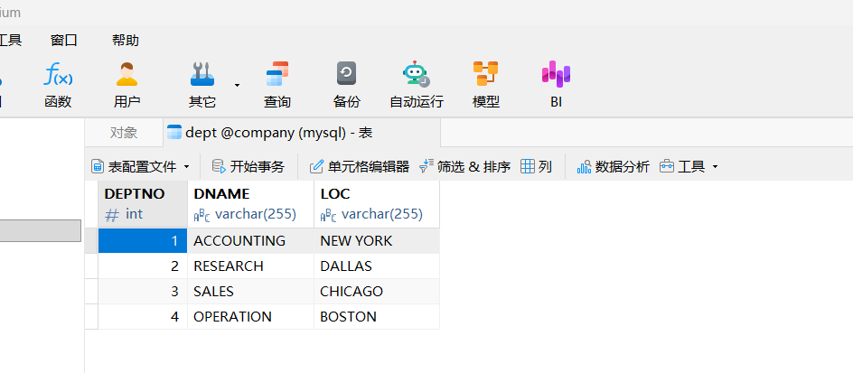

## 至此，环境搭建完毕下一节我们来开始编码

# 2.部门列表

## 2.1还是上面的项目，我们新建应该包：org.kenny.dept.dao,然后在里面新建应该DeptDao接口。内容先留空

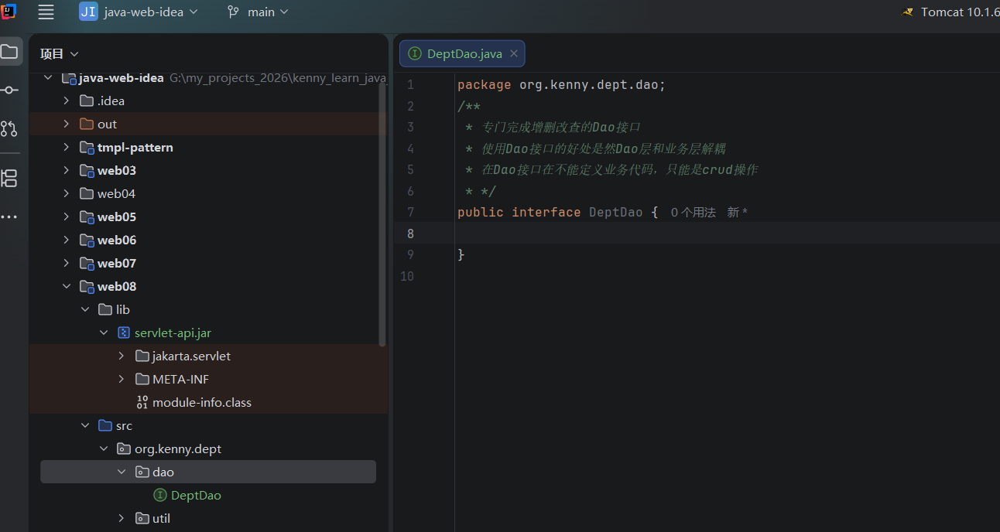

## 2.2 然后我们创建一个包org.kenny.dept.entity,然后在里面新建一个dept类，其实就是一个JavaBean对应数据库里面的一条记录。代码如下

```
package org.kenny.dept.entity;

/**
 * 这个类是用来封装数据库的一行数据的。
 * <p>
 * */
public class Dept {
    private int deptNo;
    private String dName;
    private String loc;

    //无参构造函数
    public Dept() {}
    //全参数构造函数
    public Dept(int deptNo, String dName, String loc) {
        this.deptNo = deptNo;
        this.dName = dName;
        this.loc = loc;
    }

    public int getDeptNo() {
        return deptNo;
    }

    public void setDeptNo(int deptNo) {
        this.deptNo = deptNo;
    }

    public String getdName() {
        return dName;
    }

    public void setdName(String dName) {
        this.dName = dName;
    }

    public String getLoc() {
        return loc;
    }

    public void setLoc(String loc) {
        this.loc = loc;
    }

    @Override
    public String toString() {
        return "Dept[deptNo=" + deptNo + ", dName=" + dName + ", loc=" + loc + "]";
    }
}

```

### 类结构如图

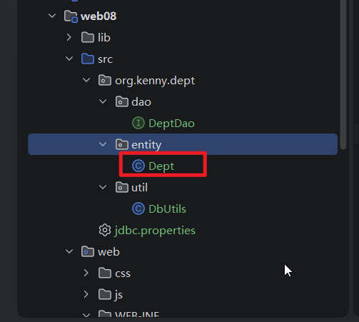

## 2.3 回到DeptDao,我们编写下面的代码,

```
package org.kenny.dept.dao;

import org.kenny.dept.entity.Dept;

import java.util.List;

/**
 * 专门完成增删改查的Dao接口
 * 使用Dao接口的好处是然Dao层和业务层解耦
 * 在Dao接口在不能定义业务代码，只能是crud操作
 * */
public interface DeptDao {
     //新增（保存部门）
     int insert(Dept dept);
     //修改部门信息
     int update(Dept newDept);
     //根据部门编号删除部门
     int deleteByNo(Integer deptNo);
     //获取所有部门数据
     List<Dept> selectAll();
     //根据部门编号查找部门
     Dept selectByNo(Integer deptNo);
     //查找最大的部门编号方法
     //本阶段，这里添加一个找到读取最大的deptNo的方法，方便我们加1计算新记录的deptNo，不过这个会有并发问题，这里暂时不考虑并发
     //我们的数据库里面DEPTNO没有设置自增长
     Integer selectMaxNo();
}

```


## 2.4然后我们在dao包里面新建一个impl子包，在里面新建一个DeptDaoImpl类，实现DeptDao接口的所有方法，代码如下

```
package org.kenny.dept.dao.impl;

import org.kenny.dept.dao.DeptDao;
import org.kenny.dept.entity.Dept;
import org.kenny.dept.util.DbUtils;

import java.sql.Connection;
import java.sql.PreparedStatement;
import java.sql.ResultSet;
import java.sql.SQLException;
import java.util.LinkedList;
import java.util.List;
/**
 * 注意：不应该在Dao里面关闭数据库连接对象，因为可能业务层还有调用。
 * */
public class DeptDaoImpl implements DeptDao {
    @Override
    public int insert(Dept dept) {
        String sql = "insert into dept(DEPTNO,DNAME,LOC) values(?,?,?)"; //使用预编译sql的方式
        int count=0;
        try(Connection conn = DbUtils.getConnection();
        PreparedStatement ps = conn.prepareStatement(sql);) {
          //用传递进来的dept对象的属性给sql语句的对应的变量赋值
          ps.setInt(1, dept.getDeptNo());
          ps.setString(2, dept.getdName());
          ps.setString(3, dept.getLoc());
          count = ps.executeUpdate();
        } catch (Exception e) {
            //注意，这里不能只用e.printStackTrace()方法，因为正常来说，不应该在Dao中吞没异常
            //有异常应该往上抛给业务层
            e.printStackTrace();
            throw new RuntimeException(e);
        }
        return count;
    }

    @Override
    public int update(Dept newDept) {
        String sql = "update dept set DNAME=?,LOC=? where DEPTNO=?"; //使用预编译sql的方式
        int count=0;
        try(Connection conn = DbUtils.getConnection();
            PreparedStatement ps = conn.prepareStatement(sql);) {
            //用传递进来的dept对象的属性给sql语句的对应的变量赋值
            ps.setString(1, newDept.getdName());
            ps.setString(2, newDept.getLoc());
            ps.setInt(3, newDept.getDeptNo());
            count = ps.executeUpdate();
        } catch (Exception e) {
            //注意，这里不能只用e.printStackTrace()方法，因为正常来说，不应该在Dao中吞没异常
            //有异常应该往上抛给业务层
            e.printStackTrace();
            throw new RuntimeException(e);
        }
        return count;
    }

    @Override
    public int deleteByNo(Integer deptNo) {
        String sql = "delete from dept where DEPTNO=?"; //使用预编译sql的方式
        int count=0;
        try(Connection conn = DbUtils.getConnection();
            PreparedStatement ps = conn.prepareStatement(sql);) {
            //用传递进来的dept对象的属性给sql语句的对应的变量赋值
            ps.setInt(1, deptNo);
            count = ps.executeUpdate();
        } catch (Exception e) {
            //注意，这里不能只用e.printStackTrace()方法，因为正常来说，不应该在Dao中吞没异常
            //有异常应该往上抛给业务层
            e.printStackTrace();
            throw new RuntimeException(e);
        }
        return count;
    }

    @Override
    public List<Dept> selectAll() {
        String sql = "select * from dept"; //使用预编译sql的方式
        List<Dept> deptList = new LinkedList<Dept>();
        Dept dept = null;
        try(Connection conn = DbUtils.getConnection();
            PreparedStatement ps = conn.prepareStatement(sql);
            ResultSet rs = ps.executeQuery();
            ) {
            //用传递进来的dept对象的属性给sql语句的对应的变量赋值
            while(rs.next()) {
                dept = new Dept(rs.getInt("DEPTNO"),rs.getString("DNAME"),rs.getString("LOC"));
                deptList.add(dept);
            }


        } catch (Exception e) {
            //注意，这里不能只用e.printStackTrace()方法，因为正常来说，不应该在Dao中吞没异常
            //有异常应该往上抛给业务层
            e.printStackTrace();
            throw new RuntimeException(e);
        }

        return deptList;

    }

    @Override
    public Dept selectByNo(Integer deptNo) {
        String sql = "select * from dept where DEPTNO=?"; //使用预编译sql的方式
        Dept dept = null;
        try(Connection conn = DbUtils.getConnection();
            PreparedStatement ps = conn.prepareStatement(sql);) {
            //用传递进来的dept对象的属性给sql语句的对应的变量赋值
            ps.setInt(1,deptNo);
            try(ResultSet rs = ps.executeQuery()) {
                if(rs.next()) {
                    dept = new Dept(rs.getInt("DEPTNO"),rs.getString("DNAME"),rs.getString("LOC"));
                }
            }

        } catch (Exception e) {
            //注意，这里不能只用e.printStackTrace()方法，因为正常来说，不应该在Dao中吞没异常
            //有异常应该往上抛给业务层
            e.printStackTrace();
            throw new RuntimeException(e);
        }

        return dept;
    }

    @Override
    public Integer selectMaxNo() {
        String sql = "select  max(DEPTNO) from dept";
        int deptno=0;
        try(Connection conn = DbUtils.getConnection();
            PreparedStatement ps = conn.prepareStatement(sql);
            ResultSet rs = ps.executeQuery();
            ) {
            if(rs.next()) {
                deptno = rs.getInt(1);
            }
        } catch (Exception e) {
            //注意，这里不能只用e.printStackTrace()方法，因为正常来说，不应该在Dao中吞没异常
            //有异常应该往上抛给业务层
            e.printStackTrace();
            throw new RuntimeException(e);
        }
        return deptno;
    }
}

```

### 类视图结构如下

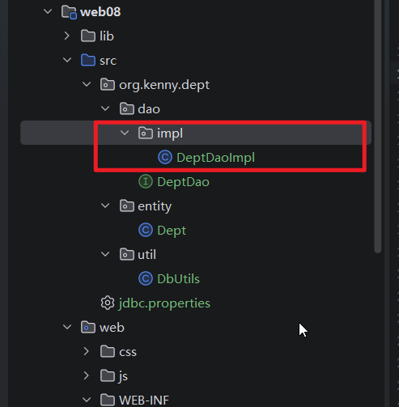


# 3.查看部门

## 3.1接着上面的项目，我们先来实现显示部门列表功能，我们在org.kenny.dept里面新建应该子包servlet，在里面新建一个DeptListServlet类，我们先写一些静态页面代码，看看能否正常显示

```
package org.kenny.dept.servlet;

import jakarta.servlet.ServletException;
import jakarta.servlet.annotation.WebServlet;
import jakarta.servlet.http.HttpServlet;
import jakarta.servlet.http.HttpServletRequest;
import jakarta.servlet.http.HttpServletResponse;
import org.kenny.dept.dao.impl.DeptDaoImpl;
import org.kenny.dept.entity.Dept;

import java.io.IOException;
import java.io.PrintWriter;
import java.util.List;

@WebServlet("/list")
public class DeptListServlet extends HttpServlet {
    @Override
    protected void doGet(HttpServletRequest req, HttpServletResponse resp) throws ServletException, IOException {
        //设置响应内容类型和编码
        resp.setContentType("text/html;charset=utf-8");
        //获取页面的输出对象
        PrintWriter out = resp.getWriter();
        out.println("""
                <main class="main">
                        <header class="topbar"><h1>部门管理</h1>
                            <div class="user">管理员
                                <button class="logout-btn" onclick="logout()">退出登录</button>
                            </div>
                        </header>
                        <section class="page">
                            <div class="page-header">
                                <div><h2>部门列表</h2>
                                    <p>查看、编辑和维护部门数据</p></div>
                                <a class="btn btn-primary" href="add.html">＋ 新增部门</a></div>
                            <div class="card">
                                <div class="toolbar"><input id="keyword" class="input" placeholder="搜索部门名称 / 负责人"><select id="status"
                                                                                                                          class="input select">
                                    <option value="">全部状态</option>
                                    <option>启用</option>
                                    <option>停用</option>
                                </select>
                                    <button class="btn btn-light" onclick="render()">查询</button>
                                </div>
                                <div class="table-wrap">
                                    <table>
                                        <thead>
                                        <tr>
                                            <th>ID</th>
                                            <th>部门名称</th>
                                            <th>负责人</th>
                                            <th>上级部门</th>
                                            <th>联系电话</th>
                                            <th>状态</th>
                                            <th>操作</th>
                                        </tr>
                                        </thead>
                                        <tbody id="deptBody"></tbody>
                                    </table>
                                </div>
                                <div class="empty" id="empty">暂无数据</div>
                            </div>
                        </section>
                    </main>
                """);
        List<Dept> deptList = null;
        DeptDaoImpl deptDao = new DeptDaoImpl();
        deptList = deptDao.selectAll();

    }
}

```

## 3.2 把项目重新部署，把根路径改为/dept

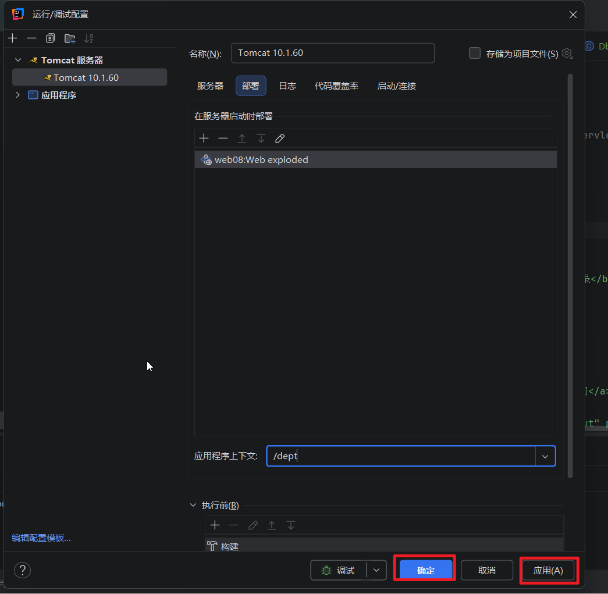

## 3.3启动服务器，在浏览器中输入：http://localhost:8080/dept/list， 效果如下

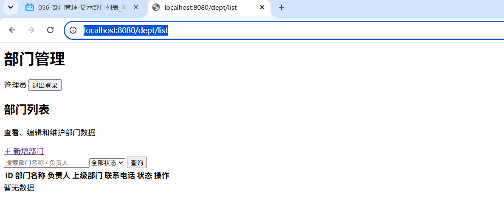


# 4.删除部门


# 5.跳转到修改页面


# 6.修改部门


# 7.添加部门

