# 监听器 Listener

Servlet 监听器是 Servlet 规范中的一部分，主要用于监听 Web 应用中的特定事件，当这些事件发生时执行预定义的操作。监听器提供了一种事件驱动的编程模型，允许开发者在应用生命周期的关键点插入自定义逻辑。

## 1.主要监听器类型

Servlet 规范定义了以下几种监听器接口：

1. **ServletContext 相关监听器**
   * `ServletContextListener`：监听 Web 应用的启动和关闭
   * `ServletContextAttributeListener`：监听应用范围内属性的添加、移除和替换
2. **HttpSession 相关监听器**
   * `HttpSessionListener`：监听会话的创建和销毁
   * `HttpSessionAttributeListener`：监听会话范围内属性的添加、移除和替换
   * `HttpSessionActivationListener`：监听会话的激活和钝化(集群环境) （了解）
   * `HttpSessionBindingListener`：监听对象绑定到会话或从会话解绑 （了解）
3. **ServletRequest 监听器**
   * `ServletRequestListener`：监听请求的初始化和销毁
   * `ServletRequestAttributeListener`：监听请求范围内属性的添加、移除和替换

## 2.典型应用场景

1. **应用初始化**：在应用启动时加载资源(数据库连接池、缓存数据等)
2. **资源清理**：在应用关闭时释放资源
3. **会话管理**：统计在线用户、会话超时处理
4. **请求监控**：记录请求日志、性能监控
5. **属性变更跟踪**：跟踪应用、会话或请求范围内属性的变化

## 3.配置方式

监听器可以通过以下两种方式配置：

1. **注解方式**：在监听器类上使用 `@WebListener` 注解

```java
@WebListener
public class MyListener implements ServletContextListener {...}
```

2. **web.xml 配置**：

```xml
<listener>
    <listener-class>com.example.MyListener</listener-class>
</listener>
```

## 3.以 ServletContextListener 为例

该监听器中提供了两个方法：

* contextInitialized：服务器启动的时候这个方法自动调用。
* contextDestroyed：服务器关闭的时候这个方法自动调用。

编写类实现 `ServletContextListener`接口：

```java
package com.jkweilai.listener;

import jakarta.servlet.ServletContextEvent;
import jakarta.servlet.ServletContextListener;
import jakarta.servlet.annotation.WebListener;

@WebListener
public class MyServletContextListener implements ServletContextListener {
    @Override
    public void contextInitialized(ServletContextEvent sce) {
        System.out.println("=====contextInitialized=====");
    }

    @Override
    public void contextDestroyed(ServletContextEvent sce) {
        System.out.println("=====contextDestroyed=====");
    }
}
```

`web.xml` 文件中配置监听器，或者使用 `@WebListener注解` 标注 。这里选择使用注解，更加方便一些。

启动和关闭服务器，观察控制台输出结果：

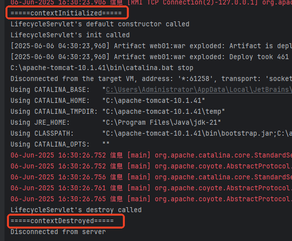


# 演练

## 1.新建一个web10模块，然后添加web支持并且创建artifacts

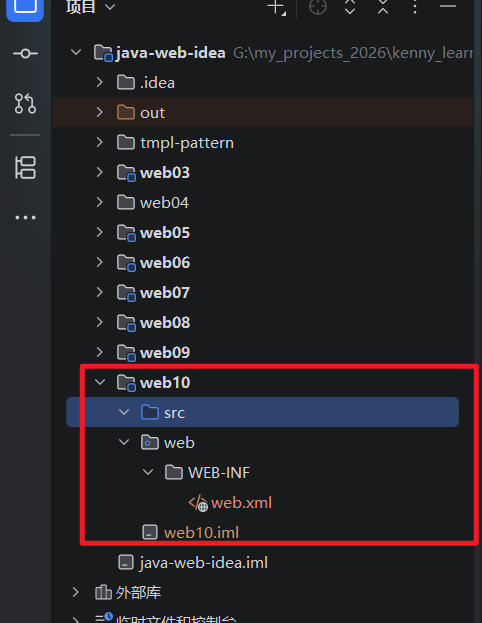

## 2.在项目根目录下面新建一个lib文件夹，把servlet-api.jar粘贴进来然后作为库添加到classpath,然后部署到服务器上

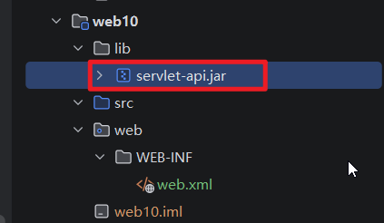

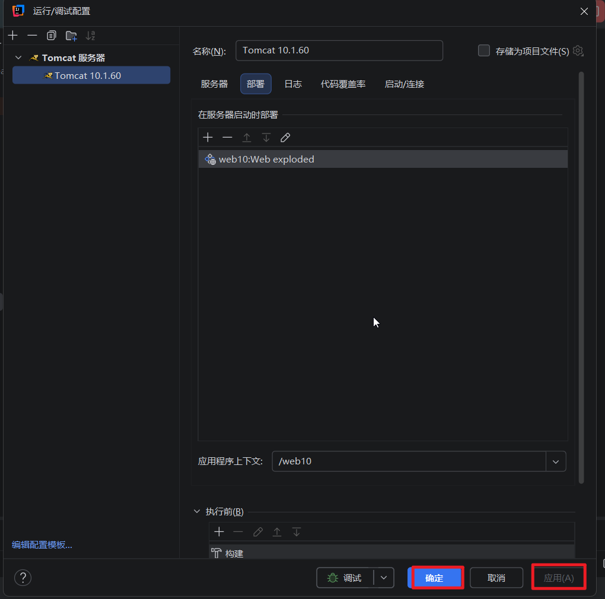

## 3.然后我们创建一个包org.kenny.listener,在里面新建有MyServletContextListener,需要实现ServletContextListener接口，整个监听器可以用来监听ServletContext对象的创建和销毁也就是web服务的启动和关闭，我们需要实现void contextInitialized(ServletContextEvent sce)和void contextDestroyed(ServletContextEvent sce) 方法

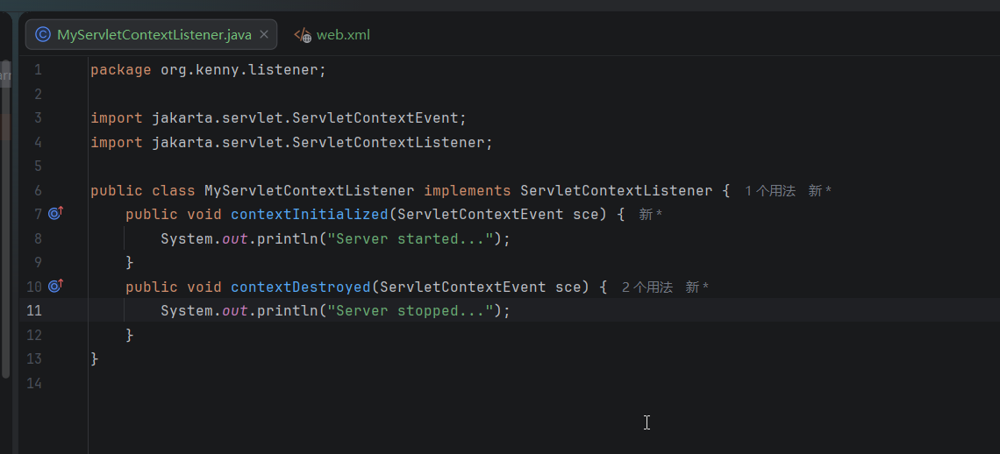

## 4.然后我们需要在web.xml中配置他的路径，然后当服务器启动就会自动调用整个监听器

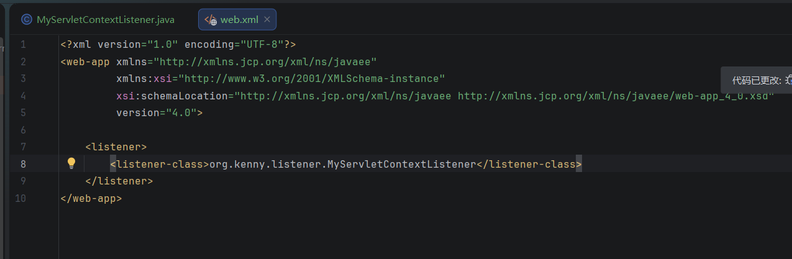

## 5.我们可以启动服务器看看，虽然此时我们没有写任何servlet，我们应该可以看到控制台有输出

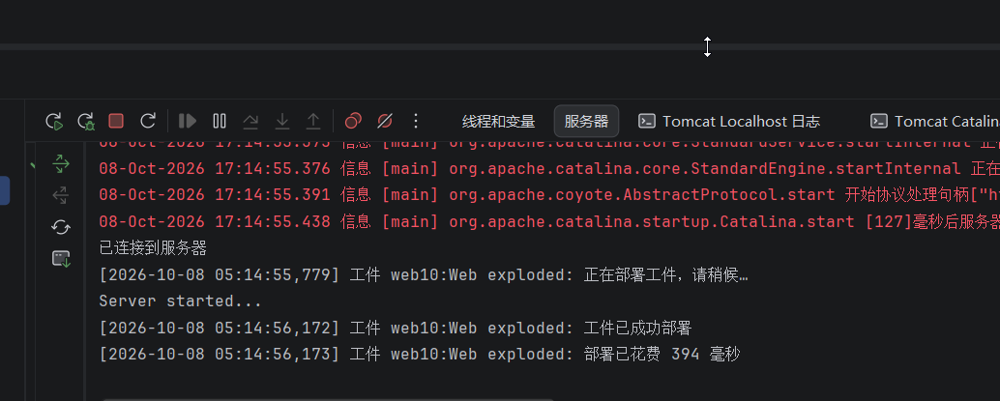

## 6.关闭服务器，也可以看到输出

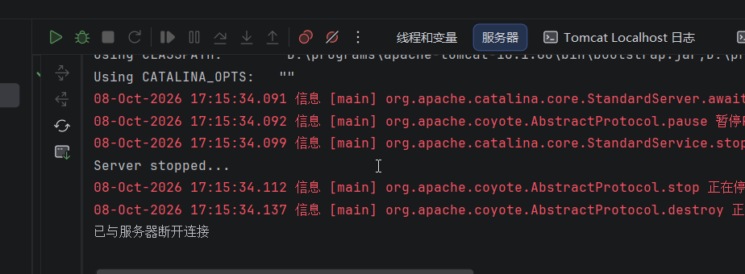

## 7.System.out有乱码，我们可以使用下面的代码来消除

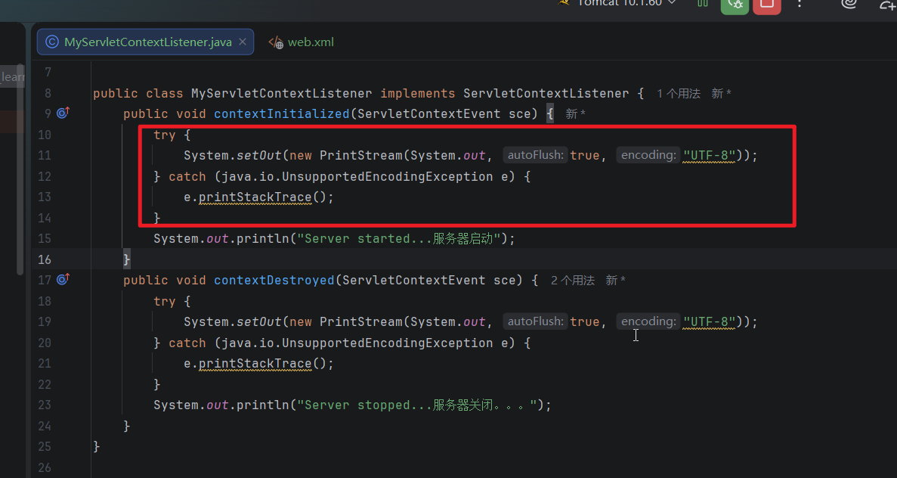

## 8.我们可以把web.xml里面的配置注释了，

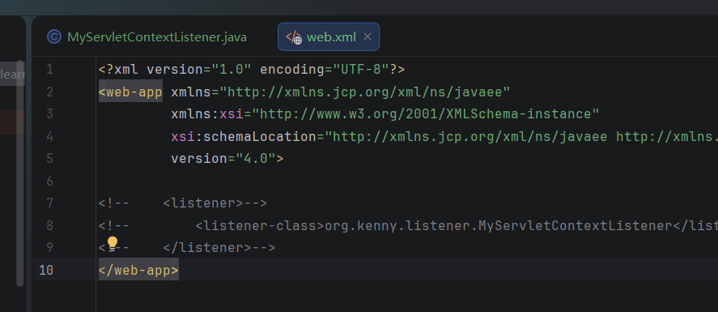

## 然后在监听器类上面添加@WebListener注解，

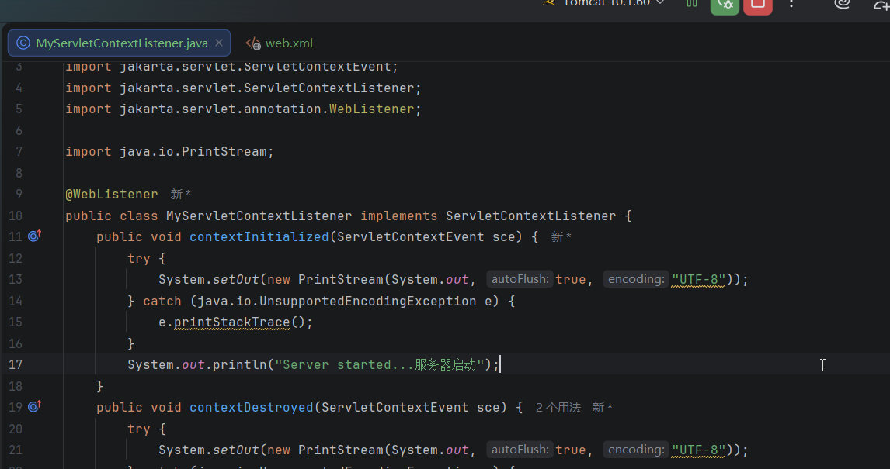

## 9.这也是可以正常工作的

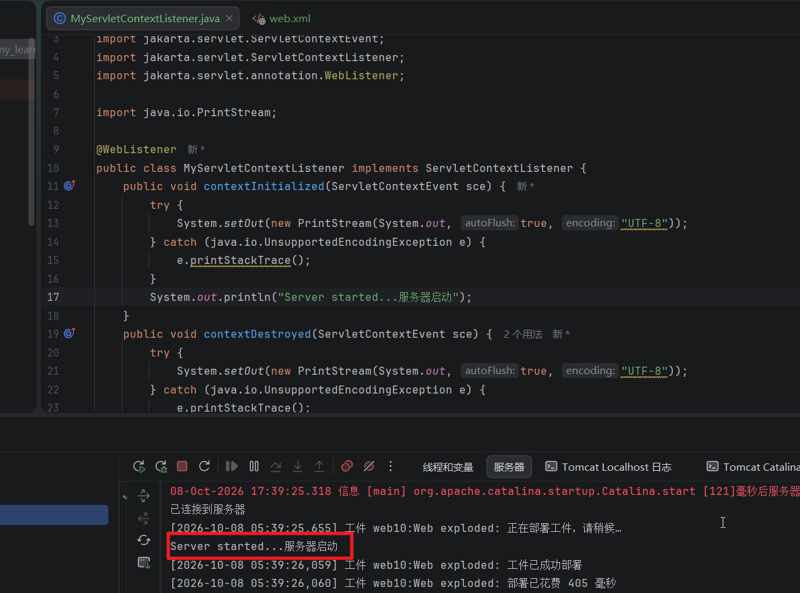

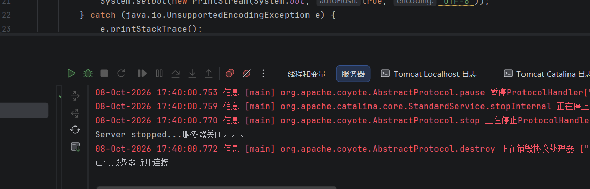

## 10.这个监听器的两个方法里面的事件对象可以获取ServletContext对象并且可以往里面设置数据和获取数据

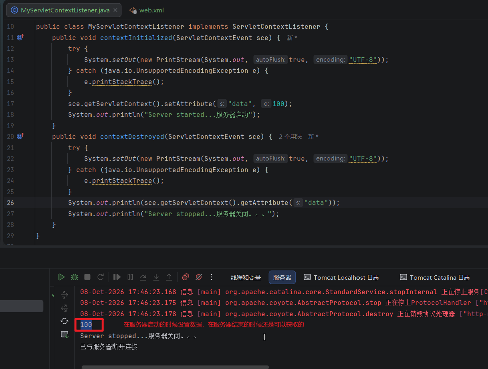

### 具体的应用场景：在服务器启动的时候创建应该数据库连接池，在服务器关闭的时候销毁这个连接池

# 演练2. ServletContextAttributeListener学习

## 1.还是上面的模块，我们新建一个MyServletContextAttributeListener实现ServletContextAttributeListener接口，注意实现3个方法：public void attributeAdded(ServletContextAttributeEvent scae)、public void attributeRemoved(ServletContextAttributeEvent scae)和public void attributeReplaced(ServletContextAttributeEvent scae)分别对应属性的添加、移除和替代，代码如下

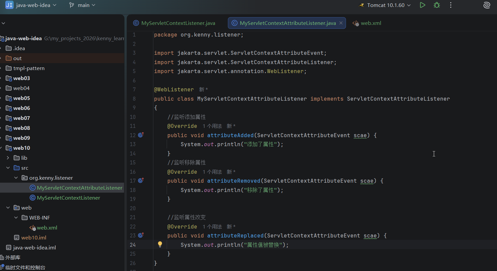

## 2.然后我们把MyServletContextListener里面添加属性的代码注释了

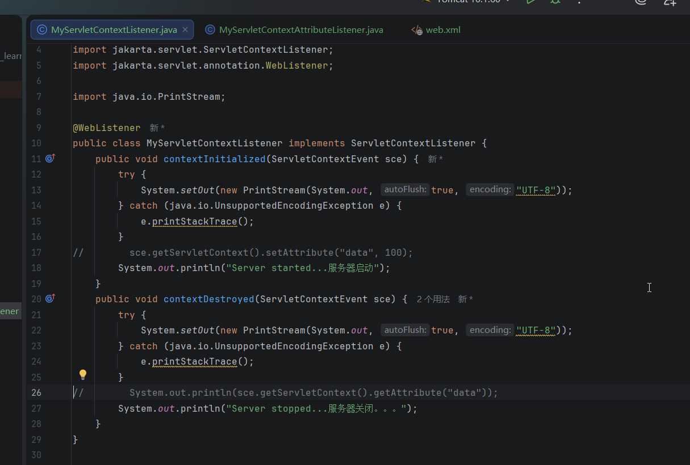

## 3.然后我们新建一个Servlet叫做ListenerTestServlet，继承HttpServlet并且实现doGet方法，添加下面的代码

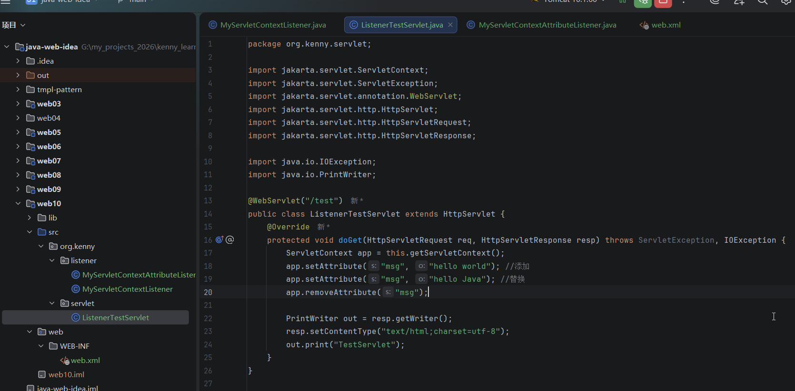

## 4.启动服务器，在浏览器访问：http://localhost:8080/web10/test，然后在控制台就会监听到属性的改变并且触发对应的函数

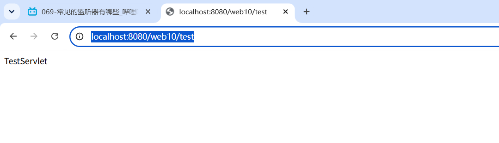

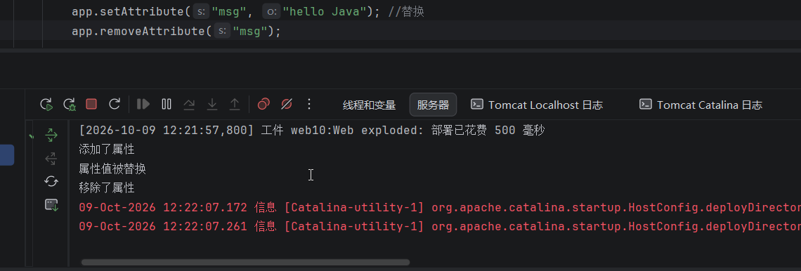


## 注意：监听器有很多，但是最常用的是ServletContextListener，因为它可以监听服务器的启动和改变。我们可能需要在服务器启动的时候做一些事情，或者在服务器关闭的时候做一些清理工作等等。

## 标记了掌握的需要掌握

Servlet 规范定义了以下几种监听器接口：

1. **ServletContext 相关监听器**
   * `ServletContextListener`：监听 Web 应用的启动和关闭    == 掌握
   * `ServletContextAttributeListener`：监听应用范围内属性的添加、移除和替换 ==掌握
2. **HttpSession 相关监听器**
   * `HttpSessionListener`：监听会话的创建和销毁  == 掌握
   * `HttpSessionAttributeListener`：监听会话范围内属性的添加、移除和替换 == 掌握
   * `HttpSessionActivationListener`：监听会话的激活和钝化(集群环境) （了解）
   * `HttpSessionBindingListener`：监听对象绑定到会话或从会话解绑 （了解）
3. **ServletRequest 监听器**
   * `ServletRequestListener`：监听请求的初始化和销毁 == 掌握
   * `ServletRequestAttributeListener`：监听请求范围内属性的添加、移除和替换 == 掌握

## Web框架主要使用ServletContextListener


# 扩展：Servlet 监听器都是接口吗？

**是的，Servlet 规范中定义的各种监听器（Listener）本质上全部都是接口**。

在 Java Servlet 规范中，监听器用于监听 Web 容器中特定对象（如 `ServletContext`、`HttpSession`、`ServletRequest`）的生命周期变化或属性改变事件。它们遵循 Java 的**观察者模式**，所有监听器本身都声明为 **`interface`**，并且默认直接或间接继承自 `java.util.EventListener`。 

常见的 Servlet 监听器接口分类

1. **生命周期监听器（按对象划分）**：
   - `javax.servlet.ServletContextListener`：监听 `ServletContext` 对象的创建和销毁。
   - `javax.servlet.http.HttpSessionListener`：监听 `HttpSession` 对象的创建和销毁。
   - `javax.servlet.ServletRequestListener`：监听 `ServletRequest` 对象的创建和销毁。
2. **属性变更监听器（监听域对象中属性的增、删、改）**：
   - `javax.servlet.ServletContextAttributeListener`
   - `javax.servlet.http.HttpSessionAttributeListener`
   - `javax.servlet.ServletRequestAttributeListener` 
3. **HTTP 会话特定状态监听器**：
   - `javax.servlet.http.HttpSessionIdListener`（监听 Session ID 变更）
   - `javax.servlet.http.HttpSessionBindingListener`（让 JavaBean 感知自己被绑定到 Session 或从 Session 中解绑）
   - `javax.servlet.http.HttpSessionActivationListener`（监听 Session 的钝化与活化）

如何使用？

因为它们都是**接口**，所以在开发时，你不能直接实例化它们，而是需要**编写一个普通的 Java 类去 `implements`（实现）对应的接口**，并重写（`@Override`）里面定义的方法，然后通过 `@WebListener` 注解、`web.xml` 配置文件 或 `ServletContext` 动态注册 让 Web 容器识别并加载。