# 过滤器 Filter

在Servlet中，**Filter（过滤器）是一种**<font style="color:#DF2A3F;">可重用</font>的组件，用于在请求到达Servlet或响应返回客户端之前拦截并处理\*\*HTTP请求和响应。它允许开发者在不修改核心业务逻辑的情况下，对Web应用的请求/响应流程进行统一处理。

## 1.Filter的核心作用

1. \*\*<font style="color:#DF2A3F;">预处理</font>\*\***请求（Pre-processing）**
   * 在请求到达目标Servlet之前，对请求进行修改或检查（如参数编码、权限验证、日志记录等）。
2. \*\*<font style="color:#DF2A3F;">后处理</font>\*\***响应（Post-processing）**
   * 在响应返回客户端之前，对响应内容进行加工（如压缩响应数据、设置HTTP头、过滤敏感信息等）。
3. **<font style="color:#DF2A3F;">拦截请求或响应</font>**
   * 根据条件决定是否将请求/响应继续传递到链中的下一个组件（如未登录时直接重定向到登录页）。

## 2.典型应用场景

* **认证/授权**：检查用户是否登录或是否有权限访问资源。
* **日志记录**：记录请求的URL、IP、耗时等信息。
* **编码处理**：统一设置请求/响应的字符编码（如`UTF-8`）。
* **数据压缩**：对响应内容进行Gzip压缩。
* **XSS防护**：过滤请求参数中的恶意脚本。
* **静态资源缓存**：为静态资源添加缓存控制头。

## 3.Filter的工作原理

1. **链式调用**：多个Filter可以组成一个链（Filter Chain），按`web.xml`定义的顺序依次执行。
2. **生命周期**：
   * **初始化**：Web容器启动时调用`init()`方法（仅一次）。
   * **拦截处理**：每次请求触发`doFilter()`方法。
   * **销毁**：容器关闭时调用`destroy()`方法。

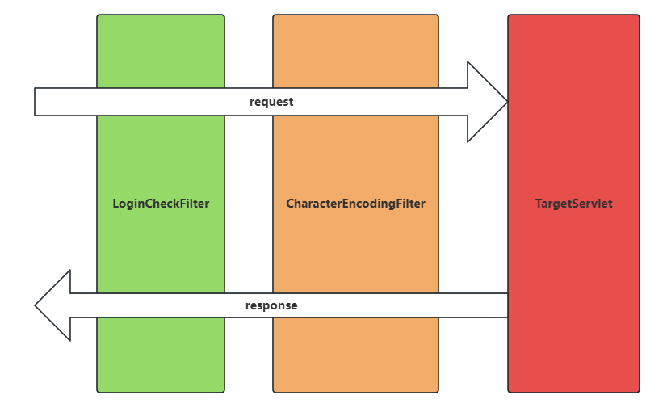

## 4.使用 Filter

### 4.1不使用 Filter 存在的问题

观察以下代码存在的问题：

```java
@WebServlet("/filter/target1")
public class Target1Servlet extends HttpServlet {
    @Override
    protected void doGet(HttpServletRequest request, HttpServletResponse response) throws ServletException, IOException {
        System.out.println("begin: Common Code");

        System.out.println("Target1Servlet doGet...");

        System.out.println("end: Common Code");
    }
}
```

```java
@WebServlet("/filter/target2")
public class Target2Servlet extends HttpServlet {
    @Override
    protected void doGet(HttpServletRequest request, HttpServletResponse response) throws ServletException, IOException {
        System.out.println("begin: Common Code");

        System.out.println("Target2Servlet doGet...");

        System.out.println("end: Common Code");
    }
}
```

存在的问题：多个 Servlet 存在公共代码，每个 Servlet 中都写一遍，代码没有得到复用。

Filter 过滤器可以解决代码复用的问题。公共代码只需要在过滤器中编写一次即可。

### 4.2使用 Filter 进行改造

两个 Servlet 改造如下：

```java
@WebServlet("/filter/target1")
public class Target1Servlet extends HttpServlet {
    @Override
    protected void doGet(HttpServletRequest request, HttpServletResponse response) throws ServletException, IOException {
        System.out.println("Target1Servlet doGet...");
    }
}
```

```java
@WebServlet("/filter/target2")
public class Target2Servlet extends HttpServlet {
    @Override
    protected void doGet(HttpServletRequest request, HttpServletResponse response) throws ServletException, IOException {
        System.out.println("Target2Servlet doGet...");
    }
}
```

编写过滤器：CommonCodeFilter

```java
package com.jkweilai.filter;

import jakarta.servlet.*;

import java.io.IOException;

public class CommonCodeFilter implements Filter {
    @Override
    public void init(FilterConfig filterConfig) throws ServletException {
        
    }

    @Override
    public void doFilter(ServletRequest request, ServletResponse response, FilterChain chain) throws IOException, ServletException {
        System.out.println("begin: Common Code");

        // 执行下一个过滤器，没有过滤器时则执行最终的Servlet
        chain.doFilter(request, response);

        System.out.println("end: Common Code");
    }

    @Override
    public void destroy() {
        
    }
}

```

`web.xml`中配置过滤器，或者也可以使用注解 <code>**<font style="color:#DF2A3F;">@WebFilter</font>**</code> 标注：

```xml
<filter>
    <filter-name>commonCodeFilter</filter-name>
    <filter-class>com.jkweilai.filter.CommonCodeFilter</filter-class>
</filter>
<filter-mapping>
    <filter-name>commonCodeFilter</filter-name>
    <url-pattern>/filter/*</url-pattern>
</filter-mapping>
```

注意：**<font style="color:#DF2A3F;">在 </font>**<code>**<font style="color:#DF2A3F;">web.xml</font>**</code>**<font style="color:#DF2A3F;">文件中同时配置了 Servlet 和 Filter，用户发送的请求路径同时满足 Servlet 和 Filter 时，Filter 优先级高，先执行</font>**。

启动服务器，打开浏览器，先后输入以下 URL，观察控制台输出：

<http://localhost:8080/web01/filter/target1>

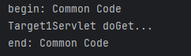

<http://localhost:8080/web01/filter/target2>

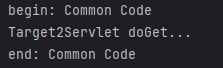

可以看到过滤器起作用了。

#### 

## 5.Filter 的执行顺序

如果编写了多个过滤器，在 web.xml 文件中**配置越靠上**，优先级越高。大家可以编写程序测试一下。

## 6.过滤路径的写法

### 6.1具体规则

在Servlet中，Filter的过滤路径（`url-pattern`）用于指定哪些请求会被过滤器拦截。其配置方式灵活多样，支持多种匹配规则。以下是所有常见的写法及其详细说明：

1. **精确匹配**：完全匹配指定的URL路径。`<url-pattern>/user/login</url-pattern>`。仅拦截`/user/login`请求。
2. **前缀匹配**：以`/`开头并以`/*`结尾，匹配所有以指定路径开头的URL。`<url-pattern>/admin/*</url-pattern>`。拦截所有以`/admin/`开头的请求。包括/admin
3. **扩展名匹配**：以`*.`开头，匹配特定后缀的文件或请求。`<url-pattern>*.do</url-pattern>`。
4. **匹配所有请求（通配符）**：配置`/*`，拦截所有请求（包括静态资源）。`<url-pattern>/*</url-pattern>`。连静态页面路径都可以拦截
5. **多模式匹配**：通过多个`<url-pattern>`或逗号分隔（注解方式）配置多个路径。

* **示例（XML）**：

```xml
<filter-mapping>
    <filter-name>myFilter</filter-name>
    <url-pattern>/api/*</url-pattern>
    <url-pattern>*.do</url-pattern>
</filter-mapping>

```

* **示例（注解）**：

```java
@WebFilter(urlPatterns = {"/api/*", "*.do"})
```

### 6.2优先级

1. **精确匹配** > **前缀匹配** > **扩展名匹配** > **默认匹配（**`/`**或**`/*`**）**。
   * 例如：`/user/login`优先于`/user/*`。

2. 相同类型的模式按配置顺序生效（XML中从上到下）。

   

## 7.责任链设计模式

责任链模式（Chain of Responsibility Pattern）是 GoF 23 种设计模式中的一种**行为型模式**，其主要目的是**将请求的发送者和接收者解耦**，让多个对象都有机会处理请求，从而避免请求发送者与接收者之间的强耦合关系。

### 7.1核心思想

将多个处理请求的对象连成一条链，请求沿着这条链传递，直到有一个对象处理它为止。每个处理者都包含对下一个处理者的引用，形成链式结构。

### 7.2关键角色

1. **抽象处理者（Handler）**
   * 定义处理请求的接口（通常包含一个处理请求的方法和一个设置下一个处理者的方法）。
   * 可以包含对下一个处理者的引用（即“链”的实现）。
2. **具体处理者（Concrete Handler）**
   * 实现抽象处理者的方法，判断是否能处理当前请求。
   * 如果能处理则处理，否则将请求转发给下一个处理者。
3. **客户端（Client）**
   * 组装责任链（设置链中处理者的顺序关系）。
   * 向链的头部发起请求。

### 7.3工作流程

1. 客户端发起请求到责任链的第一个处理者。
2. 每个处理者判断自己是否能处理该请求：
   * 能处理 → 处理并结束流程。
   * 不能处理 → 将请求传递给下一个处理者。
3. 如果链中所有处理者都无法处理，请求可能被忽略或由默认逻辑处理。

### 7.4该模式的优点

* **解耦**：请求发送者无需知道具体由哪个对象处理，只需向链头发送请求。
* **动态组合**：可以灵活调整链中处理者的顺序或增减处理者。
* **符合开闭原则**：新增处理者无需修改现有代码。

### 7.5经典应用场景

1. 多级审批流程（如请假审批：组长 → 经理 → CEO）。
2. 异常处理（如 Java 中的 `try-catch` 块，按顺序匹配异常类型）。
3. 过滤器链（如 Web 框架中的中间件处理 HTTP 请求）。

### 7.6简单代码示例

```java
// 抽象处理者
abstract class Handler {
    protected Handler next;
    public void setNext(Handler next) { this.next = next; }
    public abstract void handleRequest(String request);
}

// 具体处理者A
class ConcreteHandlerA extends Handler {
    public void handleRequest(String request) {
        if (request.equals("A")) {
            System.out.println("Handler A 处理请求");
        } else if (next != null) {
            next.handleRequest(request); // 传递给下一个处理者
        }
    }
}

// 具体处理者B
class ConcreteHandlerB extends Handler {
    public void handleRequest(String request) {
        if (request.equals("B")) {
            System.out.println("Handler B 处理请求");
        } else if (next != null) {
            next.handleRequest(request);
        }
    }
}

// 客户端
public class Client {
    public static void main(String[] args) {
        Handler handlerA = new ConcreteHandlerA();
        Handler handlerB = new ConcreteHandlerB();
        handlerA.setNext(handlerB); // 组装责任链
        
        handlerA.handleRequest("B"); // 输出：Handler B 处理请求
    }
}
```

### <font style="color:rgb(64, 64, 64);">Filter 是责任链模式的典型应用</font>

1. **<font style="color:rgb(64, 64, 64);">角色对应</font>**<font style="color:rgb(64, 64, 64);">：</font>
   * **<font style="color:rgb(64, 64, 64);">抽象处理者</font>**<font style="color:rgb(64, 64, 64);"> → </font><code>**<font style="color:rgb(64, 64, 64);background-color:rgb(236, 236, 236);">Filter</font>**</code><font style="color:rgb(64, 64, 64);"> 接口（定义 </font><code>**<font style="color:rgb(64, 64, 64);background-color:rgb(236, 236, 236);">doFilter</font>**</code><font style="color:rgb(64, 64, 64);"> 方法）。</font>
   * **<font style="color:rgb(64, 64, 64);">具体处理者</font>**<font style="color:rgb(64, 64, 64);"> </font><font style="color:rgb(64, 64, 64);">→ 用户实现的 Filter（如日志、鉴权 Filter）。</font>
   * **<font style="color:rgb(64, 64, 64);">链式传递</font>**<font style="color:rgb(64, 64, 64);"> </font><font style="color:rgb(64, 64, 64);">→ 通过</font><font style="color:rgb(64, 64, 64);"> </font><code>**<font style="color:rgb(64, 64, 64);background-color:rgb(236, 236, 236);">FilterChain.doFilter()</font>**</code><font style="color:rgb(64, 64, 64);"> </font><font style="color:rgb(64, 64, 64);">将请求传递给下一个节点。</font>
2. **<font style="color:rgb(64, 64, 64);">工作流程</font>**<font style="color:rgb(64, 64, 64);">：</font>
   * <font style="color:rgb(64, 64, 64);">请求依次经过多个 Filter，每个 Filter 可前置处理（如权限校验），再通过</font><font style="color:rgb(64, 64, 64);"> </font><code>**<font style="color:rgb(64, 64, 64);background-color:rgb(236, 236, 236);">chain.doFilter()</font>**</code><font style="color:rgb(64, 64, 64);"> </font><font style="color:rgb(64, 64, 64);">传递请求，最后还可能执行后置处理（如日志记录）。</font>
   * <font style="color:rgb(64, 64, 64);">链的组装通过 </font><code>**<font style="color:rgb(64, 64, 64);background-color:rgb(236, 236, 236);">web.xml</font>**</code><font style="color:rgb(64, 64, 64);"> 配置顺序。</font>
3. **<font style="color:rgb(64, 64, 64);">对比经典责任链</font>**<font style="color:rgb(64, 64, 64);">：</font>
   * **<font style="color:rgb(64, 64, 64);">强制传递</font>**<font style="color:rgb(64, 64, 64);">：必须调用</font><font style="color:rgb(64, 64, 64);"> </font><code>**<font style="color:rgb(64, 64, 64);background-color:rgb(236, 236, 236);">chain.doFilter()</font>**</code><font style="color:rgb(64, 64, 64);"> </font><font style="color:rgb(64, 64, 64);">确保请求到达 Servlet，而经典模式可能中途终止。</font>
   * **<font style="color:rgb(64, 64, 64);">双向处理</font>**<font style="color:rgb(64, 64, 64);">：支持请求前/后的拦截（经典模式通常单向）。</font>


## 演练：创建基本过滤器

### 1.新建一个模块起名web11，添加web支持，构建构件，部署到服务器（可以参考前面的项目的步骤）

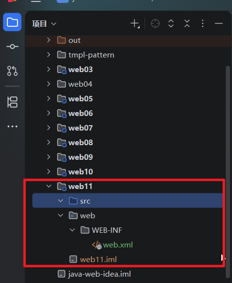

### 2.在模块根目录下面创建一个lib文件夹，把servlet-api.jar粘贴进来，然后作为库添加到classpath

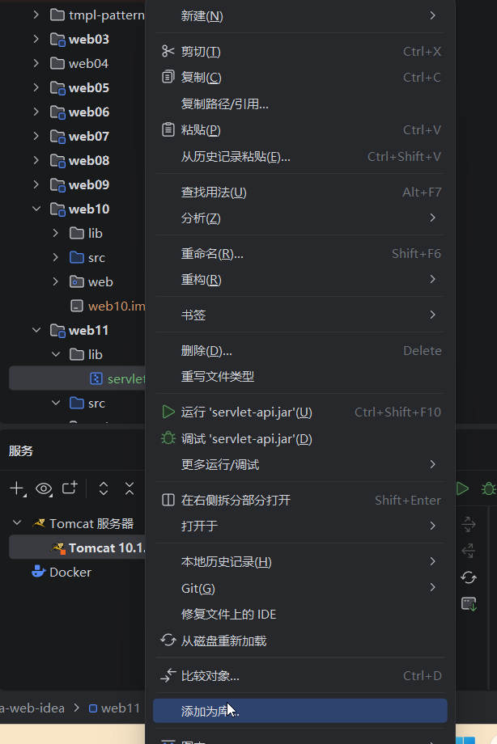

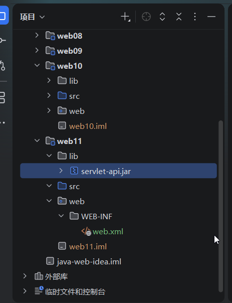

### 3.新建一个TargetServlet继承自HttpServlet，实现doGet方法

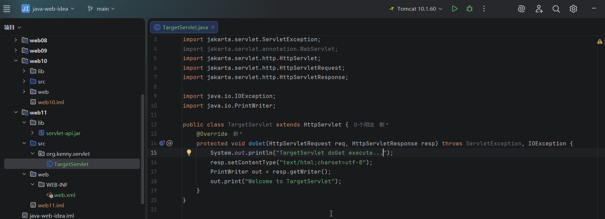

### 4.新建一个LoginCheckFilter实现Filter接口，注意是servlet包里面的Filter接口，代码如下

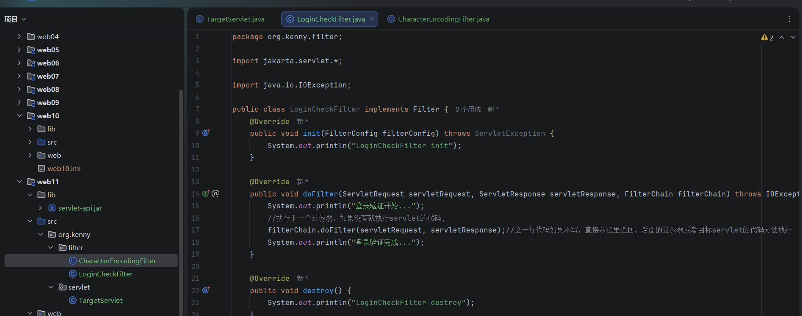

### 5.然后我们再创建一个CharacterEncodingFilter，代码如下

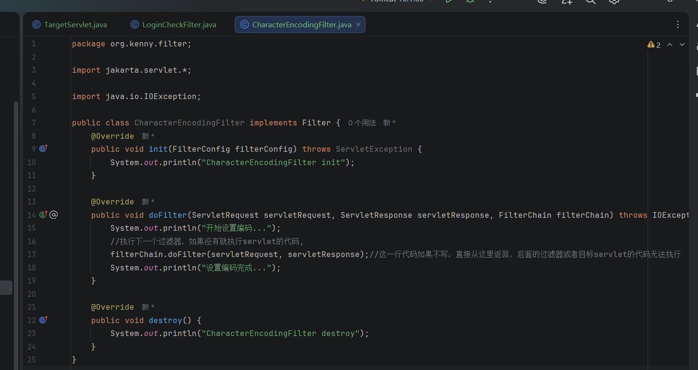

### 6.然后我们在web.xml里面配置他们

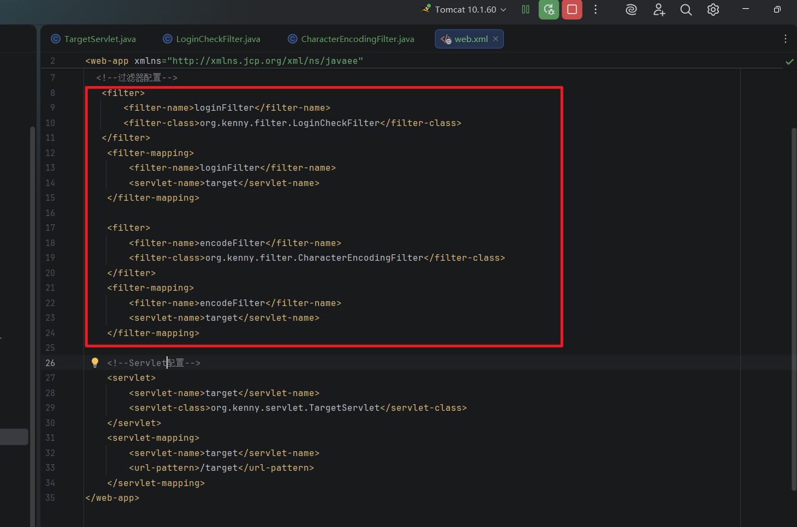

### 7.为了解决控制台乱码，我们在LoginCheckFilter的init方法里面添加处理乱码的代码

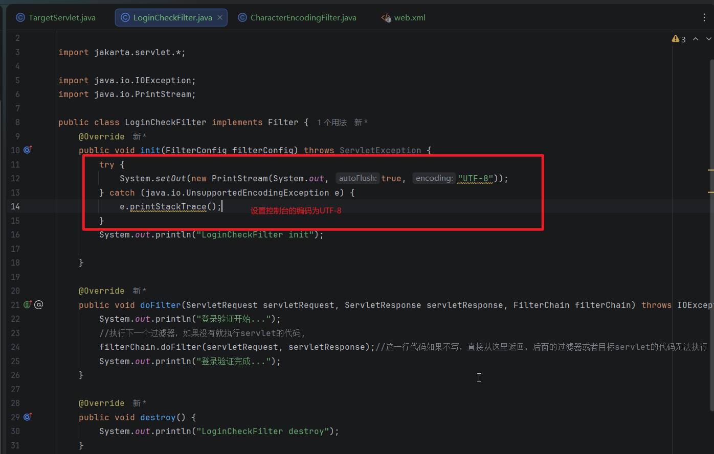

### 8.启动服务器，在浏览器中输入： http://localhost:8080/web11/target，然后就可以在控制台看到输出，说明两个filter都正常工作

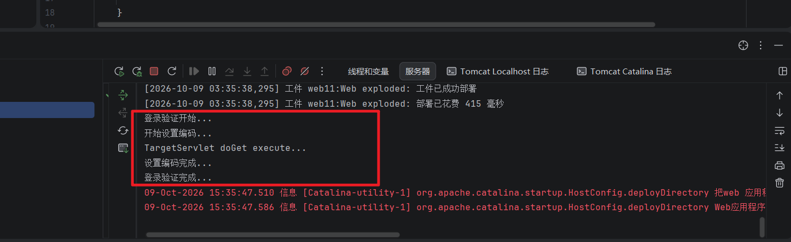

### 9.我们的Filter配置不太好，我们把它改为使用url-pattern为/*的，因为这样子它可以拦截所有路径

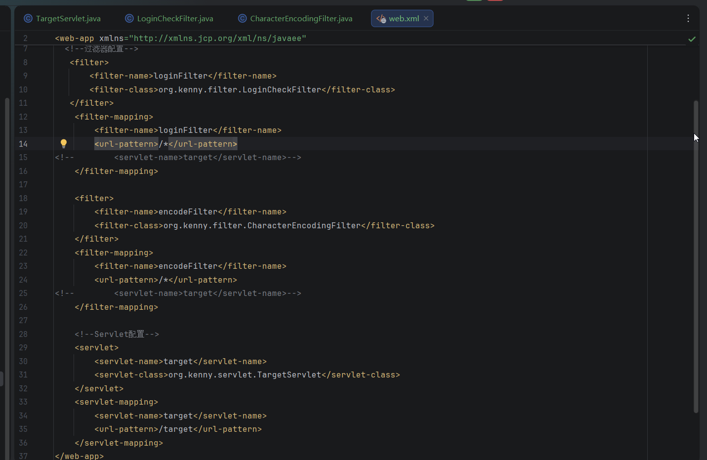

### 也是ok的，而且比较好

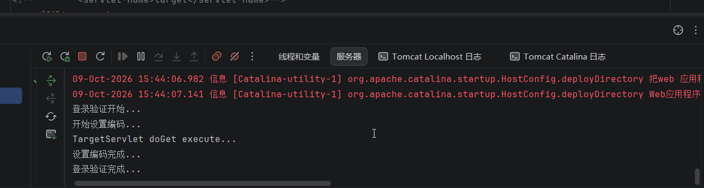

### 也可只以拦截以指定的路径开头的路径

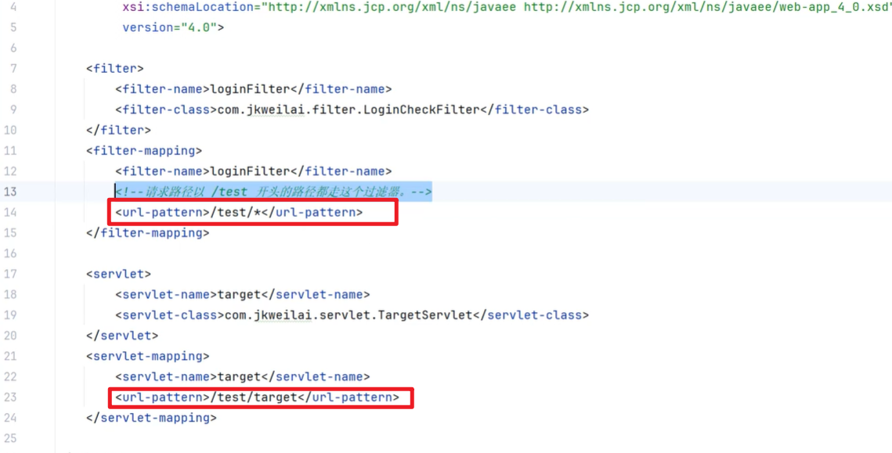

### 11.注意：过滤器在服务器启动的时候就已经完成初始化了，这一点和servlet是不一样的，因为它需要拦截路径，所以一定要先创建

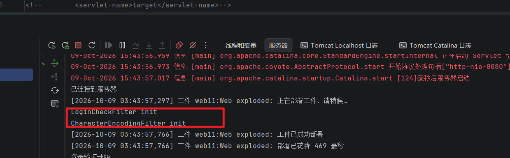

### 注意：

#### 1、在过滤器代码中，凡是写在filterChain.doFilter(servletRequest, servletResponse);这一行代码之前的代码都是对请求的过滤(拦截)代码，写在它之后的代码是对响应的过滤（拦截）代码

#### 2、过滤器的执行顺与你在web.xml中配置的先后顺序一致，也就是先配置的过滤器先执行，后配置的后执行

## 其实，过滤器也可以直接使用注解，而不必在web.xml中配置

### 1.我们把web.xml的配置全部注释了

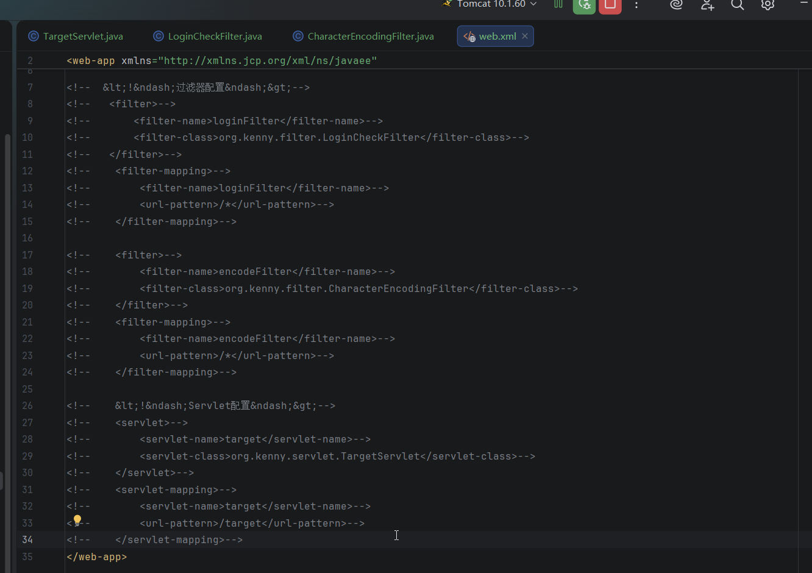

## 2.然后给过滤器添加@WebFilter注解，注意

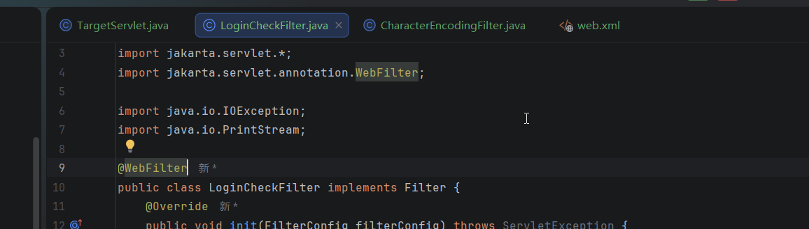

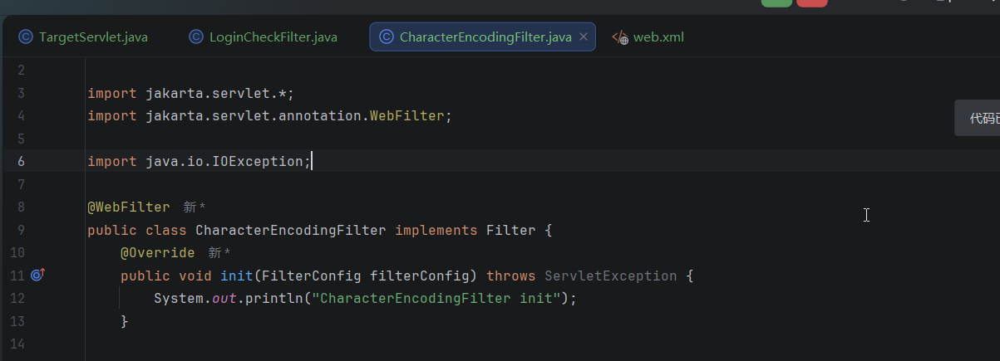

### 3.给TargetServlet添加一个@WebServlet("/target")注解

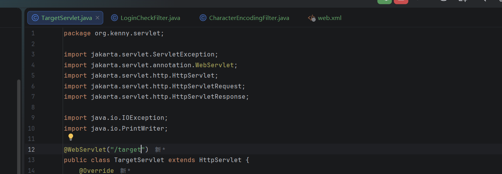

### 4.重启服务器，此时两个Filter都会初始化

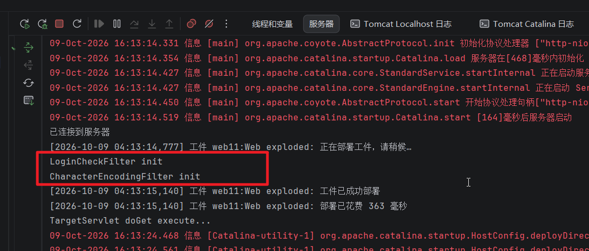

### 5.然后我们在浏览器中输入下面路径

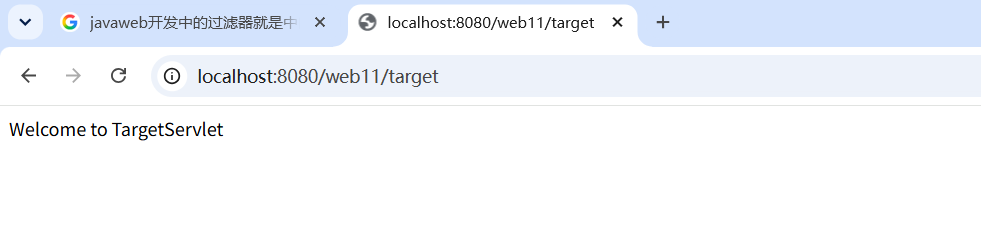

### 6.问题来了，此时，只执行servlet的方法，没有执行filter的方法，这是为什么？

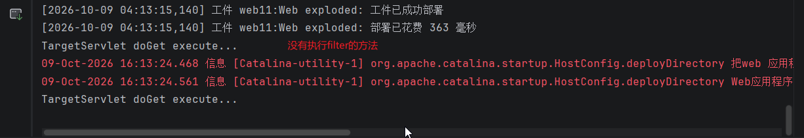

### 7.因为@WebFilter注解也是需要匹配路径的，我们来修改一下

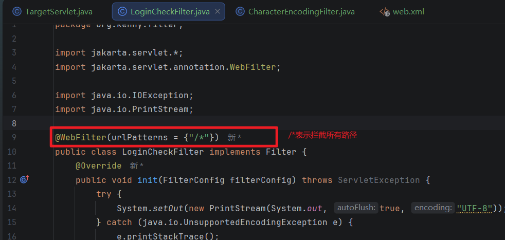

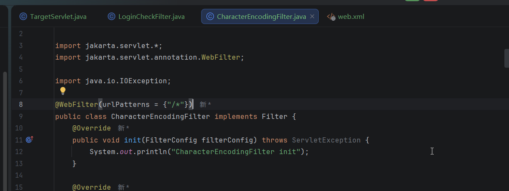

### 8.然后重启服务器再刷新页面，效果出来了

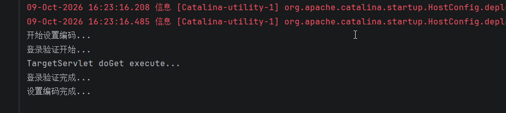

### 9.还可以有另外一种写法，使用value参数，这个比较简单

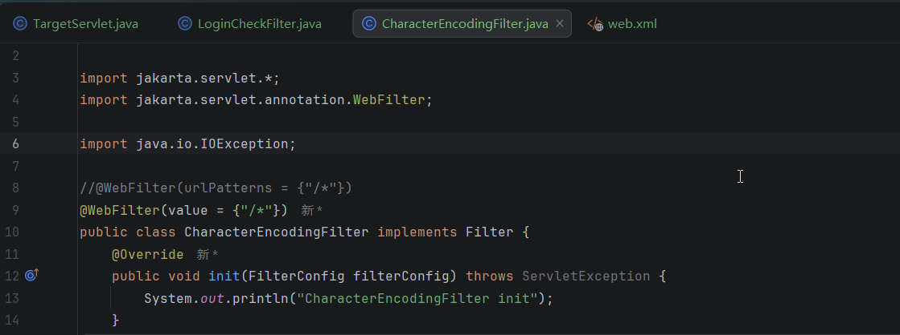

### 10.然后还可以简化

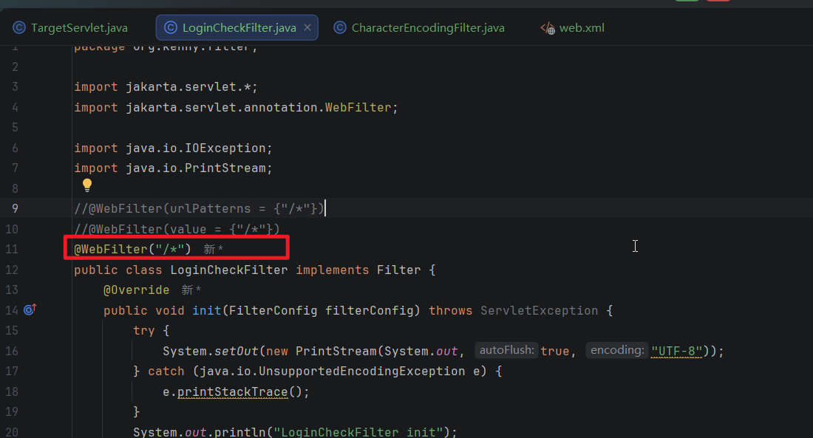

## 需要注意：用注解的方式是无法配置过滤器的优先级的，如果你需要使用优先级，就只能够在web.xml里面配置


# 扩展：javaweb开发中的过滤器就是中间件吗

***\*JavaWeb开发中的过滤器（Filter）不是严格意义上的“中间件”，但它在概念和作用上与中间件有相似之处\**。** 

1. 什么是JavaWeb的过滤器？

- **定义**：Filter是JavaWeb（Servlet规范）的三大组件之一（另外两个是Servlet和Listener）。
- **实现**：通过实现 `javax.servlet.Filter` 接口来创建。
- **工作方式**：它位于客户端与目标资源（Servlet、JSP、静态资源等）之间。当HTTP请求到达时，Filter可以先做预处理；当目标资源处理完返回响应时，Filter还可以做后处理。它支持“过滤链（Filter Chain）”概念，可以按顺序串联多个过滤器。
- 什么是中间件（Middleware）？

- **定义**：中间件是一个更广泛、更偏向系统架构的概念，通常指处于操作系统/底层平台与应用程序之间的软件（如数据库中间件、消息中间件、Web服务器/反向代理中间件如Nginx，或者像ASP.NET Core/Node.js框架里的全局管道中间件）。
- **特点**：中间件通常更接近底层，能够独立于特定的Web框架运行，处理更底层的网络协议、连接池、全局路由或跨应用通信。
- 过滤器与中间件的区别

| 比较维度       | JavaWeb 过滤器 (Filter)                                      | 中间件 (Middleware)                                          |
| -------------- | ------------------------------------------------------------ | ------------------------------------------------------------ |
| **层级与范畴** | 属于 **Java Servlet 规范** 的一部分，运行在 Servlet 容器（如 Tomcat）内部。 | 属于更宏观的架构概念，范围广得多（可以是容器级、应用级、甚至独立的分布式组件）。 |
| **依赖环境**   | 强依赖于 **Servlet 容器**（如 Tomcat、Jetty 等）。           | 许多中间件是独立进程或底层框架组件，不依赖于Servlet容器（例如Node.js/Go或.NET中的中间件）。 |
| **感知能力**   | 能够感知和操作 JavaWeb 特有的对象（如 `ServletRequest`、`ServletResponse`、`HttpSession`）。 | 通常只处理更通用的底层上下文（如原始的 HTTP Context、TCP流或字节数据）。 |
| **常见用途**   | 字符集编码设置、登录权限校验、简单日志记录、参数过滤等。     | 负载均衡、安全认证网关、消息队列、分布式缓存、全局流量控制等。 |

总结

如果非要类比，JavaWeb中的过滤器可以看作是**“Web应用内部的一种微型/轻量级请求拦截中间件”**，它在功能上起到了拦截和处理HTTP请求/响应管道的作用，但它的底层实现和运行边界仅限于Servlet容器内部，与系统级或架构级的“中间件”还是有很大区别的。